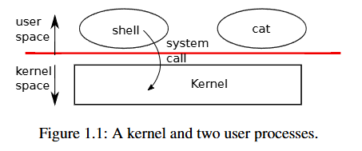
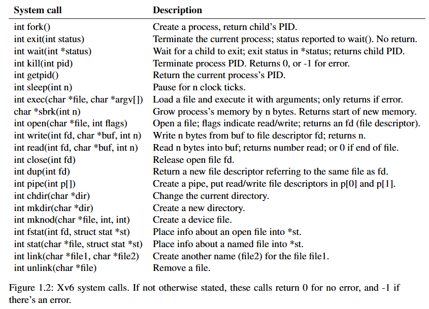

# Operating system interface

# 操作系统接口

---

## 简介

`xv6`采用传统的内核形式，将`kernel`视为一个为运行中的程序提供服务的特殊程序。每个运行中的程序称为进程，进程有包含指令、数据与栈的内存。指令实现程序的计算、数据是计算所作用的变量、栈负责组织程序的过程调用。



当进程需要调用内核服务，会调用`System call`，进入内核，内核执行服务并返回。因此，进程在用户空间和内核空间之间交替进行。至于权限由硬件部分负责升级或降级。至于`shell`也只是一个普通的用户程序。



这幅图展示了`xv6`所有的系统调用。

----

## Processes and memory

## 进程与内存

- 一个`xv6`进程由用户空间内存（指令、数据和栈）和内核私有的进程状态`PID`组成。

- 一个进程可以调用`fork`系统创建一个子进程，其内存内容与调用进程（即父进程）完全相同，但是在不同的寄存器中互不影响。在父进程中，`fork`返回子进程的`PID`，在子进程中，`fork`返回`0`。

- `exec`系统调用将调用进程的内存替换为从文件系统中存储的文件加载的新内存映像。文件需具有特定的格式，指定文件的指令部分、数据部分、以及从哪条指令开始执行等，`xv6`使用`ELF`格式。
  
  `xv6 shell`采用这种调用来运行用户程序。主循环用`getcmd`从用户处读取一行输入，然后调用`fork`创建`shell`进程的副本。父进程调用`wait`，子进程运行命令。

```c
int
main(void)
{
  static char buf[100];
  int fd;

  // Ensure that three file descriptors are open.
  while((fd = open("console", O_RDWR)) >= 0){
    if(fd >= 3){
      close(fd);
      break;
    }
  }

  // Read and run input commands.
  while(getcmd(buf, sizeof(buf)) >= 0){
    if(buf[0] == 'c' && buf[1] == 'd' && buf[2] == ' '){
      // Chdir must be called by the parent, not the child.
      buf[strlen(buf)-1] = 0;  // chop \n
      if(chdir(buf+3) < 0)
        fprintf(2, "cannot cd %s\n", buf+3);
      continue;
    }
    if(fork1() == 0)
      runcmd(parsecmd(buf));
    wait(0);
  }
  exit(0);
}

int
fork1(void)
{
  int pid;

  pid = fork();
  if(pid == -1)
    panic("fork");
  return pid;
}
```

----

## I/O and File descriptors

## I/O和文件描述符

文件描述符是一个小整数，代表一个由内核管理的对象，进程可以从中读取或写入。获取文件描述符的方法有打开文件、目录或设备，创建管道，或复制现有描述符等。我们将文件描述符指向的对象称为“文件”，文件描述符接口抽象了文件、管道与设备之间的差异，使它们看起来都像字节流。

`xv6`使用文件描述符作为每个进程表的索引，因此每个进程都有一个从零开始的私有文件描述符空间。按照惯例，进程从文件描述符0（标准输入）读取，将输出写到文件描述符1（标准输出），并将错误消息写入文件描述符0（标准错误）。`shell`利用这一惯例来实现I/O的重定向与管道。在上面的`main`中可以看到，`shell`会确保它始终有三个文件描述符处于打开状态，默认情况下这些文件描述符被用于控制台。

> 管道（pipe）是一种进程间通信（IPC）机制，允许两个相关进程通过内核管理的缓冲区进行单向数据传递。具体而言，管道是一个由内核维护的缓冲区，表现为一个先进先出（FIFO）的字节队列。管道的一端用于写入数据，另一端用于读取数据，通过文件描述符访问

`read`和`write`系统调用从由文件描述符命名的打开文件中读取字节和写入字节。

调用`read(fd,buf,n)`从文件描述符`fd`中读取最多`n`个字节，将它们复制到`buf`中，并返回读取的字节数。每个引用文件的文件描述符都有一个与之相关的偏移量，`read`从当前文件偏移量读取数据，然后将偏移量向前推进读取的字节数，当没有更多字节可读时，`read`返回`0`指示文件结束。

调用`write(fd,buf,n)`从`buf`向文件描述符`fd`写入`n`字节，并返回写入的字节数。只有在发生错误时，写入的字节数才会小于`n`。另外，`write`同样也有偏移量的概念。

文件描述符和`fork`的交互使得I/O重定向易于实现，`fork`复制父进程的文件描述符表及其内存，系统调用`exec`替换调用进程的内存，但保留其文件表。这样`shell`就可以在子进程中重新打开选定的文件描述符，然后运行新程序，从而实现I/O重定向。

```c
char *argv[2];

argv[0] = "cat";
argv[1] = 0;
if (fork() == 0) {
    close(0);
    open("input.txt", 0_RDONLY);
    exec("cat", argv);
}
```

这是`shell`运行命令`cat < input.txt`的简化版本。子进程进入`fork() == 0`，关闭文件描述符`0`，`open`将为新打开的`input.txt`使用该文件描述符，然后执行`cat`，文件描述符`0`（标准输入）指向`input.txt`。

> 在Unix/Linux系统中，文件描述符的分配策略是优先使用当前可用的最小数值的文件描述符。

`xv6 shell`中的I/O重定向代码也是以这种方式工作的：

```c
case REDIR:
    rcmd = (struct redircmd*)cmd;  // 将通用命令结构转换为重定向命令结构
    close(rcmd->fd);               // 关闭原文件描述符
    if(open(rcmd->file, rcmd->mode) < 0){  // 打开目标文件，复用已关闭的fd
      fprintf(2, "open %s failed\n", rcmd->file);  // 错误处理
      exit(1);
    }
    runcmd(rcmd->cmd);              // 执行重定向后的实际命令
    break;
```

> `open`的第二个参数由一组标志组成，用于控制`open`的行为，在[`fcntl`头文件](https://github.com/mit-pdos/xv6-riscv/blob/riscv//kernel/fcntl.h#L1-L5)中定义。O_RDONLY,O_WRONLY,O_RDWR,O_CREATE和O_TRUNC，指示`open`函数如何打开文件，用于读取、写入或是同时进行读取和写入，如果文件不存在则创建文件，将文件截断为零长度。

这里我们可以知道为什么要把`fork`与`exec`分开调用，这样，`shell`可以在不干扰主`shell`的情况下重定向子进程的I/O。

`dup`系统调用复制一个现有的文件描述符，返回一个新的文件描述符，该描述符引用相同的底层I/O对象，两个文件描述符共享一个偏移量，就像由`fork`复制的文件描述符一样。举例来说，以下两段代码的效果是相同的：

```c
// 1.
if(fork() == 0) {
write(1, "hello ", 6);
exit(0);
} else {
wait(0);
write(1, "world\n", 6);
}

// 2.
fd = dup(1);
write(1, "hello ", 6);
write(fd, "world\n", 6);
```

---

## Pipes

## 管道

管道是一个小的内核缓冲区，作为一对文件描述符暴露给进程，一个用于读取，一个用于写入。将数据写入管道的一端可以从管道的另一端读取。管道为进程提供了一种通信方式。

以下程序为例：

```c
int p[2];
char *argv[2];

argv[0] = "wc";
argv[1] = 0;

pipe(p);
if(fork() == 0) {
  close(0);
  dup(p[0]);
  close(p[0]);
  close(p[1]);
  exec("/bin/wc", argv);
} else {
  close(p[0]);
  write(p[1], "hello world\n", 12);
  close(p[1]);
}
```

调用`pipe`创建一个新的管道，并在数组`p`中记录读和写的文件描述符。`fork`后，父进程和子进程都有指向管道的文件描述符。子进程调用`close`和`dup`，使得文件描述符`0`指向管道的读端，再关闭`p`中的文件描述符，并调用`exec`来运行`wc`，从管道中读取数据。父进程关闭管道的读端，向管道写入数据，然后关闭写端。

如果没有数据可用：

- 若还有写端没有关闭，对管道的读取操作会阻塞，等待数据写入；

- 若所有引用写端的文件描述符被关闭。在这种情况下，对管道的读取操作将返回`0`。

这也是上面代码中为什么子进程中要特意`close(p[1])`的原因。

`xv6`的管道实现与之类似：

```c
case PIPE:
    pcmd = (struct pipecmd*)cmd;
    if(pipe(p) < 0)  // 创建管道
      panic("pipe");
    if(fork1() == 0){  // 创建第一个子进程，处理左侧命令
      close(1);        // 关闭标准输出
      dup(p[1]);       // 管道写端复制到标准输出
      close(p[0]);     // 关闭管道读端
      close(p[1]);     // 关闭原始管道写端
      runcmd(pcmd->left);  // 执行左侧命令
    }
    if(fork1() == 0){  // 创建第二个子进程，处理右侧命令
      close(0);
      dup(p[0]);
      close(p[0]);
      close(p[1]);
      runcmd(pcmd->right);
    }
    close(p[0]);  // 父进程关闭管道读端
    close(p[1]);  // 关闭写端
    wait(0);      // 等待第一个子进程结束
    wait(0);      // 等待第二个子进程结束
    break;
```

子进程创建一个管道，然后将管道的左端与右端连接起来。然后分别为管道的左右端调用`fork`和`runcmd`，并等待二者完成。而管道右端的命令可能又会分叉出新的子进程，这样`shell`会创建一个进程树。

管道的优势相比起临时文件主要有：

- 管道会自动清理自己；

- 管道可以传递任意长度的数据流；

- 管道允许管道阶段的并行执行；

- 对于进程间通信，管道的阻塞读写更高效。

---

## File system

## 文件系统

一些相关的命令有：

| `chdir` | `mkdir` | `mknod` | `open("...", 0_CREATE)` |
| ------- | ------- | ------- |:-----------------------:|
| 更改当前目录  | 创建新目录   | 创建新设备文件 | 创建新数据文件                 |

举例来说：

```powershell
mkdir("/dir");
fd = open("/dir/file", O_CREATE|O_WRONLY);
close(fd);
mknod("/console", 1, 1);
```

> `mknod`创建一个与设备相关的特殊文件，核心目的是在内核中建立设备文件与实际设备驱动的关联。两个参数分别是主设备号和次设备号，它们唯一标识一个内核设备。当进程稍后打开设备文件时，内核会将读写系统调用重定向到内核设备实现，而不是传递给文件系统。

另外，文件名并不等于文件本身。同样的一个底层文件（`inode`）可以有多个名称（`links`），每个`link`由目录中的一个条目组成，该条目包含一个文件名和一个对该`inode`的引用，`inode`保存了文件的元数据，包括类型、目录、设备、长度、在磁盘的位置、`links`数等。

除以上，还有几个重要的系统调用。

- `fstat`系统调用从文件描述符所引用的`inode`中检索信息，这些信息在`stat`结构体中：
  
  ```c
  #define T_DIR     1   // Directory
  #define T_FILE    2   // File
  #define T_DEVICE  3   // Device
  
  struct stat {
    int dev;     // File system's disk device
    uint ino;    // Inode number
    short type;  // Type of file
    short nlink; // Number of links to file
    uint64 size; // Size of file in bytes
  };
  ```

- `link`系统调用则创建另一个文件系统名称，指向与现有文件相同的`inode`，例如：
  
  ```powershell
  open("a", O_CREATE|O_WRONLY);
  link("a", "b");
  ```
  
  `a`和`b`指向同一个文件，对二者操作是一样的。

- `unlink`系统调用从文件系统中移除一个名称。文件的`inode`和磁盘空间只有在文件的`link`计数为零时才会被释放。另外，这是一种常见的方式：
  
  ```powershell
  fd = open("/tmp/xyz", O_CREATE|O_RDWR);
  unlink("/tmp/xyz");
  ```
  
  用来创建一个没有名称的临时`inode`，当进程关闭文件描述符`fd`或退出时将被清理。
