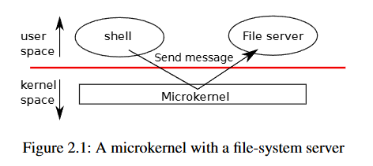
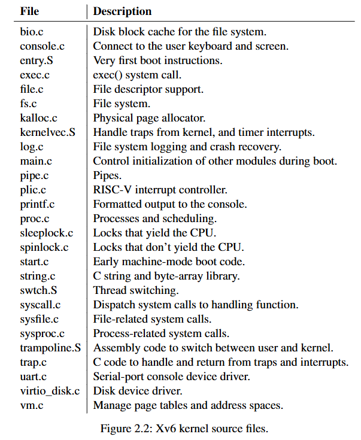
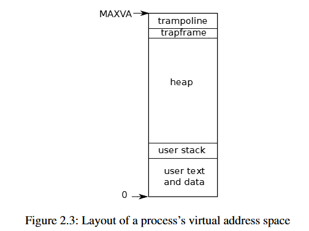

# Operating system organization

# 操作系统组织

---

操作系统必须满足三个要求：**多路复用**，**隔离**和**交互**

---

## Abstracting physical resources

## 抽象物理资源

我们需要实现各个应用程序之间的强隔离，禁止应用程序直接访问敏感的硬件资源，而是把这些资源抽象为服务，通过系统调用来交互。

---

## User mode, supervisor mode, and system calls

## 用户模式，监督模式和系统调用

强隔离要求应用程序与操作系统间有硬边界，而不希望在发生错误时二者互相影响。CPU会提供硬件支持以实现强隔离：**RISC-V**提供了三种模式可以执行指令：**machine mode**，**supervisor mode**，**user mode**。

在机器模式下执行的指令具有完全权限，主要用于配置计算机，CPU在启动时会处于机器模式，然后会切换为监管模式。

在监管模式下，CPU可以执行特权指令，如：启用与禁用中断、读取和写入保护页表地址的寄存器等，在内核空间中运行。但如果用户模式下尝试执行这些指令，CPU会切换到监管模式，监管模式的代码会终止该应用程序。

应用程序只能执行用户模式的指令，并在用户空间中运行。如果想调用内核函数必须切换到内核模式，CPU为此提供了指令（RISC-V是`ecall`指令），用于将CPU从用户模式切换到监管模式，并进入内核指定的入口点。这样内核可以验证系统调用的参数并决定是否允许应用程序执行请求的操作，这样也是出于安全性考虑，防止恶意程序跳过参数验证点而进入内核。

在内核空间（监管模式）运行的软件称为内核**kernel**。

---

## Kernel Organization

## 内核组织

设计上一个核心的问题是操作系统的哪些部分应该在监管模式下运行。最简单的方式就是整个操作系统都驻留在内核中，因此所有系统调用的实现都在监管模式下运行，这种组织方式被称为单体内核**monolithic kernel**。

这种方式很方便简单，但是缺点是操作系统不同部分之间的接口通常很复杂；而在这种方式里错误是致命的，因为这种模式下的错误通常会导致内核崩溃，所有应用程序都会失败，必须进行重启。

而为了减少这种内核中发生错误的风险，设计者可以尽量减少在监管模式下运行的代码，并在用户模式下执行大部分的操作系统代码，这种内核组织方式称为**microkernel**。下面的图展示的就是这种设计：



`xv6`实现为一个单体内核，内核接口也就对应于操作系统接口。

---

## Code: xv6 organization

## 代码：xv6项目

内核源代码位于`kernel/sub-directory`目录，按照模块化概念被划分为多个文件，详见下图：



模块间的接口定义在`kernel/defs.h`文件。

---

## Process overview

## 进程概述

`xv6`中的隔离单位是进程，进程的抽象防止一个进程破坏或窥探另一个进程的内存、CPU、文件描述符等，并防止进程破坏内核本身。内核用来实现进程的机制包括各个模式、地址空间、线程的时间切片等。

`xv6`使用`page tables`（硬件实现）来为每个进程提供自己的地址空间，**RISC-V**`page table`把虚拟地址（**RISC-V**指令操作的地址）转换为物理地址（CPU芯片发送到主存储器的地址）。`xv6`为每个进程维护一个单独的页表，该表定义了该进程的地址空间：



首先是从虚拟地址0开始的进程的用户内存，指令在前面，然后是全局变量，然后是用户栈，最后是一个堆区域（用于`malloc`），进程可以根据需要拓展该区域。在顶部，`xv6`保留了一个页用于`trampoline`和一个页用于映射进程的`trapframe`转换到内核，这部分详见第四章。

`xv6`内核为每个进程维护的状态信息位于结构体`proc`中，每个进程最重要的内核状态包括其页表、内核栈和运行状态。

```c
// Per-process state
struct proc {
  struct spinlock lock;

  // p->lock must be held when using these:
  enum procstate state;        // Process state
  void *chan;                  // If non-zero, sleeping on chan
  int killed;                  // If non-zero, have been killed
  int xstate;                  // Exit status to be returned to parent's wait
  int pid;                     // Process ID

  // wait_lock must be held when using this:
  struct proc *parent;         // Parent process

  // these are private to the process, so p->lock need not be held.
  uint64 kstack;               // Virtual address of kernel stack
  uint64 sz;                   // Size of process memory (bytes)
  pagetable_t pagetable;       // User page table
  struct trapframe *trapframe; // data page for trampoline.S
  struct context context;      // swtch() here to run process
  struct file *ofile[NOFILE];  // Open files
  struct inode *cwd;           // Current directory
  char name[16];               // Process name (debugging)
};
```

每个进程都有一个执行线程，用于执行进程的指令。线程可以被挂起，稍后再恢复，这会在内核切换进程时用到。线程的大部分状态存储在线程的栈上。每个进程有两个栈：用户栈和内核栈。当进程执行用户指令时，使用用户栈，而内核栈为空；当进程进入内核时，代码在进程的内核栈上运行；当进程在内核中，其用户栈仍然包含保存的数据，但是不会主动使用。进程的线程在主动使用用户栈与内核栈之间交替切换。内核栈是独立的并且会收到用户代码的保护，即使进程破坏了用户栈，内核栈也仍然可以执行。

进程可以通过执行**RISC-V**的`ecall`指令来进行系统调用，该指令提升硬件特权级别并将程序计数器改为内核定义的入口点。入口点处代码切换到内核栈并执行实现系统调用的内核指令。调用完成再调用`sret`指令切换回用户模式。

---

## Code: starting xv6 and the first process

## 代码：启动xv6与第一个进程

当**RISC-V**计算机启动时，它会初始化自身并运行存储在只读存储器的`boot loader`，这个引导加载程序会把`xv6`内核加载到内存中，放置在物理地址**0x80000000**处，前面的地址区域留给I/O设备映射。

然后在机器模式下，CPU从`_entry`（`kernel/entry.S:6`）开始执行`xv6`。`xv6`预声明了一个栈**stack0**（`kernel/start.c:11`），`_entry`处的代码将栈指针寄存器`sp`加载为`stack0+4096`（栈顶地址，**RISC-V**栈向下增长）。栈初始化完成后，调用`start`代码（`kernel/start.c:21`）。

`start`执行一些仅在机器模式下允许的配置，并切换到监管模式。它将`mstatus`寄存器中先前的机器模式设置为监管模式（以便后续通过`mret`指令切换）；然后将`mepc`寄存器的地址设置为`main`函数的地址，使得`mret`执行后跳转到`main`；再向`satp`寄存器写入0来禁用监管模式下的虚拟地址转换，而由物理地址直接映射；然后将所有中断和异常委托给监管模式；最后编程时钟芯片以周期性触发定时器中断，为后续多任务调度提供时间基准；最后执行`mret`指令，返回监管模式并跳转至`main`函数。

`main`函数在初始化几个设备和子系统后，通过调用`userinit`（`kernel/proc.c:212`）创建第一个进程，该进程执行用**RISC-V**汇编写的程序`user/initcode.S`，该程序通过`exec`系统调用运行一个新程序（本例是`/init`），当`exec`完成，内核就会返回到`/init`进程的用户空间。`Init`函数创建一个新的控制台设备文件并使用文件描述符0、1、2打开，然后它在控制台启动一个`shell`，系统启动完成。
