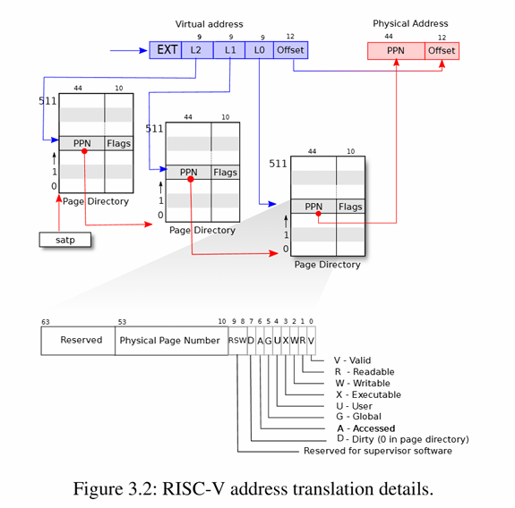

# Page tables

# 页表

---

## Paging hardware

## 分页硬件

> 首先需要明确的是：RISC-V指令（包括kernel和user）操作的都是虚拟地址，机器的RAM或者物理内存则通过物理地址进行索引。RISC-V的page table hardware通过将每个虚拟地址映射到物理地址来连接它们。

`xv6`运行在**Sv39 RISC-V**上，这表明它只用64-bit虚拟地址的底部39位，剩下的25位不用。在这种配置中，RISC-V的**page table**在逻辑上是一个包含$2^{27}$个页表项（page table entries， PTEs）的数组。每个PTE包含一个44位的物理页号（physical page number，PPN）和一些标志位。分页硬件通过使用39位中的顶部27位来索引页表以找到一个PTE，并生成一个56位的物理地址，其顶部44位来自PTE中的PPN，底部12位则从原始的虚拟地址中复制而来。


页表使操作系统能够以$4096(2^{12})$字节对齐的块为单位控制虚拟地址到物理地址的转换，这样的块称为**page**。



如上图所示，实际的转换过程分为三个步骤。页表以三级树的形式存储在物理内存中。**root**是一个4096字节的页表，包含512个PTE（这受限于后面的高9位），这些PTE包含树中下一级页表页的物理地址，每个页表页又包含512个PTE，就这样构成三层的树状结构。分页硬件使用27位中的**高9位**选择根页表的页中的PTE，中间9位用于选择树中下一级页表的页中的PTE，低9位选择最终的PTE。

如果这三个PTE中任何一个不存在，分页硬件都会引发一个页面错误异常，将由内核来处理这个异常。

每个PTE包含标志位，这些标志位告诉分页硬件如何使用相关的虚拟地址。**PTE_V**指示PTE是否存在，如果未设置，引用该页面会导致异常；**PTE_R**控制是否允许指令读取该页面；**PTE_W**控制是否允许指令写入该页面；**PTE_X**控制CPU是否可以将页面内容解释为指令并执行；**PTE_U**控制是否允许用户模式下的指令访问该页面，如果未设置**PTE_U**，则PTE只能在监管模式下使用。

```c
// kernel/riscv.h
#define PTE_V (1L << 0) // valid
#define PTE_R (1L << 1)
#define PTE_W (1L << 2)
#define PTE_X (1L << 3)
#define PTE_U (1L << 4) // user can access
```

内核会通过把根页表的页的物理地址写入`satp`寄存器来告诉硬件使用页表。每个CPU都有自己的`satp`，CPU使用它自己的`satp`指向的页表来转换后续指令生成的所有地址。

> 一些解释：物理内存指DRAM中的存储单元，一个字节的物理内存有一个地址，称为物理地址。指令只使用虚拟地址，分页硬件将虚拟地址转换为物理地址，然后发送到DRAM硬件进行读取或写入。而虚拟内存是内核提供的用于管理物理内存和虚拟地址的抽象和机制的集合。

---

## Kernel address space

## 内核地址空间

`xv6`为每个进程维护一个页表，描述它的用户地址空间，再加上一个描述内核地址空间的单页表。内核负责其地址空间的布局，以便在虚拟地址上访问物理内存和各种硬件资源。


在**QEMU**模拟的计算机中，包含从物理地址`0x80000000`至少到`0x86400000`的RAM，`xv6`称为**PHYSTOP**；模拟还包括磁盘接口等I/O设备，QEMU将设备接口暴露给软件，当作物理地址空间`0x80000000`以下的内存映射设备的寄存器，内核可以通过读写这些特殊的物理地址与设备交互，这些操作是与设备硬件通信。

内核通过直接映射访问RAM和内存映射设备的寄存器。内核本身位于虚拟地址空间与物理内存中的**KERNBASE**，直接映射简化了读取或写入物理内存的内核代码。例如：`fork`为子进程分配用户内存时，分配器返回该内存的物理地址；`fork`在将父进程的用户内存复制到子进程时，直接将该地址用作虚拟地址。

但也有几个内核虚拟地址不是直接映射的：

- **The trampoline page**：它被映射到虚拟地址空间的顶部，用户页表也有相同的映射；

- **The kernel stack pages**：每个进程都有自己的内核栈，它被映射到高位，以便`xv6`可以在其下方留下一个未映射的防护页。防护页的PTE是无效的（PTE_V未设置），因此如果内核溢出内核栈，可能会导致异常并使内核崩溃。如果没有防护页，溢出的栈就会覆盖其他内核内存导致操作错误。在操作系统设计中，崩溃比可能的错误操作更好。

内核通过权限PTE_R和PTE_X映射**trampoline page**和**kernel text**，内核从这些页面读取并执行指令；通过权限PTE_R和PTE_W映射其他页面，以便能读取这些页面中的内存。但**guard pages**的映射是无效的。

---

## Code: creating an address space

## 代码：创建一个地址空间

大部分用于操作系统空间和页表的`xv6`代码位于`kernel/vm.c`中。

核心数据是`pagetable_t`，它实际上是指向RISC-V根页表页的指针。`pagetable_t`可以是内核页表，也可以是每个进程的页表之一。

```c
// 全局内核页表指针
pagetable_t kernel_pagetable;

extern char etext[];  // 内核代码段结束地址（由链接脚本kernel.ld定义）
extern char trampoline[]; // 跳板代码地址（trampoline.S中定义）
```

核心函数是`walk`，它负责查找虚拟地址的PTE，以及前两级PTE映射的页表页。

以`kvm`开头的函数操作内核页表，以`uvm`开头的函数操作用户页表，其他函数二者均可。`copyout`和`copyin`是用于实现用户态与内核态数据交换的核心通道。它们都需要显示转换地址来找到相应的物理内存。

```tex
用户空间虚拟地址
+-----------------+ 0x0000
| 代码段 (PTE_R/X) | ← copyin 可读取
| 数据段 (PTE_R/W) | ← copyout 可写入
+-----------------+ 0x80000000 
内核空间虚拟地址
```

`copyout`用于内核到用户空间的拷贝：

```c
int copyout(pagetable_t pagetable, uint64 dstva, char *src, uint64 len)
{
  // 循环处理每个页
  while(len > 0){
    // 计算当前页起始地址
    va0 = PGROUNDDOWN(dstva);

    // 安全检查：虚拟地址有效性
    if (va0 >= MAXVA) return -1;

    // 获取页表项（不分配新页）
    pte = walk(pagetable, va0, 0);

    // 权限检查：目标页必须可写
    if((*pte & PTE_W) == 0) return -1;

    // 获取物理地址
    pa0 = walkaddr(pagetable, va0);

    // 计算本次拷贝长度（考虑页边界）
    n = PGSIZE - (dstva - va0);
    if(n > len) n = len;

    // 执行内存拷贝（内核→用户）
    memmove((void*)(pa0 + (dstva - va0)), src, n);

    // 更新指针和剩余长度
    len -= n;
    src += n;
    dstva = va0 + PGSIZE;
  }
  return 0;
}
```

其中，`PGROUNDDOWN`是一个重要的地址对齐宏，定义在`kernel/riscv.h`中：

    #define PGROUNDDOWN(a) (((a)) & ~(PGSIZE-1))  // &按位与  ~按位取反

`xv6`用**4KB**页，故地址对齐要求地址必须是4096的整数倍，即要求对齐地址的二进制低12位全部为0。同时有`PGSIZE=4096=0x1000`，实际计算过程如下：

```t4
PGSIZE = 4096 (0x1000)
PGSIZE-1 = 4095 (0xFFF)
~(PGSIZE-1) = 0xFFFFFFFFFFFFF000 // 64位掩码

地址：0x1234 (0000 0000 0000 0000 0001 0010 0011 0100)
掩码：0xFFFFF000 (1111 1111 1111 1111 1111 0000 0000 0000)
按位与操作：
   0000 0000 0000 0000 0001 0010 0011 0100  
 & 1111 1111 1111 1111 1111 0000 0000 0000
 ------------------------------------------
   0000 0000 0000 0000 0001 0000 0000 0000 → 0x1000
```

掩码即用于将低12位全部清零。

`copyin`用于用户到内核空间的拷贝：

```c
int copyin(pagetable_t pagetable, char *dst, uint64 srcva, uint64 len)
{
  // 循环处理每个页
  while(len > 0){
    // 计算当前页起始地址
    va0 = PGROUNDDOWN(srcva);

    // 直接获取物理地址（已通过页表权限检查）
    pa0 = walkaddr(pagetable, va0);

    // 计算本次拷贝长度
    n = PGSIZE - (srcva - va0);
    if(n > len) n = len;

    // 执行内存拷贝（用户→内核）
    memmove(dst, (void*)(pa0 + (srcva - va0)), n);

    // 更新指针和剩余长度
    len -= n;
    dst += n;
    srcva = va0 + PGSIZE;
  }
  return 0;
}
```

在启动序列的早期，`main`首先调用`kvminit`创建内核的页表。

```c
// start() jumps here in supervisor mode on all CPUs.
void
main()
{
  if(cpuid() == 0){
    consoleinit();
    printfinit();
    printf("\n");
    printf("xv6 kernel is booting\n");
    printf("\n");
    kinit();         // physical page allocator
    kvminit();       // create kernel page table
    kvminithart();   // turn on paging
    procinit();      // process table
    trapinit();      // trap vectors
    trapinithart();  // install kernel trap vector
    plicinit();      // set up interrupt controller
    plicinithart();  // ask PLIC for device interrupts
    binit();         // buffer cache
    iinit();         // inode table
    fileinit();      // file table
    virtio_disk_init(); // emulated hard disk
    userinit();      // first user process
    __sync_synchronize();
    started = 1;
  } else {
    while(started == 0)
      ;
    __sync_synchronize();
    printf("hart %d starting\n", cpuid());
    kvminithart();    // turn on paging
    trapinithart();   // install kernel trap vector
    plicinithart();   // ask PLIC for device interrupts
  }

  scheduler();        
}
```

这个调用发生在`xv6`在RISC-V上启用分页之前，因此地址直接引用物理内存。`kvminit`首先分配一页物理内存来保存根页表页，然后它调用`kvmmap`来安装内核所需的地址转换。这些转换包括内核的指令和数据、物理内存直到`PHYSTOP`，以及属于设备的内存范围。

```c
void kvminit(void) {
  kernel_pagetable = kvmmake();
}

pagetable_t kvmmake(void) {
  // 分配并清空页表
  pagetable_t kpgtbl = (pagetable_t)kalloc();
  memset(kpgtbl, 0, PGSIZE);

  // 硬件设备映射
  kvmmap(kpgtbl, UART0, UART0, PGSIZE, PTE_R | PTE_W);      // 串口
  kvmmap(kpgtbl, VIRTIO0, VIRTIO0, PGSIZE, PTE_R | PTE_W); // 虚拟IO设备

#ifdef LAB_NET
  kvmmap(kpgtbl, 0x30000000L, 0x30000000L, 0x10000000, PTE_R | PTE_W); // PCI配置空间
  kvmmap(kpgtbl, 0x40000000L, 0x40000000L, 0x20000, PTE_R | PTE_W);    // 网卡寄存器
#endif

  // 核心内存映射
  kvmmap(kpgtbl, PLIC, PLIC, 0x4000000, PTE_R | PTE_W);       // 中断控制器
  kvmmap(kpgtbl, KERNBASE, KERNBASE, etext-KERNBASE, PTE_R | PTE_X); // 内核代码段
  kvmmap(kpgtbl, (uint64)etext, (uint64)etext, PHYSTOP-(uint64)etext, PTE_R | PTE_W); // 内核数据段
  kvmmap(kpgtbl, TRAMPOLINE, (uint64)trampoline, PGSIZE, PTE_R | PTE_X); // 陷阱处理页

  // 进程内核栈映射
  proc_mapstacks(kpgtbl);

  return kpgtbl;
}
```

构造的内存布局如下：

```tex
0xFFFFFFFFFFFFFFFF
┌────────────────┐ ← TRAMPOLINE (陷阱处理页)
│  进程内核栈     │
├────────────────┤ 
│   内核数据      │
├────────────────┤ ← etext
│   内核代码      │
├────────────────┤ ← KERNBASE (0x80000000)
│   PLIC         │
│   VIRTIO       │
│   UART         │
└────────────────┘ ← 0x0
```

`kvmmap`调用`mappages`，将虚拟地址到物理地址的映射加入页表中。

```c
// add a mapping to the kernel page table.
// only used when booting.
// does not flush TLB or enable paging.
void
kvmmap(pagetable_t kpgtbl, uint64 va, uint64 pa, uint64 sz, int perm)
{
  if(mappages(kpgtbl, va, sz, pa, perm) != 0)
    panic("kvmmap");
}
```

`mappages`对范围内的每个虚拟地址分别进行映射，以页为单位。对于每个要映射的虚拟地址，`mappages`调用`walk`来找到该地址的PTE地址，然后它初始化PTE以保存相关的物理页号以及相关的权限参数，并将`PTE_V`标记为有效。

```c
// Create PTEs for virtual addresses starting at va that refer to
// physical addresses starting at pa.
// va and size MUST be page-aligned.
// Returns 0 on success, -1 if walk() couldn't
// allocate a needed page-table page.
int
mappages(pagetable_t pagetable, uint64 va, uint64 size, uint64 pa, int perm)
{
  uint64 a, last;
  pte_t *pte;

  // 虚拟地址对齐检查
  if((va % PGSIZE) != 0)
    panic("mappages: va not aligned");

  // 映射区域对齐检查
  if((size % PGSIZE) != 0)
    panic("mappages: size not aligned");

  // 映射区域大小检查
  if(size == 0)
    panic("mappages: size");

  a = va;
  last = va + size - PGSIZE; 

  // 映射过程
  for(;;){ 
    // 获取PTE指针，通过参数alloc=1自动创建缺失的页表页
    if((pte = walk(pagetable, a, 1)) == 0)
      return -1;
    if(*pte & PTE_V)
      panic("mappages: remap");
    // 设置页表项
    *pte = PA2PTE(pa) | perm | PTE_V;
    if(a == last)
      break;
    // 更新地址到下一页
    a += PGSIZE;
    pa += PGSIZE;
  }
  return 0;
}
```

`walk`函数模仿RISC-V的分页硬件寻找虚拟地址的PTE，它逐级下降三级页表，每次使用9位虚拟地址，使用每一级的9位虚拟地址来查找下一级页表或最终页面的PTE。如果PTE无效，则所需的页面尚未分配，如果`alloc`参数被设置，则`walk`会分配一个新的页表页并将其物理地址放入PTE中。`walk`返回树中最底层的PTE地址。

```c
// 三级页表遍历函数
pte_t *
walk(pagetable_t pagetable, uint64 va, int alloc)
{
  // 1. 虚拟地址合法性检查（Sv39规范）
  if(va >= MAXVA)
    panic("walk");

  // 2. 三级页表遍历（level从2到0递减）
  for(int level = 2; level > 0; level--) {
    // 2.1 计算当前层级的页表索引（9位）
    pte_t *pte = &pagetable[PX(level, va)];

    // 2.2 处理有效PTE
    if(*pte & PTE_V) {
      // 2.2.1 提取下一级页表物理地址
      pagetable = (pagetable_t)PTE2PA(*pte);
#ifdef LAB_PGTBL
      // 实验专用：若为叶节点直接返回（大页支持）
      if(PTE_LEAF(*pte)) {
        return pte;
      }
#endif
    } 
    // 2.3 处理无效PTE（需要时分配新页表）
    else {
      if(!alloc || (pagetable = (pde_t*)kalloc()) == 0)
        return 0;
      // 2.3.1 初始化新页表（清零并设置有效位）
      memset(pagetable, 0, PGSIZE);
      *pte = PA2PTE(pagetable) | PTE_V;
    }
  }
  // 3. 返回最终层级的PTE指针
  return &pagetable[PX(0, va)];
}
```

上述代码依赖于物理内存直接映射到内核虚拟地址空间。在它逐层下降页表时，它从PTE中获取下一级页表的物理地址，然后使用该地址作为虚拟地址获取下一级的PTE。

`main`调用`kvminithart`来设置内核页表，这个函数是`xv6`启用虚拟内存的核心操作。它将根页表页的物理地址写入寄存器**satp**。此后，CPU将用内核页表来转换地址。

```c
// Switch h/w page table register to the kernel's page table,
// and enable paging.
void
kvminithart()
{
  // wait for any previous writes to the page table memory to finish.
  sfence_vma();  // 刷新流水线中的内存操作

  // 设置satp寄存器开启分页
  w_satp(MAKE_SATP(kernel_pagetable));

  // flush stale entries from the TLB.
  sfence_vma();
}
```

`main`中随后调用`procinit`函数，这个函数负责为每个进程分配一个内核栈，它将每个栈映射到由`KSTACK`生成的虚拟地址，并留出保护页。`kvmmap`将映射的PTE添加到内核页表中，调用`kvminithart`将内核页表重新加载到**satp**中，以便硬件知道新的PTE。

```c
// initialize the proc table.
void
procinit(void)
{
  struct proc *p;

  // 初始化进程ID和等待锁
  initlock(&pid_lock, "nextpid");
  initlock(&wait_lock, "wait_lock");

  // 遍历所有进程控制块
  for(p = proc; p < &proc[NPROC]; p++) {
      initlock(&p->lock, "proc");            // 初始化进程锁
      p->state = UNUSED;                     // 标记为未使用状态
      p->kstack = KSTACK((int) (p - proc));  // 计算内核栈虚拟地址
  }
}
```

内存布局示例（**NPROC**=3）：

```tex
0x3fffff000 ┌───────────────┐ ← TRAMPOLINE 
            │    Guard Page │
0x3ffffe000 ├───────────────┤ ← proc[0].kstack
            │  Kernel Stack │
0x3ffffd000 ├───────────────┤ ← Guard
            │    Guard Page │
0x3ffffc000 ├───────────────┤ ← proc[1].kstack
            │  Kernel Stack │
0x3ffffb000 ├───────────────┤ ← Guard
            │    Guard Page │
0x3ffffa000 ├───────────────┤ ← proc[2].kstack
            │  Kernel Stack │
0x3ffff9000 └───────────────┘
```

> RISC-V的CPU在**Translation Look-aside Buffer**（TLB）中缓存页表项，当`xv6`更改页表时，它需要告诉CPU使得相应的缓存TLB失效。RISC-V有`sfence.vma`指令刷新当前CPU的TLB。`xv6`在重新加载寄存器后在`kvminithart`中执行`sfence.vma`，并在切换到用户页表后返回到用户空间前在`trampoline`代码中执行。

---

## Physical memory allocation

## 物理内存分配

内核必须在运行时为页表、用户内存、内核栈和管道缓冲区分配和释放物理内存。`xv6`使用从内核结束到`PHYSTOP`之间的物理内存进行运行时分配，它一次分配和释放整个4096字节的页面。内核通过追踪维护一个链表来获取页面是否空闲的情况。**allocation**从链表中移除一个页面，**freeing**将释放的页面添加到链表中。

---

## Code：Physical memory allocator

## 代码：物理内存分配器

分配器相关的代码位于`kernel/kalloc.c`。其数据结构是一个可用于分配的物理内存页面的列表，每个空闲页面的列表元素是`run`，分配器将每个空闲页面的`run`结构存储在空闲页面本身中。

```c
struct run {
  struct run *next; // 空闲页链表节点
};

struct {
  struct spinlock lock; // 保护空闲链表的自旋锁
  struct run *freelist; // 空闲页链表头指针
} kmem;
```

`main`函数调用`kinit`函数来初始化分配器。`kinit`将空闲列表初始化为包含**kernel end**到`PHYSTOP`之间的每一页。

```c
void kinit() {
  initlock(&kmem.lock, "kmem");
  freerange(end, (void*)PHYSTOP); // 初始化可用内存范围
}
```

`xv6`假设机器有128兆字节的RAM，`kinit`调用`freerange`来通过每页调用`kfree`将内存添加到空闲列表中。一个PTE只能引用对齐在4096字节边界上的物理地址，因此`freerange`使用`PGROUNDUP`来确保它只释放对齐的物理地址。

```c
void
freerange(void *pa_start, void *pa_end)
{
  char *p;
  p = (char*)PGROUNDUP((uint64)pa_start);
  for(; p + PGSIZE <= (char*)pa_end; p += PGSIZE) {
    kfree(p);
  }
}
```

分配器开始时没有内存，对`kfree`的调用为它提供了一些内存来管理。分配器对地址的操作主要为两种：将其视为整数进行算术运算或者将其用作指针来读写内存。

`kfree`首先将被释放的内存中的每个字节都设置为`1`，这会导致在释放内存后使用内存的代码会读取到垃圾数据而非旧的合法内容，这是一种保护性与安全性的考虑，希望垃圾数据可以使得代码尽早崩溃。

```c
// Free the page of physical memory pointed at by pa,
// which normally should have been returned by a
// call to kalloc().  (The exception is when
// initializing the allocator; see kinit above.)
void
kfree(void *pa)
{
  struct run *r;

  // 安全检查：地址对齐和范围验证
  if(((uint64)pa % PGSIZE) != 0 || (char*)pa < end || (uint64)pa >= PHYSTOP)
    panic("kfree");


#ifndef LAB_SYSCALL
  // Fill with junk to catch dangling refs.
  memset(pa, 1, PGSIZE);
#endif

  // 将页面加入空闲链表
  r = (struct run*)pa;

  acquire(&kmem.lock);
  r->next = kmem.freelist;
  kmem.freelist = r;
  release(&kmem.lock);
}
```

然后`kfree`将页面添加到空闲列表的前面，它将`pa`强制转换为指向`run`的指针，将空闲列表的旧起始位置记录在`r->next`中，并将空闲列表设置成`r`，

`kalloc`移除并返回空闲列表中的第一个元素。

```c
// Allocate one 4096-byte page of physical memory.
// Returns a pointer that the kernel can use.
// Returns 0 if the memory cannot be allocated.
void *
kalloc(void)
{
  struct run *r;

  acquire(&kmem.lock);
  r = kmem.freelist;
  if(r) {
    kmem.freelist = r->next;
  }
  release(&kmem.lock);
#ifndef LAB_SYSCALL
  if(r)
    memset((char*)r, 5, PGSIZE); // fill with junk
#endif
  return (void*)r;
}
```

---

## Process address space

## 进程地址空间

每个进程都有独立的页表，当`xv6`在进程间切换时，页表也会更改。进程的用户内存从虚拟地址`0`开始，可以增长到`MAXVA`（可见**Figure 2.3**），允许进程原则上寻址256G的内存。

当一个进程向`xv6`请求更多的用户内存时，`xv6`首先使用`kalloc`分配物理页。然后将指向新物理页的PTE添加到进程的页表中，`xv6`会在这些PTE中设置相关的参数标志。

这样设计主要有三个优点：

- 不同进程的页表将用户地址转换为了物理内存的不同页，每个进程都有私有的用户内存。

- 每个进程都将其内存视为从零开始的连续虚拟地址，进程的物理内存可以是非连续的。

```tex
虚拟地址空间        物理内存
0x0000       →    物理页A
0x1000       →    物理页C
0x2000       →    物理页B
0x3000       →    物理页D
```

- 一个物理内存页面出现在所有地址空间中

> `trampoline`页用于在处理系统调用或中断时，从用户态切换到内核态。而所有进程在切换到内核时都需要执行相同的`trampoline`代码，因此`xv6`将这个页映射到每个用户地址空间的相同虚拟地址。这样无论哪个页触发系统调用，都能跳转到同一个物理页中的代码。


---

## Code：sbrk

**Sbrk**是进程用于缩小或增长其内存的系统调用，实现在`kernel/proc.c/growproc`中。`growproc`根据`n`的正负来调用`uvmalloc`或`uvmdealloc`。

```c
// Grow or shrink user memory by n bytes.
// Return 0 on success, -1 on failure.
int
growproc(int n)
{
  uint64 sz;
  struct proc *p = myproc();

  sz = p->sz;
  if(n > 0){
    if((sz = uvmalloc(p->pagetable, sz, sz + n, PTE_W)) == 0) {
      return -1;
    }
  } else if(n < 0){
    sz = uvmdealloc(p->pagetable, sz, sz + n);
  }
  p->sz = sz;
  return 0;
}
```

`uvmalloc`使用`kalloc`分配物理内存，并使用`mappages`将PTE添加到用户页表中。

```c
// Allocate PTEs and physical memory to grow process from oldsz to
// newsz, which need not be page aligned.  Returns new size or 0 on error.
uint64
uvmalloc(pagetable_t pagetable, uint64 oldsz, uint64 newsz, int xperm)
{
  char *mem;
  uint64 a;
  int sz;

  if(newsz < oldsz)
    return oldsz;

  oldsz = PGROUNDUP(oldsz);
  for(a = oldsz; a < newsz; a += sz){
    sz = PGSIZE;
    mem = kalloc();
    if(mem == 0){
      uvmdealloc(pagetable, a, oldsz);
      return 0;
    }
#ifndef LAB_SYSCALL
    memset(mem, 0, sz);
#endif
    if(mappages(pagetable, a, sz, (uint64)mem, PTE_R|PTE_U|xperm) != 0){
      kfree(mem);
      uvmdealloc(pagetable, a, oldsz);
      return 0;
    }
  }
  return newsz;
}
```

`uvmdealloc`调用`uvmunmap`。

```c
// Deallocate user pages to bring the process size from oldsz to
// newsz.  oldsz and newsz need not be page-aligned, nor does newsz
// need to be less than oldsz.  oldsz can be larger than the actual
// process size.  Returns the new process size.
uint64
uvmdealloc(pagetable_t pagetable, uint64 oldsz, uint64 newsz)
{
  if(newsz >= oldsz)
    return oldsz;

  if(PGROUNDUP(newsz) < PGROUNDUP(oldsz)){
    int npages = (PGROUNDUP(oldsz) - PGROUNDUP(newsz)) / PGSIZE;
    uvmunmap(pagetable, PGROUNDUP(newsz), npages, 1);
  }

  return newsz;
}
```

`uvmunmap`调用`walk`查找PTE并使用`kfree`释放它们所引用的物理内存。

```c
// Remove npages of mappings starting from va. va must be
// page-aligned. The mappings must exist.
// Optionally free the physical memory.
void
uvmunmap(pagetable_t pagetable, uint64 va, uint64 npages, int do_free)
{
  uint64 a;
  pte_t *pte;
  int sz;

  if((va % PGSIZE) != 0)
    panic("uvmunmap: not aligned");

  for(a = va; a < va + npages*PGSIZE; a += sz){
    sz = PGSIZE;
    if((pte = walk(pagetable, a, 0)) == 0)
      panic("uvmunmap: walk");
    if((*pte & PTE_V) == 0) {
      printf("va=%ld pte=%ld\n", a, *pte);
      panic("uvmunmap: not mapped");
    }
    if(PTE_FLAGS(*pte) == PTE_V)
      panic("uvmunmap: not a leaf");
    if(do_free){
      uint64 pa = PTE2PA(*pte);
      kfree((void*)pa);
    }
    *pte = 0;
  }
}
```

页表在`xv6`中不仅仅用于地址转换，还作为跟踪物理内存分配的数据结构。这意味着在释放内存时，系统必须遍历页表来找到所有相关的物理页并释放，这也体现在`uvmunmap`函数中。

---

## Code：exec

**Exec**是创建用户部分的地址空间的系统调用。它从文件系统存储的文件中初始化地址空间的用户部分。**Exec**使用`namei`打开指定的二进制路径，然后读取ELF头。

> `xv6`程序以ELF格式描述，定义在`kernel/elf.h`中，一个ELF二进制文件由一个ELF头`struct elfhdr`和一系列程序段头`struct proghdr`组成。每个`proghdr`描述了必须加载到内存中的应用程序部分

```c
int
exec(char *path, char **argv)
{
  char *s, *last;
  int i, off;
  uint64 argc, sz = 0, sp, ustack[MAXARG], stackbase;
  struct elfhdr elf;
  struct inode *ip;
  struct proghdr ph;
  pagetable_t pagetable = 0, oldpagetable;
  struct proc *p = myproc();

  // 1. 文件系统操作
  begin_op();

  // 获取可执行文件的inode
  if((ip = namei(path)) == 0){
    end_op();
    return -1;
  }
  ilock(ip);

  // Check ELF header
  // 2. ELF文件验证
  // 读取ELF头
  if(readi(ip, 0, (uint64)&elf, 0, sizeof(elf)) != sizeof(elf))
    goto bad;

  // 校验
  if(elf.magic != ELF_MAGIC)
    goto bad;

  // 3. 创建新页表
  if((pagetable = proc_pagetable(p)) == 0)
    goto bad;

  // Load program into memory.
  // 4. 加载程序段
  for(i=0, off=elf.phoff; i<elf.phnum; i++, off+=sizeof(ph)){
    // 读取程序头
    if(readi(ip, 0, (uint64)&ph, off, sizeof(ph)) != sizeof(ph))
      goto bad;
    if(ph.type != ELF_PROG_LOAD)
      continue;
    if(ph.memsz < ph.filesz)
      goto bad;
    if(ph.vaddr + ph.memsz < ph.vaddr)
      goto bad;
    if(ph.vaddr % PGSIZE != 0)
      goto bad;
    uint64 sz1;
    // 分配虚拟内存
    if((sz1 = uvmalloc(pagetable, sz, ph.vaddr + ph.memsz, flags2perm(ph.flags))) == 0)
      goto bad;
    sz = sz1;
    // 加载程序内容
    if(loadseg(pagetable, ph.vaddr, ip, ph.off, ph.filesz) < 0)
      goto bad;
  }
  iunlockput(ip);
  end_op();
  ip = 0;

  p = myproc();
  uint64 oldsz = p->sz;

  // Allocate some pages at the next page boundary.
  // Make the first inaccessible as a stack guard.
  // Use the rest as the user stack.
  // 5. 用户栈初始化
  sz = PGROUNDUP(sz);
  uint64 sz1;
  // 分配栈空间
  if((sz1 = uvmalloc(pagetable, sz, sz + (USERSTACK+1)*PGSIZE, PTE_W)) == 0)
    goto bad;
  sz = sz1;
  // 设置保护页
  uvmclear(pagetable, sz-(USERSTACK+1)*PGSIZE);
  sp = sz;
  stackbase = sp - USERSTACK*PGSIZE;

  // Push argument strings, prepare rest of stack in ustack.
  // 6. 参数压栈
  for(argc = 0; argv[argc]; argc++) {
    if(argc >= MAXARG)
      goto bad;
    sp -= strlen(argv[argc]) + 1;
    sp -= sp % 16; // riscv sp must be 16-byte aligned
    if(sp < stackbase)
      goto bad;
    // 复制参数
    if(copyout(pagetable, sp, argv[argc], strlen(argv[argc]) + 1) < 0)
      goto bad;
    ustack[argc] = sp;
  }
  ustack[argc] = 0;

  // push the array of argv[] pointers.
  sp -= (argc+1) * sizeof(uint64);
  sp -= sp % 16;
  if(sp < stackbase)
    goto bad;
  if(copyout(pagetable, sp, (char *)ustack, (argc+1)*sizeof(uint64)) < 0)
    goto bad;

  // arguments to user main(argc, argv)
  // argc is returned via the system call return
  // value, which goes in a0.
  p->trapframe->a1 = sp;

  // Save program name for debugging.
  for(last=s=path; *s; s++)
    if(*s == '/')
      last = s+1;
  safestrcpy(p->name, last, sizeof(p->name));

  // Commit to the user image.
  // 7. 上下文切换
  oldpagetable = p->pagetable;
  p->pagetable = pagetable;
  p->sz = sz;
  p->trapframe->epc = elf.entry;  // initial program counter = main
  p->trapframe->sp = sp; // initial stack pointer
  proc_freepagetable(oldpagetable, oldsz);

  return argc; // this ends up in a0, the first argument to main(argc, argv)

 bad:
  if(pagetable)
    proc_freepagetable(pagetable, sz);
  if(ip){
    iunlockput(ip);
    end_op();
  }
  return -1;
}
```

它首先检查文件是否包含一个ELF二进制文件，该文件以4字节的`magic number`：`0x7F`、`E`、`L`、`F`或`ELF_MAGIC`开头。如果开头正确，则`exec`认为该文件格式良好。

然后它调用`proc_pagetable`分配一个没有用户映射的新页表，使用`uvmalloc`为每个ELF段分配内存，并使用`loadseg`将每个段加载到内存中。

`loadseg`使用`walkaddr`找到分配的物理地址，写入ELF段的每一页，并使用`readi`从文件中读取数据。

`exec`创建的第一个用户程序`/init`的程序段头如下：

```tex
# objdump -p _init
user/_init:     file format elf64-littleriscv

Program Header：
LOAD off    0x00000000000000b0 vaddr 0x0000000000000000
                                  paddr 0x0000000000000000 align 2^3
     filesz 0x0000000000000840 memsz 0x0000000000000858 flag rwx
STACK off   0x0000000000000000 vaddr 0x0000000000000000
                                  paddr 0x0000000000000000 align 2^4
     filesz 0x0000000000000000 memsz 0x0000000000000000 flag rw 
```

`LOAD`段：`uvmalloc`会分配2136字节的物理内存，但仅从ELF文件中读取2112字节，剩余24字节将会被填零。

| 字段       | 值                            | 说明                                    |
| -------- | ---------------------------- | ------------------------------------- |
| **偏移**   | `0x00000000000000b0`         | 该段在ELF文件中的起始位置（相对于文件开头的字节偏移）。         |
| **虚拟地址** | `0x0000000000000000`         | 该段应加载到进程虚拟地址空间的位置（用户空间通常从0开始）。        |
| **物理地址** | `0x0000000000000000`         | 物理地址（通常与虚拟地址相同，除非启用特殊内存映射，xv6未使用此字段）。 |
| **对齐**   | `2^3`（即8字节对齐）                | 段在内存和文件中的对齐要求。                        |
| **文件大小** | `0x0000000000000840`（2112字节） | 段在ELF文件中占用的实际数据大小。                    |
| **内存大小** | `0x0000000000000858`（2136字节） | 段在内存中占用的总大小（包括未初始化的数据，如`.bss`段）。      |
| **标志**   | `rwx`                        | 内存权限：可读（`r`）、可写（`w`）、可执行（`x`）。        |

接下来，`exec`分配并初始化用户栈，它仅分配一个栈页。`exec`将参数字符串逐个复制到栈顶，并在`ustack`中记录它们的指针。它在`main`函数接受的`argv`列表末尾放置一个空指针，`ustack`的前三个条目是虚拟的返回程序计数器，`argc`和`argv`指针。

**Exec**会在栈页下面放置一个不可访问的页面，这样尝试使用超过一个页面大小的程序将会出错。这个不可访问的页面还允许`exec`处理过大的参数，这种情况下`exec`用于将参数复制到栈的`copyout`函数将注意到目标页面不可访问并返回`-1`。

`STACK`段：仅用于指示栈的权限和对齐要求，实际栈空间由操作系统在运行时分配。`exec`会为用户进程分配一个物理页作为栈，并映射到用户虚拟地址空间的高端地址，栈下方还会放一个不可访问的页用于检测栈溢出。

| 字段       | 值                    | 说明                                |
| -------- | -------------------- | --------------------------------- |
| **偏移**   | `0x0000000000000000` | 该段在ELF文件中无数据（栈不由文件内容初始化）。         |
| **虚拟地址** | `0x0000000000000000` | 栈的虚拟地址起始位置（通常由操作系统动态分配，此处为占位符）。   |
| **物理地址** | `0x0000000000000000` | 未使用（xv6中用户栈由内核分配）。                |
| **对齐**   | `2^4`（即16字节对齐）       | 栈的对齐要求。                           |
| **文件大小** | `0x0000000000000000` | 栈空间不由文件内容初始化，因此大小为0。              |
| **内存大小** | `0x0000000000000000` | 栈大小由操作系统动态决定（xv6默认分配一个页，如4096字节）。 |
| **标志**   | `rw`                 | 栈的权限：可读、可写（不可执行）。                 |

在准备新内存映像时，如果`exec`检测到错误，它将会跳转到`bad`，释放新映像并返回`-1`，**Exec**必须等待直到确定系统调用成功后才能释放旧映像，如果旧映像已被释放则系统调用无法向其返回`-1`。

另外，`exec`根据ELF文件指定的地址将字节从ELF文件加载到内存中，用户或进程可以在ELF文件中放置任意地址。因此，`exec`的风险在于ELF文件中的地址可能指向内核导致崩溃或是内核隔离机制破坏。`xv6`进行多项检查来规避风险：

1. 地址溢出检查：
   
   - 代码：`if (ph.vaddr + ph.memsz < ph.vaddr)`。
   - 目的：防止用户构造的ELF段通过整数溢出指向内核空间。
   - 旧版本漏洞：旧xv6用户地址空间包含内核（但无权限），恶意程序可能通过溢出将数据写入内核地址。

2. 内核与用户页表隔离：
   
   - RISC-V版xv6中，内核使用独立页表，用户页表仅映射用户空间。
   - `loadseg` 写入的是进程页表，无法直接修改内核内存。

3. 栈保护页：
   
   - 在用户栈下方放置不可访问页，触发栈溢出时立即报错，而非覆盖其他内存。

4. 参数边界检查：
   
   - `copyout` 在复制参数到用户栈时，检查目标地址是否有效。