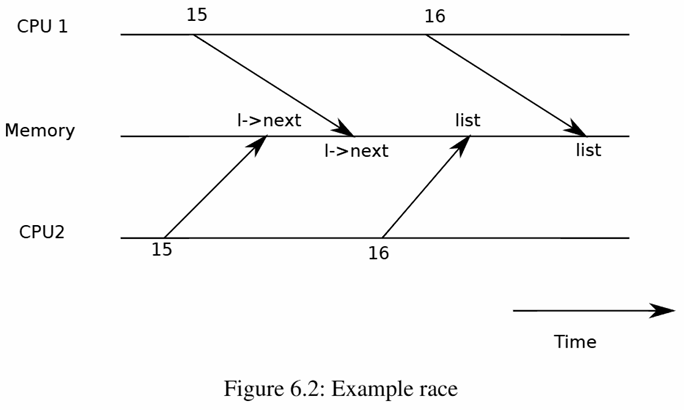
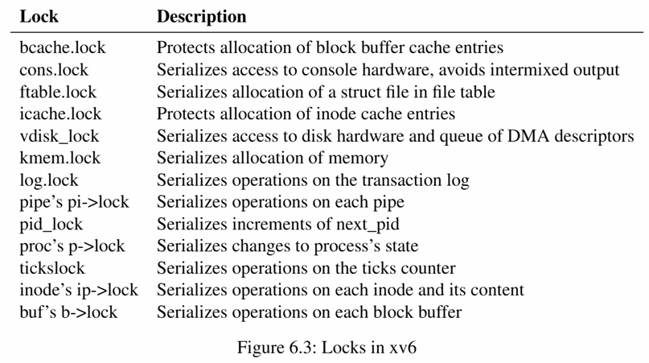

# Locking

**并发**一词指的是由于多处理器并行、线程切换或中断而导致多个指令流交错的情况。内核中充满了并发访问的数据，它可以通过并行性提高性能，并增加响应性。但相应的，需要设计在并发下保持正确性的策略，以及支持它们的抽象，这被称为 *concurrency control* 技术。

**lock**就是其中一种广泛使用的技术。锁可以确保一次只有一个CPU可以持有，为每个共享数据项关联一个锁，即可使得数据项一次只能被一个CPU使用。锁的缺点在于降低性能，因为它们将并发操作串行化了。

---

## Race conditions

## 竞态条件

> *race condition* 是指内存位置被并发访问过，并且至少有一次访问是写操作的情况。

竞态通常会导致错误，它的结果取决于所涉及的CPU的确切时间安排以及内存系统如何排序它们的内存操作，这使得由它引起的错误难以重现和调试。常用的解决方案就是使用锁，确保互斥，从而使得一次只有一个CPU可以执行相关的敏感代码行。举例来说：

```c
struct element {
  int data;
  struct element *next;
};

struct element *list = 0;
struct lock listlock;


void
push (int data)
{
  struct element *l;

  l = malloc(sizeof *l);
  l->data = data;

  acquire(&listlock);
  l->next = list;
  list = l;
  release(&listlock);
}
```

这段代码如果在没有`lock`的情况下，两个CPU同时执行`push`，就可能出现错误：



把`acquire`与`release`之间的指令序列称为**critical section**，锁在这里用来保护`list`。

可以将锁视为并发的 critical section 的序列化，使它们一次只运行一个；也可以将受到同一锁保护的临界区视为彼此 **atomic** 的，它们只能看到之前临界区的完整更改，而看不到那些部分完成的更新。

但锁会限制性能，例如两个进程同时调用`kfree`，锁将串行化这两个调用。内核设计中的挑战之一就是避免锁争用，复杂的内核会专门通过数据结构和算法避免锁争用。锁的位置对性能也很重要，以上面的代码为例，如果把`acquire`提前到`malloc`，虽然可行，但会降低性能，因为对`malloc`的调用也会被串行化。

---

## Code：Locks

`xv6`有两种类型的锁，`spinlock`和`sleep-lock`，表示为结构体。我们从自旋锁开始：

```c
// Mutual exclusion lock.
struct spinlock {
  uint locked;       // Is the lock held?

  // For debugging:
  char *name;        // Name of lock.
  struct cpu *cpu;   // The cpu holding the lock.
};
```

`locked`表示该锁是否可用，可用时为`0`。从逻辑上理解或许可以采用类似下面的代码来获取锁：

```c
void
acquire(struct spinlock *lk)  // does not work!
{
  for(;;) {
    if(lk->locked == 0) {
      lk->locked = 1;
      break;
    }
  }
}
```

不过这个实现在多处理器上无法保证互斥，可能两个CPU同时到达`if`语句，并均获取并持有锁。因此，我们需要使`if(lk->locked == 0)`和`lk->locked = 1`作为一个`atomic`的步骤执行。

多核处理器通常会提供这两句的`atomic`版本的指令，在 RISCV 中，这个指令是`amoswap r, a`。指令读取内存地址`a`处的值，将寄存器`r`的内容写入该地址，并将读取的值放入`r`，即它会交换寄存器和内存地址的值。

`xv6`的`acquire`使用了C标准库的原子操作函数`__sync_lock_test_and_set`，用于实现`atomic swap`操作，它对应的RISCV汇编指令即是`amoswap`，返回值是`lk->locked`的旧内容。

```c
// Acquire the lock.
// Loops (spins) until the lock is acquired.
void
acquire(struct spinlock *lk)
{
  push_off(); // disable interrupts to avoid deadlock.
  if(holding(lk))
    panic("acquire");

  // On RISC-V, sync_lock_test_and_set turns into an atomic swap:
  //   a5 = 1
  //   s1 = &lk->locked
  //   amoswap.w.aq a5, a5, (s1)
  while(__sync_lock_test_and_set(&lk->locked, 1) != 0)
    ;

  // Tell the C compiler and the processor to not move loads or stores
  // past this point, to ensure that the critical section's memory
  // references happen strictly after the lock is acquired.
  // On RISC-V, this emits a fence instruction.
  __sync_synchronize();

  // Record info about lock acquisition for holding() and debugging.
  lk->cpu = mycpu();
}
```

`acquire`在这个循环中不断重试（自旋），直到获取锁。每次都会将`1`交换到`lk->locked`中，并检查旧值，如果是`0`，则表示已经成功获取；如果是`1`，那么其他CPU持有锁，原子地将`1`交换到`lk->locked`中并没有改变它的值。

一旦锁被获取，`acquire`会记录获取锁的CPU，`lk->cpu`字段受锁保护，只有在持有锁时才能更改。

函数`release`则与`acquire`相反，它清除`lk->cpu`字段，然后释放锁。

```c
// Release the lock.
void
release(struct spinlock *lk)
{
  if(!holding(lk))
    panic("release");

  lk->cpu = 0;

  // Tell the C compiler and the CPU to not move loads or stores
  // past this point, to ensure that all the stores in the critical
  // section are visible to other CPUs before the lock is released,
  // and that loads in the critical section occur strictly before
  // the lock is released.
  // On RISC-V, this emits a fence instruction.
  __sync_synchronize();

  // Release the lock, equivalent to lk->locked = 0.
  // This code doesn't use a C assignment, since the C standard
  // implies that an assignment might be implemented with
  // multiple store instructions.
  // On RISC-V, sync_lock_release turns into an atomic swap:
  //   s1 = &lk->locked
  //   amoswap.w zero, zero, (s1)
  __sync_lock_release(&lk->locked);

  pop_off();
}
```

但我们不能直接复制`lk->locked`。在C标准中，编译器允许使用多个存储指令来实现赋值，因此它们在并发代码中不一定是原子的。这里使用了C库函数`__sync_lock_release`来执行原子赋值，这个函数也会被编译为`amoswap`指令。

---

## Code：Using locks

使用锁的关键在于决定使用多少锁以及每个锁应该保护哪些数据和不变性。有几个基本原则：

- 如果任何时候一个变量可以被一个CPU写入，同时另一个CPU可以读取或写入它，就应该使用锁来防止这两个操作重叠。

- 锁保护的是不变性。如果一个不变性涉及多个内存位置，通常这些位置都需要由单个锁进行保护。

- 不要过度加锁，因为锁会降低并行性。

作为**coarse-grained locking**的一个例子，`kalloc.c`分配器有一个由单个锁保护的单一空闲列表。如果不同CPU上的多个进程同时尝试分配页面，每个进程都必须在`acquire`中自旋等待其轮次。而如果锁的争用浪费了大量CPU时间，可以修改分配器设计以拥有多个空闲列表，每个列表都有自己的锁，从而允许并行分配来提高性能。

作为**fine-grained locking**的一个例子，`xv6`为每个文件都有一个单独的锁。因此操作不同文件的进程通常可以继续执行，而无需等待彼此的锁。

总之，锁粒度的决策需要由性能和复杂性考虑两方面来驱动。下图列出了`xv6`中的所有锁。



---

## Deadlock and lock ordering

## 死锁和锁顺序

如果内核中的代码路径必须同时持有多个锁，那么所有代码路径以相同的顺序获取这些锁是非常重要的。如果不这样就有可能发生死锁。

假设`xv6`中有两个代码路径需要锁 A 和 B ，路径1以先 A 后 B 的顺序获取锁，路径2则相反。假设线程 T1 执行代码路径1并获取锁 A ，T2 执行代码路径2并获取锁 B。接下来，T1 将尝试获取 B，而 T2 将尝试获取 A 。这两个操作都会无限期阻塞。因此为了避免这种死锁，所有代码路径必须以相同的路径获取锁。而这个对全局的锁的获取顺序的需求意味着锁实际上也是函数规范的一部分。

`xv6`有许多长度为2的锁顺序链，这是由于`sleep`的工作方式（第七章）。

例如`consoleintr`是处理键入字符的中断例程。当换行符到达时，任何等待控制台输入的进程都应该被唤醒。为此，`consoleintr`在调用`wakeup`时持有`cons.lock`，而`wakeup`会获取等待进程的锁以唤醒它。因此，**the global deadlock-avoiding lock order**就包含了一条规则：必须在获取任何进程锁之前获取`cons.lock`。

```c
void
consoleintr(int c)
{
  acquire(&cons.lock);

  switch(c){
  case C('P'):  // Print process list.
    procdump();
    break;
  case C('U'):  // Kill line.
    while(cons.e != cons.w &&
          cons.buf[(cons.e-1) % INPUT_BUF_SIZE] != '\n'){
      cons.e--;
      consputc(BACKSPACE);
    }
    break;
  case C('H'): // Backspace
  case '\x7f': // Delete key
    if(cons.e != cons.w){
      cons.e--;
      consputc(BACKSPACE);
    }
    break;
  default:
    if(c != 0 && cons.e-cons.r < INPUT_BUF_SIZE){
      c = (c == '\r') ? '\n' : c;

      // echo back to the user.
      consputc(c);

      // store for consumption by consoleread().
      cons.buf[cons.e++ % INPUT_BUF_SIZE] = c;

      if(c == '\n' || c == C('D') || cons.e-cons.r == INPUT_BUF_SIZE){
        // wake up consoleread() if a whole line (or end-of-file)
        // has arrived.
        cons.w = cons.e;
        wakeup(&cons.r);
      }
    }
    break;
  }
  
  release(&cons.lock);
}
```

文件系统代码包含`xv6`中最长的锁链。例如，创建一个文件需要同时持有目录的锁、新文件的`inode`的锁、磁盘块缓冲区的锁、磁盘驱动器的`vdisk_lock`以及调用进程的`p->lock`。为了避免死锁，文件系统代码总是按照这个顺序获取锁。

但有时候锁的顺序可能会与程序的逻辑结构相冲突。例如，代码模块 M1 调用模块 M2，但锁的顺序要求 M2 中的锁在 M1 中的锁之前获取。有时锁的身份事先未知，可能必须持有某个锁才能发现下一个要获取的锁的身份。这种情况在文件系统查找路径名中的连续组件时会出现，在等待和退出代码中搜索进程表以查找子进程时也会出现。

死锁的危险性限制了锁方案的细粒度。更多的锁往往意味着更多的死锁可能。

---

## Locks and interrupt handlers

## 锁和中断处理程序

一些`xv6`自旋锁保护了由线程和中断处理程序共同使用的数据。例如，`clockintr`定时器中断处理程序递增`ticks`的时候，可能正好内核线程`sys_sleep`在读取`ticks`是时间。`tickslock`序列化这两个访问。

但自旋锁与中断的交互也带来了潜在危险。假设`sys_sleep`持有`tickslock`，且它的CPU被一个定时器中断打断，`clockintr`会尝试获取`tickslock`。这种情况下CPU又将陷入死锁。

为了防止这种情况，如果自旋锁会被中断处理程序使用，CPU在持有该锁时必须禁用中断。在`xv6`中更简化，当CPU获取任何锁时，总是禁用该CPU上的中断。

重新启用中断时，`xv6`需要进行一些记录工作来正确处理嵌套临界区（nested critical sections）的情况。`acquire`调用`push_off`函数，它禁用中断并增加增加当前CPU上的锁嵌套级别；`release`调用`pop_off`函数，减少锁的嵌套计数。当计数达到`0`时，`pop_off`会恢复最外层临界区开始时存在的中断启用状态。`intr_off`和`intr_on`分别执行RISC-V指令来禁用和启用中断。

> 在多线程或多进程的系统中，临界区是指一段代码，在同一时间只能有一个线程或进程进入执行。即前面`acquire`与`release`之间的代码。当临界区嵌套时，即一个临界区内部又包含另一个临界区，系统需要特殊处理以确保中断的正确启用和禁用。

`acquire`在设置`lk->locked`之前必须严格调用`push_off`。如果二者顺序颠倒，将有一个时间窗口，锁被持有且中断被启用，存在导致死锁的可能性。同样，`release`必须在释放锁之后才能调用`pop_off`。

---

## Instruction and memory ordering

## 指令和内存排序

许多编译器和CPU为提高性能，会乱序地执行代码。这很容易导致多处理器上的不正确行为。CPU的排序规则被称为**memory model**。

例如，这段用于`push`的代码中，如果编译器或CPU将第四行的存储操作移动到第六行的释放操作之后，将导致在一段时间中，另一个CPU可以获取锁并观察到更新后的列表，但它会看到一个未初始化的`list->next`。

```c
l = malloc(sizeof *l);
l->data = data;
acquire(&listlock);
l->next = list;
list = l;
release(&listlock);
```

为了告诉硬件和编译器不要执行这种重新排序，`xv6`在`acquire`和`release`中均使用`__sync_synchronize()`。这是一个内存屏障，它告诉编译器和CPU不要在屏障前后重新排序加载或存储操作。

---

## Sleep locks

## 睡眠锁

有时`xv6`需要长时间持有锁，比如文件系统读取和写入磁盘上的文件内容时需要保持文件锁定，这些磁盘操作可能需要几十毫秒。如果另一个进程想要获取这个锁，持有自旋锁这么长时间会有些浪费，因为获取锁的进程会自旋并浪费CPU。自旋锁的另一个缺点是，进程在持有自旋锁时无法释放CPU。而我们希望持有锁的进程在等待磁盘时，其他进程可以使用CPU。

基于以上，我们需要一种在等待获取锁时释放CPU。并在持有锁时允许释放CPU（和中断）的锁类型。这种锁就是`sleeplock`。

```c
// Long-term locks for processes
struct sleeplock {
  uint locked;       // Is the lock held?
  struct spinlock lk; // spinlock protecting this sleep lock
  
  // For debugging:
  char *name;        // Name of lock.
  int pid;           // Process holding lock
};


```

`acquiresleep`在等待时让出CPU，使用的技术在第七章解释。睡眠锁有一个由自旋锁保护的`locked`字段，`acquiresleep`调用`sleep`原子地让出CPU并释放自旋锁。这样在它等待时，其他线程就可以执行了。

```c
void
acquiresleep(struct sleeplock *lk)
{
  acquire(&lk->lk);
  while (lk->locked) {
    sleep(lk, &lk->lk);
  }
  lk->locked = 1;
  lk->pid = myproc()->pid;
  release(&lk->lk);
}
```

睡眠锁因为不会禁用中断，所以它不能在中断处理程序中使用，它也不能在自旋锁的临界区使用。

自旋锁适用于短临界区，而睡眠锁适用于长时间的操作。

---

## Real world

大多数操作系统支持 **POSIX** 线程（Pthreads），它允许用户进程在不同的CPU上并发运行多个线程。Pthreads 支持用户级锁、屏障等。也有很多操作系统使用无锁数据结构和算法等。


