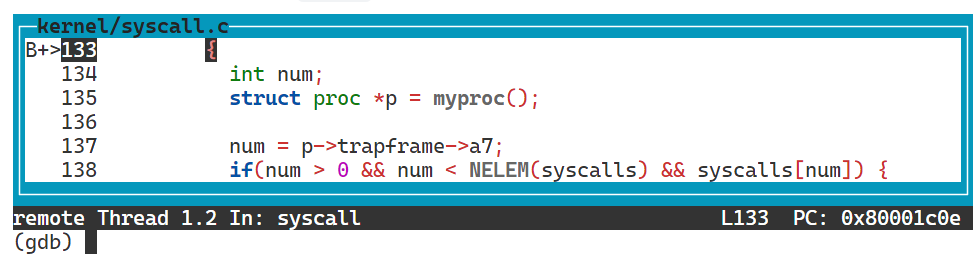
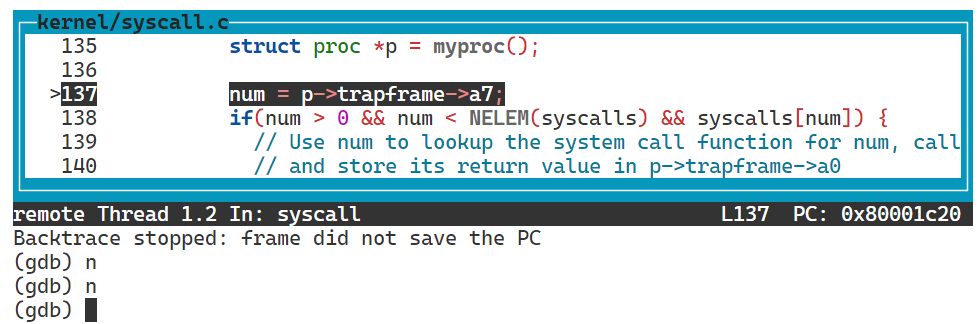
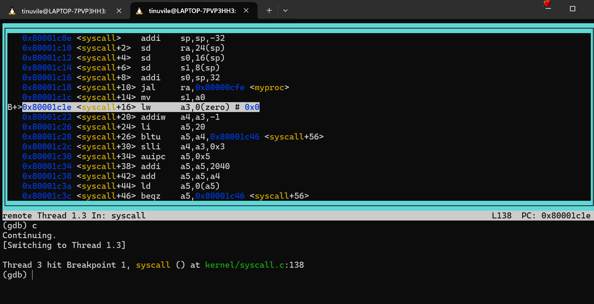
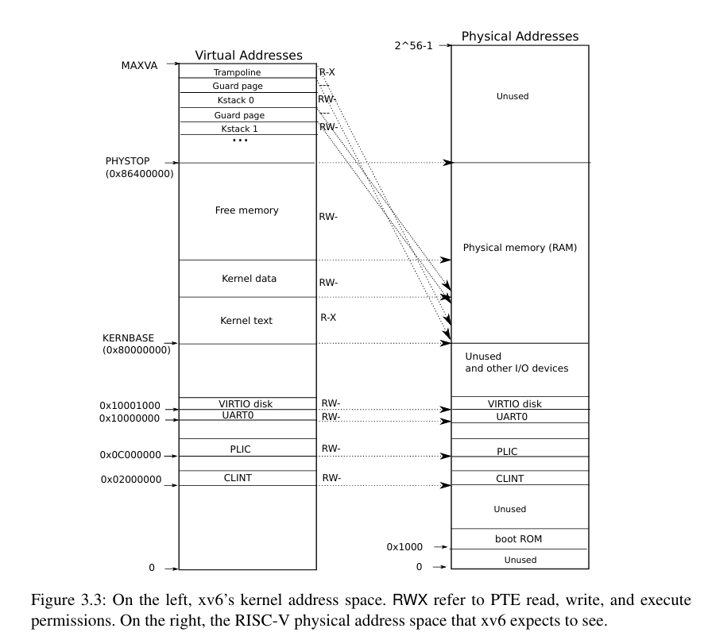

## Prepare work

### 4.3 Code: Calling system calls

在`user/initcode.S`中，用户代码将`exec`的参数放入寄存器`a0`和`a1`中，并将系统调用数放进`a7`；

```asm6502
# exec(init, argv)
.globl start
start:
        la a0, init
        la a1, argv
        li a7, SYS_exec
        ecall
```

然后系统调用数将与`kernel/syscall.c`中的函数指针表匹配；

```c
// An array mapping syscall numbers from syscall.h
// to the function that handles the system call.
static uint64 (*syscalls[])(void) = {
[SYS_fork]    sys_fork,
[SYS_exit]    sys_exit,
[SYS_wait]    sys_wait,
[SYS_pipe]    sys_pipe,
[SYS_read]    sys_read,
[SYS_kill]    sys_kill,
[SYS_exec]    sys_exec,
[SYS_fstat]   sys_fstat,
[SYS_chdir]   sys_chdir,
[SYS_dup]     sys_dup,
[SYS_getpid]  sys_getpid,
[SYS_sbrk]    sys_sbrk,
[SYS_sleep]   sys_sleep,
[SYS_uptime]  sys_uptime,
[SYS_open]    sys_open,
[SYS_write]   sys_write,
[SYS_mknod]   sys_mknod,
[SYS_unlink]  sys_unlink,
[SYS_link]    sys_link,
[SYS_mkdir]   sys_mkdir,
[SYS_close]   sys_close,
};
```

`syscall`从保存在`trapframe`中的`a7`中检索系统调用数，并用它来索引`syscalls`；

```c
void
syscall(void)
{
  int num;
  struct proc *p = myproc();

  num = p->trapframe->a7;
  if(num > 0 && num < NELEM(syscalls) && syscalls[num]) {
    // Use num to lookup the system call function for num, call it,
    // and store its return value in p->trapframe->a0
    p->trapframe->a0 = syscalls[num]();
  } else {
    printf("%d %s: unknown sys call %d\n",
            p->pid, p->name, num);
    p->trapframe->a0 = -1;
  }
}
```

而对于上面的系统调用，`a7`包含的系统调用对应在`syscall.h`中：

```c
// System call numbers
#define SYS_fork    1
#define SYS_exit    2
#define SYS_wait    3
#define SYS_pipe    4
#define SYS_read    5
#define SYS_kill    6
#define SYS_exec    7
#define SYS_fstat   8
#define SYS_chdir   9
#define SYS_dup    10
#define SYS_getpid 11
#define SYS_sbrk   12
#define SYS_sleep  13
#define SYS_uptime 14
#define SYS_open   15
#define SYS_write  16
#define SYS_mknod  17
#define SYS_unlink 18
#define SYS_link   19
#define SYS_mkdir  20
#define SYS_close  21
```

当系统调用实现函数并返回时，`syscall`将返回值记录在`p->trapframe->a0`中，原始用户空间调用`exec`即返回此值。通常返回负数表示错误，返回零或正数表示成功，若系统调用号无效则`syscall`会打印错误并返回`-1`。

### 4.4 Code: System call arguments

用户代码与内核中系统调用直接传递参数可以通过寄存器，`argint`、`argaddr`都从中检索第`n`个系统调用，它们调用`argraw`来读取寄存器。

```c
static uint64
argraw(int n)
{
  struct proc *p = myproc();
  switch (n) {
  case 0:
    return p->trapframe->a0;
  case 1:
    return p->trapframe->a1;
  case 2:
    return p->trapframe->a2;
  case 3:
    return p->trapframe->a3;
  case 4:
    return p->trapframe->a4;
  case 5:
    return p->trapframe->a5;
  }
  panic("argraw");
  return -1;
}

// Fetch the nth 32-bit system call argument.
void
argint(int n, int *ip)
{
  *ip = argraw(n);
}

// Retrieve an argument as a pointer.
// Doesn't check for legality, since
// copyin/copyout will do that.
void
argaddr(int n, uint64 *ip)
{
  *ip = argraw(n);
}
```

但一些系统调用需要讲指针作为参数传递，例如`exec`系统调用向内核传递了一个指向用户空间中字符串参数的指针数组。内核实现了安全的在用户提供的地址间传递数据的功能，例如`fetchstr`，文件系统调用使用`fetchstr`从用户空间检索字符串文件名参数，然后调用`copyinstr`进行后面的具体处理

```c
// Fetch the nul-terminated string at addr from the current process.
// Returns length of string, not including nul, or -1 for error.
int
fetchstr(uint64 addr, char *buf, int max)
{
  struct proc *p = myproc();
  if(copyinstr(p->pagetable, buf, addr, max) < 0)
    return -1;
  return strlen(buf);
}
```

`copyinstr`从`pagetable`中的虚拟地址`srcva`复制最多`max`字节到`dst`，它调用`walkaddr`在软件中遍历页表，以确定`srcva`的物理地址`pa0`。由于内核将所有物理RAM的地址映射到相同的内核虚拟地址，`copyinstr`可以直接将字符串字节从`pa0`复制到`dst`，`walkaddr`检查用户提供的虚拟地址是否属于进程的用户地址空间。`copyout`则用于将数据从内核复制到用户提供的地址。

```c
// Copy a null-terminated string from user to kernel.
// Copy bytes to dst from virtual address srcva in a given page table,
// until a '\0', or max.
// Return 0 on success, -1 on error.
int
copyinstr(pagetable_t pagetable, char *dst, uint64 srcva, uint64 max)
{
  uint64 n, va0, pa0;
  int got_null = 0;

  while(got_null == 0 && max > 0){
    va0 = PGROUNDDOWN(srcva);
    pa0 = walkaddr(pagetable, va0);
    if(pa0 == 0)
      return -1;
    n = PGSIZE - (srcva - va0);
    if(n > max)
      n = max;

    char *p = (char *) (pa0 + (srcva - va0));
    while(n > 0){
      if(*p == '\0'){
        *dst = '\0';
        got_null = 1;
        break;
      } else {
        *dst = *p;
      }
      --n;
      --max;
      p++;
      dst++;
    }

    srcva = va0 + PGSIZE;
  }
  if(got_null){
    return 0;
  } else {
    return -1;
  }
}
```

### 相关源文件

- The user-space "`stubs`" that route system calls into the kernel are in `user/usys.S`, which is generated by `user/usys.pl` when you run make. Declarations are in `user/user.h`
  用户空间的“存根”将系统调用路由到内核中，这些存根位于 `user/usys.S` ，当你运行 `make` 时由 `user/usys.pl` 生成。声明位于 `user/user.h` 。
- The kernel-space code that routes a system call to the kernel function that implements it is in `kernel/syscall.c` and `kernel/syscall.h`. 
  将系统调用路由到实现它的内核函数的内核空间代码位于 `kernel/syscall.c` 和 `kernel/syscall.h` 。
- Process-related code is `kernel/proc.h` and `kernel/proc.c`. 
  进程相关的代码是 `kernel/proc.h` 和 `kernel/proc.c` 。

### 切换分支

```bash
tinuvile@LAPTOP-7PVP3HH3:~/xv6-labs-2024$ git fetch
tinuvile@LAPTOP-7PVP3HH3:~/xv6-labs-2024$ git checkout syscall
M       Makefile
Branch 'syscall' set up to track remote branch 'syscall' from 'origin'.
Switched to a new branch 'syscall'
tinuvile@LAPTOP-7PVP3HH3:~/xv6-labs-2024$ make clean
rm -rf *.tex *.dvi *.idx *.aux *.log *.ind *.ilg *.dSYM *.zip *.pcap \
*/*.o */*.d */*.asm */*.sym \
user/initcode user/initcode.out user/usys.S user/_* \
kernel/kernel \
mkfs/mkfs fs.img .gdbinit __pycache__ xv6.out* \
ph barrier
```

## 开始实验

### Using gdb ([easy](https://pdos.csail.mit.edu/6.S081/2024/labs/guidance.html))

这个实验是学习`GDB`调试器的使用。运行前别忘了安装**RISC-V**架构的**GDB**调试工具：

```bash
sudo apt install gdb-multiarch
```

在一个窗口中运行：

```bash
tinuvile@LAPTOP-7PVP3HH3:~/xv6-labs-2024$ make qemu-gdb
riscv64-unknown-elf-gcc    -c -o kernel/entry.o kernel/entry.S
riscv64-unknown-elf-gcc -Wall -Werror -O -fno-omit-frame-pointer -ggdb -gdwarf-2 -DSOL_SYSCALL -DLAB_SYSCALL -MD -mcmodel=medany -fno-common -nostdlib -fno-builtin-strncpy -fno-builtin-strncmp -fno-builtin-strlen -fno-builtin-memset -fno-builtin-memmove -fno-builtin-memcmp -fno-builtin-log -fno-builtin-bzero -fno-builtin-strchr -fno-builtin-exit -fno-builtin-malloc -fno-builtin-putc -fno-builtin-free -fno-builtin-memcpy -Wno-main -fno-builtin-printf -fno-builtin-fprintf -fno-builtin-vprintf -I. -fno-stack-protector -fno-pie -no-pie  -c -o kernel/kalloc.o kernel/kalloc.c
riscv64-unknown-elf-gcc -Wall -Werror -O -fno-omit-frame-pointer -ggdb -gdwarf-2 -DSOL_SYSCALL -DLAB_SYSCALL -MD -mcmodel=medany -fno-common -nostdlib -fno-builtin-strncpy -fno-builtin-strncmp -fno-builtin-strlen -fno-builtin-memset -fno-builtin-memmove -fno-builtin-memcmp -fno-builtin-log -fno-builtin-bzero -fno-builtin-strchr -fno-builtin-exit -fno-builtin-malloc -fno-builtin-putc -fno-builtin-free -fno-builtin-memcpy -Wno-main -fno-builtin-printf -fno-builtin-fprintf -fno-builtin-vprintf -I. -fno-stack-protector -fno-pie -no-pie  -c -o kernel/string.o kernel/string.c
riscv64-unknown-elf-gcc -Wall -Werror -O -fno-omit-frame-pointer -ggdb -gdwarf-2 -DSOL_SYSCALL -DLAB_SYSCALL -MD -mcmodel=medany -fno-common -nostdlib -fno-builtin-strncpy -fno-builtin-strncmp -fno-builtin-strlen -fno-builtin-memset -fno-builtin-memmove -fno-builtin-memcmp -fno-builtin-log -fno-builtin-bzero -fno-builtin-strchr -fno-builtin-exit -fno-builtin-malloc -fno-builtin-putc -fno-builtin-free -fno-builtin-memcpy -Wno-main -fno-builtin-printf -fno-builtin-fprintf -fno-builtin-vprintf -I. -fno-stack-protector -fno-pie -no-pie  -c -o kernel/main.o kernel/main.c
riscv64-unknown-elf-gcc -Wall -Werror -O -fno-omit-frame-pointer -ggdb -gdwarf-2 -DSOL_SYSCALL -DLAB_SYSCALL -MD -mcmodel=medany -fno-common -nostdlib -fno-builtin-strncpy -fno-builtin-strncmp -fno-builtin-strlen -fno-builtin-memset -fno-builtin-memmove -fno-builtin-memcmp -fno-builtin-log -fno-builtin-bzero -fno-builtin-strchr -fno-builtin-exit -fno-builtin-malloc -fno-builtin-putc -fno-builtin-free -fno-builtin-memcpy -Wno-main -fno-builtin-printf -fno-builtin-fprintf -fno-builtin-vprintf -I. -fno-stack-protector -fno-pie -no-pie  -c -o kernel/vm.o kernel/vm.c
riscv64-unknown-elf-gcc -Wall -Werror -O -fno-omit-frame-pointer -ggdb -gdwarf-2 -DSOL_SYSCALL -DLAB_SYSCALL -MD -mcmodel=medany -fno-common -nostdlib -fno-builtin-strncpy -fno-builtin-strncmp -fno-builtin-strlen -fno-builtin-memset -fno-builtin-memmove -fno-builtin-memcmp -fno-builtin-log -fno-builtin-bzero -fno-builtin-strchr -fno-builtin-exit -fno-builtin-malloc -fno-builtin-putc -fno-builtin-free -fno-builtin-memcpy -Wno-main -fno-builtin-printf -fno-builtin-fprintf -fno-builtin-vprintf -I. -fno-stack-protector -fno-pie -no-pie  -c -o kernel/proc.o kernel/proc.c
riscv64-unknown-elf-gcc    -c -o kernel/swtch.o kernel/swtch.S
riscv64-unknown-elf-gcc    -c -o kernel/trampoline.o kernel/trampoline.S        
riscv64-unknown-elf-gcc -Wall -Werror -O -fno-omit-frame-pointer -ggdb -gdwarf-2 -DSOL_SYSCALL -DLAB_SYSCALL -MD -mcmodel=medany -fno-common -nostdlib -fno-builtin-strncpy -fno-builtin-strncmp -fno-builtin-strlen -fno-builtin-memset -fno-builtin-memmove -fno-builtin-memcmp -fno-builtin-log -fno-builtin-bzero -fno-builtin-strchr -fno-builtin-exit -fno-builtin-malloc -fno-builtin-putc -fno-builtin-free -fno-builtin-memcpy -Wno-main -fno-builtin-printf -fno-builtin-fprintf -fno-builtin-vprintf -I. -fno-stack-protector -fno-pie -no-pie  -c -o kernel/trap.o kernel/trap.c
riscv64-unknown-elf-gcc -Wall -Werror -O -fno-omit-frame-pointer -ggdb -gdwarf-2 -DSOL_SYSCALL -DLAB_SYSCALL -MD -mcmodel=medany -fno-common -nostdlib -fno-builtin-strncpy -fno-builtin-strncmp -fno-builtin-strlen -fno-builtin-memset -fno-builtin-memmove -fno-builtin-memcmp -fno-builtin-log -fno-builtin-bzero -fno-builtin-strchr -fno-builtin-exit -fno-builtin-malloc -fno-builtin-putc -fno-builtin-free -fno-builtin-memcpy -Wno-main -fno-builtin-printf -fno-builtin-fprintf -fno-builtin-vprintf -I. -fno-stack-protector -fno-pie -no-pie  -c -o kernel/syscall.o kernel/syscall.c
riscv64-unknown-elf-gcc -Wall -Werror -O -fno-omit-frame-pointer -ggdb -gdwarf-2 -DSOL_SYSCALL -DLAB_SYSCALL -MD -mcmodel=medany -fno-common -nostdlib -fno-builtin-strncpy -fno-builtin-strncmp -fno-builtin-strlen -fno-builtin-memset -fno-builtin-memmove -fno-builtin-memcmp -fno-builtin-log -fno-builtin-bzero -fno-builtin-strchr -fno-builtin-exit -fno-builtin-malloc -fno-builtin-putc -fno-builtin-free -fno-builtin-memcpy -Wno-main -fno-builtin-printf -fno-builtin-fprintf -fno-builtin-vprintf -I. -fno-stack-protector -fno-pie -no-pie  -c -o kernel/sysproc.o kernel/sysproc.c
riscv64-unknown-elf-gcc -Wall -Werror -O -fno-omit-frame-pointer -ggdb -gdwarf-2 -DSOL_SYSCALL -DLAB_SYSCALL -MD -mcmodel=medany -fno-common -nostdlib -fno-builtin-strncpy -fno-builtin-strncmp -fno-builtin-strlen -fno-builtin-memset -fno-builtin-memmove -fno-builtin-memcmp -fno-builtin-log -fno-builtin-bzero -fno-builtin-strchr -fno-builtin-exit -fno-builtin-malloc -fno-builtin-putc -fno-builtin-free -fno-builtin-memcpy -Wno-main -fno-builtin-printf -fno-builtin-fprintf -fno-builtin-vprintf -I. -fno-stack-protector -fno-pie -no-pie  -c -o kernel/bio.o kernel/bio.c
riscv64-unknown-elf-gcc -Wall -Werror -O -fno-omit-frame-pointer -ggdb -gdwarf-2 -DSOL_SYSCALL -DLAB_SYSCALL -MD -mcmodel=medany -fno-common -nostdlib -fno-builtin-strncpy -fno-builtin-strncmp -fno-builtin-strlen -fno-builtin-memset -fno-builtin-memmove -fno-builtin-memcmp -fno-builtin-log -fno-builtin-bzero -fno-builtin-strchr -fno-builtin-exit -fno-builtin-malloc -fno-builtin-putc -fno-builtin-free -fno-builtin-memcpy -Wno-main -fno-builtin-printf -fno-builtin-fprintf -fno-builtin-vprintf -I. -fno-stack-protector -fno-pie -no-pie  -c -o kernel/fs.o kernel/fs.c
riscv64-unknown-elf-gcc -Wall -Werror -O -fno-omit-frame-pointer -ggdb -gdwarf-2 -DSOL_SYSCALL -DLAB_SYSCALL -MD -mcmodel=medany -fno-common -nostdlib -fno-builtin-strncpy -fno-builtin-strncmp -fno-builtin-strlen -fno-builtin-memset -fno-builtin-memmove -fno-builtin-memcmp -fno-builtin-log -fno-builtin-bzero -fno-builtin-strchr -fno-builtin-exit -fno-builtin-malloc -fno-builtin-putc -fno-builtin-free -fno-builtin-memcpy -Wno-main -fno-builtin-printf -fno-builtin-fprintf -fno-builtin-vprintf -I. -fno-stack-protector -fno-pie -no-pie  -c -o kernel/log.o kernel/log.c
riscv64-unknown-elf-gcc -Wall -Werror -O -fno-omit-frame-pointer -ggdb -gdwarf-2 -DSOL_SYSCALL -DLAB_SYSCALL -MD -mcmodel=medany -fno-common -nostdlib -fno-builtin-strncpy -fno-builtin-strncmp -fno-builtin-strlen -fno-builtin-memset -fno-builtin-memmove -fno-builtin-memcmp -fno-builtin-log -fno-builtin-bzero -fno-builtin-strchr -fno-builtin-exit -fno-builtin-malloc -fno-builtin-putc -fno-builtin-free -fno-builtin-memcpy -Wno-main -fno-builtin-printf -fno-builtin-fprintf -fno-builtin-vprintf -I. -fno-stack-protector -fno-pie -no-pie  -c -o kernel/sleeplock.o kernel/sleeplock.c
riscv64-unknown-elf-gcc -Wall -Werror -O -fno-omit-frame-pointer -ggdb -gdwarf-2 -DSOL_SYSCALL -DLAB_SYSCALL -MD -mcmodel=medany -fno-common -nostdlib -fno-builtin-strncpy -fno-builtin-strncmp -fno-builtin-strlen -fno-builtin-memset -fno-builtin-memmove -fno-builtin-memcmp -fno-builtin-log -fno-builtin-bzero -fno-builtin-strchr -fno-builtin-exit -fno-builtin-malloc -fno-builtin-putc -fno-builtin-free -fno-builtin-memcpy -Wno-main -fno-builtin-printf -fno-builtin-fprintf -fno-builtin-vprintf -I. -fno-stack-protector -fno-pie -no-pie  -c -o kernel/file.o kernel/file.c
riscv64-unknown-elf-gcc -Wall -Werror -O -fno-omit-frame-pointer -ggdb -gdwarf-2 -DSOL_SYSCALL -DLAB_SYSCALL -MD -mcmodel=medany -fno-common -nostdlib -fno-builtin-strncpy -fno-builtin-strncmp -fno-builtin-strlen -fno-builtin-memset -fno-builtin-memmove -fno-builtin-memcmp -fno-builtin-log -fno-builtin-bzero -fno-builtin-strchr -fno-builtin-exit -fno-builtin-malloc -fno-builtin-putc -fno-builtin-free -fno-builtin-memcpy -Wno-main -fno-builtin-printf -fno-builtin-fprintf -fno-builtin-vprintf -I. -fno-stack-protector -fno-pie -no-pie  -c -o kernel/pipe.o kernel/pipe.c
riscv64-unknown-elf-gcc -Wall -Werror -O -fno-omit-frame-pointer -ggdb -gdwarf-2 -DSOL_SYSCALL -DLAB_SYSCALL -MD -mcmodel=medany -fno-common -nostdlib -fno-builtin-strncpy -fno-builtin-strncmp -fno-builtin-strlen -fno-builtin-memset -fno-builtin-memmove -fno-builtin-memcmp -fno-builtin-log -fno-builtin-bzero -fno-builtin-strchr -fno-builtin-exit -fno-builtin-malloc -fno-builtin-putc -fno-builtin-free -fno-builtin-memcpy -Wno-main -fno-builtin-printf -fno-builtin-fprintf -fno-builtin-vprintf -I. -fno-stack-protector -fno-pie -no-pie  -c -o kernel/exec.o kernel/exec.c
riscv64-unknown-elf-gcc -Wall -Werror -O -fno-omit-frame-pointer -ggdb -gdwarf-2 -DSOL_SYSCALL -DLAB_SYSCALL -MD -mcmodel=medany -fno-common -nostdlib -fno-builtin-strncpy -fno-builtin-strncmp -fno-builtin-strlen -fno-builtin-memset -fno-builtin-memmove -fno-builtin-memcmp -fno-builtin-log -fno-builtin-bzero -fno-builtin-strchr -fno-builtin-exit -fno-builtin-malloc -fno-builtin-putc -fno-builtin-free -fno-builtin-memcpy -Wno-main -fno-builtin-printf -fno-builtin-fprintf -fno-builtin-vprintf -I. -fno-stack-protector -fno-pie -no-pie  -c -o kernel/sysfile.o kernel/sysfile.c
riscv64-unknown-elf-gcc    -c -o kernel/kernelvec.o kernel/kernelvec.S
riscv64-unknown-elf-gcc -Wall -Werror -O -fno-omit-frame-pointer -ggdb -gdwarf-2 -DSOL_SYSCALL -DLAB_SYSCALL -MD -mcmodel=medany -fno-common -nostdlib -fno-builtin-strncpy -fno-builtin-strncmp -fno-builtin-strlen -fno-builtin-memset -fno-builtin-memmove -fno-builtin-memcmp -fno-builtin-log -fno-builtin-bzero -fno-builtin-strchr -fno-builtin-exit -fno-builtin-malloc -fno-builtin-putc -fno-builtin-free -fno-builtin-memcpy -Wno-main -fno-builtin-printf -fno-builtin-fprintf -fno-builtin-vprintf -I. -fno-stack-protector -fno-pie -no-pie  -c -o kernel/plic.o kernel/plic.c
riscv64-unknown-elf-gcc -Wall -Werror -O -fno-omit-frame-pointer -ggdb -gdwarf-2 -DSOL_SYSCALL -DLAB_SYSCALL -MD -mcmodel=medany -fno-common -nostdlib -fno-builtin-strncpy -fno-builtin-strncmp -fno-builtin-strlen -fno-builtin-memset -fno-builtin-memmove -fno-builtin-memcmp -fno-builtin-log -fno-builtin-bzero -fno-builtin-strchr -fno-builtin-exit -fno-builtin-malloc -fno-builtin-putc -fno-builtin-free -fno-builtin-memcpy -Wno-main -fno-builtin-printf -fno-builtin-fprintf -fno-builtin-vprintf -I. -fno-stack-protector -fno-pie -no-pie  -c -o kernel/virtio_disk.o kernel/virtio_disk.c
riscv64-unknown-elf-gcc -Wall -Werror -O -fno-omit-frame-pointer -ggdb -gdwarf-2 -DSOL_SYSCALL -DLAB_SYSCALL -MD -mcmodel=medany -fno-common -nostdlib -fno-builtin-strncpy -fno-builtin-strncmp -fno-builtin-strlen -fno-builtin-memset -fno-builtin-memmove -fno-builtin-memcmp -fno-builtin-log -fno-builtin-bzero -fno-builtin-strchr -fno-builtin-exit -fno-builtin-malloc -fno-builtin-putc -fno-builtin-free -fno-builtin-memcpy -Wno-main -fno-builtin-printf -fno-builtin-fprintf -fno-builtin-vprintf -I. -fno-stack-protector -fno-pie -no-pie  -c -o kernel/start.o kernel/start.c
riscv64-unknown-elf-gcc -Wall -Werror -O -fno-omit-frame-pointer -ggdb -gdwarf-2 -DSOL_SYSCALL -DLAB_SYSCALL -MD -mcmodel=medany -fno-common -nostdlib -fno-builtin-strncpy -fno-builtin-strncmp -fno-builtin-strlen -fno-builtin-memset -fno-builtin-memmove -fno-builtin-memcmp -fno-builtin-log -fno-builtin-bzero -fno-builtin-strchr -fno-builtin-exit -fno-builtin-malloc -fno-builtin-putc -fno-builtin-free -fno-builtin-memcpy -Wno-main -fno-builtin-printf -fno-builtin-fprintf -fno-builtin-vprintf -I. -fno-stack-protector -fno-pie -no-pie  -c -o kernel/console.o kernel/console.c
riscv64-unknown-elf-gcc -Wall -Werror -O -fno-omit-frame-pointer -ggdb -gdwarf-2 -DSOL_SYSCALL -DLAB_SYSCALL -MD -mcmodel=medany -fno-common -nostdlib -fno-builtin-strncpy -fno-builtin-strncmp -fno-builtin-strlen -fno-builtin-memset -fno-builtin-memmove -fno-builtin-memcmp -fno-builtin-log -fno-builtin-bzero -fno-builtin-strchr -fno-builtin-exit -fno-builtin-malloc -fno-builtin-putc -fno-builtin-free -fno-builtin-memcpy -Wno-main -fno-builtin-printf -fno-builtin-fprintf -fno-builtin-vprintf -I. -fno-stack-protector -fno-pie -no-pie  -c -o kernel/printf.o kernel/printf.c
riscv64-unknown-elf-gcc -Wall -Werror -O -fno-omit-frame-pointer -ggdb -gdwarf-2 -DSOL_SYSCALL -DLAB_SYSCALL -MD -mcmodel=medany -fno-common -nostdlib -fno-builtin-strncpy -fno-builtin-strncmp -fno-builtin-strlen -fno-builtin-memset -fno-builtin-memmove -fno-builtin-memcmp -fno-builtin-log -fno-builtin-bzero -fno-builtin-strchr -fno-builtin-exit -fno-builtin-malloc -fno-builtin-putc -fno-builtin-free -fno-builtin-memcpy -Wno-main -fno-builtin-printf -fno-builtin-fprintf -fno-builtin-vprintf -I. -fno-stack-protector -fno-pie -no-pie  -c -o kernel/uart.o kernel/uart.c
riscv64-unknown-elf-gcc -Wall -Werror -O -fno-omit-frame-pointer -ggdb -gdwarf-2 -DSOL_SYSCALL -DLAB_SYSCALL -MD -mcmodel=medany -fno-common -nostdlib -fno-builtin-strncpy -fno-builtin-strncmp -fno-builtin-strlen -fno-builtin-memset -fno-builtin-memmove -fno-builtin-memcmp -fno-builtin-log -fno-builtin-bzero -fno-builtin-strchr -fno-builtin-exit -fno-builtin-malloc -fno-builtin-putc -fno-builtin-free -fno-builtin-memcpy -Wno-main -fno-builtin-printf -fno-builtin-fprintf -fno-builtin-vprintf -I. -fno-stack-protector -fno-pie -no-pie  -c -o kernel/spinlock.o kernel/spinlock.c
riscv64-unknown-elf-gcc -Wall -Werror -O -fno-omit-frame-pointer -ggdb -gdwarf-2 -DSOL_SYSCALL -DLAB_SYSCALL -MD -mcmodel=medany -fno-common -nostdlib -fno-builtin-strncpy -fno-builtin-strncmp -fno-builtin-strlen -fno-builtin-memset -fno-builtin-memmove -fno-builtin-memcmp -fno-builtin-log -fno-builtin-bzero -fno-builtin-strchr -fno-builtin-exit -fno-builtin-malloc -fno-builtin-putc -fno-builtin-free -fno-builtin-memcpy -Wno-main -fno-builtin-printf -fno-builtin-fprintf -fno-builtin-vprintf -I. -fno-stack-protector -fno-pie -no-pie -march=rv64g -nostdinc -I. -Ikernel -c user/initcode.S -o user/initcode.o
riscv64-unknown-elf-ld -z max-page-size=4096 -N -e start -Ttext 0 -o user/initcode.out user/initcode.o
riscv64-unknown-elf-objcopy -S -O binary user/initcode.out user/initcode        
riscv64-unknown-elf-objdump -S user/initcode.o > user/initcode.asm
riscv64-unknown-elf-ld -z max-page-size=4096 -T kernel/kernel.ld -o kernel/kernel kernel/entry.o kernel/kalloc.o kernel/string.o kernel/main.o kernel/vm.o kernel/proc.o kernel/swtch.o kernel/trampoline.o kernel/trap.o kernel/syscall.o kernel/sysproc.o kernel/bio.o kernel/fs.o kernel/log.o kernel/sleeplock.o kernel/file.o kernel/pipe.o kernel/exec.o kernel/sysfile.o kernel/kernelvec.o kernel/plic.o kernel/virtio_disk.o kernel/start.o kernel/console.o kernel/printf.o kernel/uart.o kernel/spinlock.o
riscv64-unknown-elf-objdump -S kernel/kernel > kernel/kernel.asm
riscv64-unknown-elf-objdump -t kernel/kernel | sed '1,/SYMBOL TABLE/d; s/ .* / /; /^$/d' > kernel/kernel.sym
sed "s/:1234/:26000/" < .gdbinit.tmpl-riscv > .gdbinit
gcc -DSOL_SYSCALL -DLAB_SYSCALL -Werror -Wall -I. -o mkfs/mkfs mkfs/mkfs.c
riscv64-unknown-elf-gcc -Wall -Werror -O -fno-omit-frame-pointer -ggdb -gdwarf-2 -DSOL_SYSCALL -DLAB_SYSCALL -MD -mcmodel=medany -fno-common -nostdlib -fno-builtin-strncpy -fno-builtin-strncmp -fno-builtin-strlen -fno-builtin-memset -fno-builtin-memmove -fno-builtin-memcmp -fno-builtin-log -fno-builtin-bzero -fno-builtin-strchr -fno-builtin-exit -fno-builtin-malloc -fno-builtin-putc -fno-builtin-free -fno-builtin-memcpy -Wno-main -fno-builtin-printf -fno-builtin-fprintf -fno-builtin-vprintf -I. -fno-stack-protector -fno-pie -no-pie   -c -o user/ulib.o user/ulib.c
perl user/usys.pl > user/usys.S
riscv64-unknown-elf-gcc -Wall -Werror -O -fno-omit-frame-pointer -ggdb -gdwarf-2 -DSOL_SYSCALL -DLAB_SYSCALL -MD -mcmodel=medany -fno-common -nostdlib -fno-builtin-strncpy -fno-builtin-strncmp -fno-builtin-strlen -fno-builtin-memset -fno-builtin-memmove -fno-builtin-memcmp -fno-builtin-log -fno-builtin-bzero -fno-builtin-strchr -fno-builtin-exit -fno-builtin-malloc -fno-builtin-putc -fno-builtin-free -fno-builtin-memcpy -Wno-main -fno-builtin-printf -fno-builtin-fprintf -fno-builtin-vprintf -I. -fno-stack-protector -fno-pie -no-pie -c -o user/usys.o user/usys.S
riscv64-unknown-elf-gcc -Wall -Werror -O -fno-omit-frame-pointer -ggdb -gdwarf-2 -DSOL_SYSCALL -DLAB_SYSCALL -MD -mcmodel=medany -fno-common -nostdlib -fno-builtin-strncpy -fno-builtin-strncmp -fno-builtin-strlen -fno-builtin-memset -fno-builtin-memmove -fno-builtin-memcmp -fno-builtin-log -fno-builtin-bzero -fno-builtin-strchr -fno-builtin-exit -fno-builtin-malloc -fno-builtin-putc -fno-builtin-free -fno-builtin-memcpy -Wno-main -fno-builtin-printf -fno-builtin-fprintf -fno-builtin-vprintf -I. -fno-stack-protector -fno-pie -no-pie   -c -o user/printf.o user/printf.c
riscv64-unknown-elf-gcc -Wall -Werror -O -fno-omit-frame-pointer -ggdb -gdwarf-2 -DSOL_SYSCALL -DLAB_SYSCALL -MD -mcmodel=medany -fno-common -nostdlib -fno-builtin-strncpy -fno-builtin-strncmp -fno-builtin-strlen -fno-builtin-memset -fno-builtin-memmove -fno-builtin-memcmp -fno-builtin-log -fno-builtin-bzero -fno-builtin-strchr -fno-builtin-exit -fno-builtin-malloc -fno-builtin-putc -fno-builtin-free -fno-builtin-memcpy -Wno-main -fno-builtin-printf -fno-builtin-fprintf -fno-builtin-vprintf -I. -fno-stack-protector -fno-pie -no-pie   -c -o user/umalloc.o user/umalloc.c
riscv64-unknown-elf-gcc -Wall -Werror -O -fno-omit-frame-pointer -ggdb -gdwarf-2 -DSOL_SYSCALL -DLAB_SYSCALL -MD -mcmodel=medany -fno-common -nostdlib -fno-builtin-strncpy -fno-builtin-strncmp -fno-builtin-strlen -fno-builtin-memset -fno-builtin-memmove -fno-builtin-memcmp -fno-builtin-log -fno-builtin-bzero -fno-builtin-strchr -fno-builtin-exit -fno-builtin-malloc -fno-builtin-putc -fno-builtin-free -fno-builtin-memcpy -Wno-main -fno-builtin-printf -fno-builtin-fprintf -fno-builtin-vprintf -I. -fno-stack-protector -fno-pie -no-pie   -c -o user/cat.o user/cat.c
riscv64-unknown-elf-ld -z max-page-size=4096 -T user/user.ld -o user/_cat user/cat.o user/ulib.o user/usys.o user/printf.o user/umalloc.o
riscv64-unknown-elf-objdump -S user/_cat > user/cat.asm
riscv64-unknown-elf-objdump -t user/_cat | sed '1,/SYMBOL TABLE/d; s/ .* / /; /^$/d' > user/cat.sym
riscv64-unknown-elf-gcc -Wall -Werror -O -fno-omit-frame-pointer -ggdb -gdwarf-2 -DSOL_SYSCALL -DLAB_SYSCALL -MD -mcmodel=medany -fno-common -nostdlib -fno-builtin-strncpy -fno-builtin-strncmp -fno-builtin-strlen -fno-builtin-memset -fno-builtin-memmove -fno-builtin-memcmp -fno-builtin-log -fno-builtin-bzero -fno-builtin-strchr -fno-builtin-exit -fno-builtin-malloc -fno-builtin-putc -fno-builtin-free -fno-builtin-memcpy -Wno-main -fno-builtin-printf -fno-builtin-fprintf -fno-builtin-vprintf -I. -fno-stack-protector -fno-pie -no-pie   -c -o user/echo.o user/echo.c
riscv64-unknown-elf-ld -z max-page-size=4096 -T user/user.ld -o user/_echo user/echo.o user/ulib.o user/usys.o user/printf.o user/umalloc.o
riscv64-unknown-elf-objdump -S user/_echo > user/echo.asm
riscv64-unknown-elf-objdump -t user/_echo | sed '1,/SYMBOL TABLE/d; s/ .* / /; /^$/d' > user/echo.sym
riscv64-unknown-elf-gcc -Wall -Werror -O -fno-omit-frame-pointer -ggdb -gdwarf-2 -DSOL_SYSCALL -DLAB_SYSCALL -MD -mcmodel=medany -fno-common -nostdlib -fno-builtin-strncpy -fno-builtin-strncmp -fno-builtin-strlen -fno-builtin-memset -fno-builtin-memmove -fno-builtin-memcmp -fno-builtin-log -fno-builtin-bzero -fno-builtin-strchr -fno-builtin-exit -fno-builtin-malloc -fno-builtin-putc -fno-builtin-free -fno-builtin-memcpy -Wno-main -fno-builtin-printf -fno-builtin-fprintf -fno-builtin-vprintf -I. -fno-stack-protector -fno-pie -no-pie   -c -o user/forktest.o user/forktest.c
# forktest has less library code linked in - needs to be small
# in order to be able to max out the proc table.
riscv64-unknown-elf-ld -z max-page-size=4096 -N -e main -Ttext 0 -o user/_forktest user/forktest.o user/ulib.o user/usys.o
riscv64-unknown-elf-objdump -S user/_forktest > user/forktest.asm
riscv64-unknown-elf-gcc -Wall -Werror -O -fno-omit-frame-pointer -ggdb -gdwarf-2 -DSOL_SYSCALL -DLAB_SYSCALL -MD -mcmodel=medany -fno-common -nostdlib -fno-builtin-strncpy -fno-builtin-strncmp -fno-builtin-strlen -fno-builtin-memset -fno-builtin-memmove -fno-builtin-memcmp -fno-builtin-log -fno-builtin-bzero -fno-builtin-strchr -fno-builtin-exit -fno-builtin-malloc -fno-builtin-putc -fno-builtin-free -fno-builtin-memcpy -Wno-main -fno-builtin-printf -fno-builtin-fprintf -fno-builtin-vprintf -I. -fno-stack-protector -fno-pie -no-pie   -c -o user/grep.o user/grep.c
riscv64-unknown-elf-ld -z max-page-size=4096 -T user/user.ld -o user/_grep user/grep.o user/ulib.o user/usys.o user/printf.o user/umalloc.o
riscv64-unknown-elf-objdump -S user/_grep > user/grep.asm
riscv64-unknown-elf-objdump -t user/_grep | sed '1,/SYMBOL TABLE/d; s/ .* / /; /^$/d' > user/grep.sym
riscv64-unknown-elf-gcc -Wall -Werror -O -fno-omit-frame-pointer -ggdb -gdwarf-2 -DSOL_SYSCALL -DLAB_SYSCALL -MD -mcmodel=medany -fno-common -nostdlib -fno-builtin-strncpy -fno-builtin-strncmp -fno-builtin-strlen -fno-builtin-memset -fno-builtin-memmove -fno-builtin-memcmp -fno-builtin-log -fno-builtin-bzero -fno-builtin-strchr -fno-builtin-exit -fno-builtin-malloc -fno-builtin-putc -fno-builtin-free -fno-builtin-memcpy -Wno-main -fno-builtin-printf -fno-builtin-fprintf -fno-builtin-vprintf -I. -fno-stack-protector -fno-pie -no-pie   -c -o user/init.o user/init.c
riscv64-unknown-elf-ld -z max-page-size=4096 -T user/user.ld -o user/_init user/init.o user/ulib.o user/usys.o user/printf.o user/umalloc.o
riscv64-unknown-elf-objdump -S user/_init > user/init.asm
riscv64-unknown-elf-objdump -t user/_init | sed '1,/SYMBOL TABLE/d; s/ .* / /; /^$/d' > user/init.sym
riscv64-unknown-elf-gcc -Wall -Werror -O -fno-omit-frame-pointer -ggdb -gdwarf-2 -DSOL_SYSCALL -DLAB_SYSCALL -MD -mcmodel=medany -fno-common -nostdlib -fno-builtin-strncpy -fno-builtin-strncmp -fno-builtin-strlen -fno-builtin-memset -fno-builtin-memmove -fno-builtin-memcmp -fno-builtin-log -fno-builtin-bzero -fno-builtin-strchr -fno-builtin-exit -fno-builtin-malloc -fno-builtin-putc -fno-builtin-free -fno-builtin-memcpy -Wno-main -fno-builtin-printf -fno-builtin-fprintf -fno-builtin-vprintf -I. -fno-stack-protector -fno-pie -no-pie   -c -o user/kill.o user/kill.c
riscv64-unknown-elf-ld -z max-page-size=4096 -T user/user.ld -o user/_kill user/kill.o user/ulib.o user/usys.o user/printf.o user/umalloc.o
riscv64-unknown-elf-objdump -S user/_kill > user/kill.asm
riscv64-unknown-elf-objdump -t user/_kill | sed '1,/SYMBOL TABLE/d; s/ .* / /; /^$/d' > user/kill.sym
riscv64-unknown-elf-gcc -Wall -Werror -O -fno-omit-frame-pointer -ggdb -gdwarf-2 -DSOL_SYSCALL -DLAB_SYSCALL -MD -mcmodel=medany -fno-common -nostdlib -fno-builtin-strncpy -fno-builtin-strncmp -fno-builtin-strlen -fno-builtin-memset -fno-builtin-memmove -fno-builtin-memcmp -fno-builtin-log -fno-builtin-bzero -fno-builtin-strchr -fno-builtin-exit -fno-builtin-malloc -fno-builtin-putc -fno-builtin-free -fno-builtin-memcpy -Wno-main -fno-builtin-printf -fno-builtin-fprintf -fno-builtin-vprintf -I. -fno-stack-protector -fno-pie -no-pie   -c -o user/ln.o user/ln.c
riscv64-unknown-elf-ld -z max-page-size=4096 -T user/user.ld -o user/_ln user/ln.o user/ulib.o user/usys.o user/printf.o user/umalloc.o
riscv64-unknown-elf-objdump -S user/_ln > user/ln.asm
riscv64-unknown-elf-objdump -t user/_ln | sed '1,/SYMBOL TABLE/d; s/ .* / /; /^$/d' > user/ln.sym
riscv64-unknown-elf-gcc -Wall -Werror -O -fno-omit-frame-pointer -ggdb -gdwarf-2 -DSOL_SYSCALL -DLAB_SYSCALL -MD -mcmodel=medany -fno-common -nostdlib -fno-builtin-strncpy -fno-builtin-strncmp -fno-builtin-strlen -fno-builtin-memset -fno-builtin-memmove -fno-builtin-memcmp -fno-builtin-log -fno-builtin-bzero -fno-builtin-strchr -fno-builtin-exit -fno-builtin-malloc -fno-builtin-putc -fno-builtin-free -fno-builtin-memcpy -Wno-main -fno-builtin-printf -fno-builtin-fprintf -fno-builtin-vprintf -I. -fno-stack-protector -fno-pie -no-pie   -c -o user/ls.o user/ls.c
riscv64-unknown-elf-ld -z max-page-size=4096 -T user/user.ld -o user/_ls user/ls.o user/ulib.o user/usys.o user/printf.o user/umalloc.o
riscv64-unknown-elf-objdump -S user/_ls > user/ls.asm
riscv64-unknown-elf-objdump -t user/_ls | sed '1,/SYMBOL TABLE/d; s/ .* / /; /^$/d' > user/ls.sym
riscv64-unknown-elf-gcc -Wall -Werror -O -fno-omit-frame-pointer -ggdb -gdwarf-2 -DSOL_SYSCALL -DLAB_SYSCALL -MD -mcmodel=medany -fno-common -nostdlib -fno-builtin-strncpy -fno-builtin-strncmp -fno-builtin-strlen -fno-builtin-memset -fno-builtin-memmove -fno-builtin-memcmp -fno-builtin-log -fno-builtin-bzero -fno-builtin-strchr -fno-builtin-exit -fno-builtin-malloc -fno-builtin-putc -fno-builtin-free -fno-builtin-memcpy -Wno-main -fno-builtin-printf -fno-builtin-fprintf -fno-builtin-vprintf -I. -fno-stack-protector -fno-pie -no-pie   -c -o user/mkdir.o user/mkdir.c
riscv64-unknown-elf-ld -z max-page-size=4096 -T user/user.ld -o user/_mkdir user/mkdir.o user/ulib.o user/usys.o user/printf.o user/umalloc.o
riscv64-unknown-elf-objdump -S user/_mkdir > user/mkdir.asm
riscv64-unknown-elf-objdump -t user/_mkdir | sed '1,/SYMBOL TABLE/d; s/ .* / /; /^$/d' > user/mkdir.sym
riscv64-unknown-elf-gcc -Wall -Werror -O -fno-omit-frame-pointer -ggdb -gdwarf-2 -DSOL_SYSCALL -DLAB_SYSCALL -MD -mcmodel=medany -fno-common -nostdlib -fno-builtin-strncpy -fno-builtin-strncmp -fno-builtin-strlen -fno-builtin-memset -fno-builtin-memmove -fno-builtin-memcmp -fno-builtin-log -fno-builtin-bzero -fno-builtin-strchr -fno-builtin-exit -fno-builtin-malloc -fno-builtin-putc -fno-builtin-free -fno-builtin-memcpy -Wno-main -fno-builtin-printf -fno-builtin-fprintf -fno-builtin-vprintf -I. -fno-stack-protector -fno-pie -no-pie   -c -o user/rm.o user/rm.c
riscv64-unknown-elf-ld -z max-page-size=4096 -T user/user.ld -o user/_rm user/rm.o user/ulib.o user/usys.o user/printf.o user/umalloc.o
riscv64-unknown-elf-objdump -S user/_rm > user/rm.asm
riscv64-unknown-elf-objdump -t user/_rm | sed '1,/SYMBOL TABLE/d; s/ .* / /; /^$/d' > user/rm.sym
riscv64-unknown-elf-gcc -Wall -Werror -O -fno-omit-frame-pointer -ggdb -gdwarf-2 -DSOL_SYSCALL -DLAB_SYSCALL -MD -mcmodel=medany -fno-common -nostdlib -fno-builtin-strncpy -fno-builtin-strncmp -fno-builtin-strlen -fno-builtin-memset -fno-builtin-memmove -fno-builtin-memcmp -fno-builtin-log -fno-builtin-bzero -fno-builtin-strchr -fno-builtin-exit -fno-builtin-malloc -fno-builtin-putc -fno-builtin-free -fno-builtin-memcpy -Wno-main -fno-builtin-printf -fno-builtin-fprintf -fno-builtin-vprintf -I. -fno-stack-protector -fno-pie -no-pie   -c -o user/sh.o user/sh.c
riscv64-unknown-elf-ld -z max-page-size=4096 -T user/user.ld -o user/_sh user/sh.o user/ulib.o user/usys.o user/printf.o user/umalloc.o
riscv64-unknown-elf-objdump -S user/_sh > user/sh.asm
riscv64-unknown-elf-objdump -t user/_sh | sed '1,/SYMBOL TABLE/d; s/ .* / /; /^$/d' > user/sh.sym
riscv64-unknown-elf-gcc -Wall -Werror -O -fno-omit-frame-pointer -ggdb -gdwarf-2 -DSOL_SYSCALL -DLAB_SYSCALL -MD -mcmodel=medany -fno-common -nostdlib -fno-builtin-strncpy -fno-builtin-strncmp -fno-builtin-strlen -fno-builtin-memset -fno-builtin-memmove -fno-builtin-memcmp -fno-builtin-log -fno-builtin-bzero -fno-builtin-strchr -fno-builtin-exit -fno-builtin-malloc -fno-builtin-putc -fno-builtin-free -fno-builtin-memcpy -Wno-main -fno-builtin-printf -fno-builtin-fprintf -fno-builtin-vprintf -I. -fno-stack-protector -fno-pie -no-pie   -c -o user/stressfs.o user/stressfs.c
riscv64-unknown-elf-ld -z max-page-size=4096 -T user/user.ld -o user/_stressfs user/stressfs.o user/ulib.o user/usys.o user/printf.o user/umalloc.o
riscv64-unknown-elf-objdump -S user/_stressfs > user/stressfs.asm
riscv64-unknown-elf-objdump -t user/_stressfs | sed '1,/SYMBOL TABLE/d; s/ .* / /; /^$/d' > user/stressfs.sym
riscv64-unknown-elf-gcc -Wall -Werror -O -fno-omit-frame-pointer -ggdb -gdwarf-2 -DSOL_SYSCALL -DLAB_SYSCALL -MD -mcmodel=medany -fno-common -nostdlib -fno-builtin-strncpy -fno-builtin-strncmp -fno-builtin-strlen -fno-builtin-memset -fno-builtin-memmove -fno-builtin-memcmp -fno-builtin-log -fno-builtin-bzero -fno-builtin-strchr -fno-builtin-exit -fno-builtin-malloc -fno-builtin-putc -fno-builtin-free -fno-builtin-memcpy -Wno-main -fno-builtin-printf -fno-builtin-fprintf -fno-builtin-vprintf -I. -fno-stack-protector -fno-pie -no-pie   -c -o user/usertests.o user/usertests.c
riscv64-unknown-elf-ld -z max-page-size=4096 -T user/user.ld -o user/_usertests user/usertests.o user/ulib.o user/usys.o user/printf.o user/umalloc.o
riscv64-unknown-elf-objdump -S user/_usertests > user/usertests.asm
riscv64-unknown-elf-objdump -t user/_usertests | sed '1,/SYMBOL TABLE/d; s/ .* / /; /^$/d' > user/usertests.sym
riscv64-unknown-elf-gcc -Wall -Werror -O -fno-omit-frame-pointer -ggdb -gdwarf-2 -DSOL_SYSCALL -DLAB_SYSCALL -MD -mcmodel=medany -fno-common -nostdlib -fno-builtin-strncpy -fno-builtin-strncmp -fno-builtin-strlen -fno-builtin-memset -fno-builtin-memmove -fno-builtin-memcmp -fno-builtin-log -fno-builtin-bzero -fno-builtin-strchr -fno-builtin-exit -fno-builtin-malloc -fno-builtin-putc -fno-builtin-free -fno-builtin-memcpy -Wno-main -fno-builtin-printf -fno-builtin-fprintf -fno-builtin-vprintf -I. -fno-stack-protector -fno-pie -no-pie   -c -o user/grind.o user/grind.c
riscv64-unknown-elf-ld -z max-page-size=4096 -T user/user.ld -o user/_grind user/grind.o user/ulib.o user/usys.o user/printf.o user/umalloc.o
riscv64-unknown-elf-objdump -S user/_grind > user/grind.asm
riscv64-unknown-elf-objdump -t user/_grind | sed '1,/SYMBOL TABLE/d; s/ .* / /; /^$/d' > user/grind.sym
riscv64-unknown-elf-gcc -Wall -Werror -O -fno-omit-frame-pointer -ggdb -gdwarf-2 -DSOL_SYSCALL -DLAB_SYSCALL -MD -mcmodel=medany -fno-common -nostdlib -fno-builtin-strncpy -fno-builtin-strncmp -fno-builtin-strlen -fno-builtin-memset -fno-builtin-memmove -fno-builtin-memcmp -fno-builtin-log -fno-builtin-bzero -fno-builtin-strchr -fno-builtin-exit -fno-builtin-malloc -fno-builtin-putc -fno-builtin-free -fno-builtin-memcpy -Wno-main -fno-builtin-printf -fno-builtin-fprintf -fno-builtin-vprintf -I. -fno-stack-protector -fno-pie -no-pie   -c -o user/wc.o user/wc.c
riscv64-unknown-elf-ld -z max-page-size=4096 -T user/user.ld -o user/_wc user/wc.o user/ulib.o user/usys.o user/printf.o user/umalloc.o
riscv64-unknown-elf-objdump -S user/_wc > user/wc.asm
riscv64-unknown-elf-objdump -t user/_wc | sed '1,/SYMBOL TABLE/d; s/ .* / /; /^$/d' > user/wc.sym
riscv64-unknown-elf-gcc -Wall -Werror -O -fno-omit-frame-pointer -ggdb -gdwarf-2 -DSOL_SYSCALL -DLAB_SYSCALL -MD -mcmodel=medany -fno-common -nostdlib -fno-builtin-strncpy -fno-builtin-strncmp -fno-builtin-strlen -fno-builtin-memset -fno-builtin-memmove -fno-builtin-memcmp -fno-builtin-log -fno-builtin-bzero -fno-builtin-strchr -fno-builtin-exit -fno-builtin-malloc -fno-builtin-putc -fno-builtin-free -fno-builtin-memcpy -Wno-main -fno-builtin-printf -fno-builtin-fprintf -fno-builtin-vprintf -I. -fno-stack-protector -fno-pie -no-pie   -c -o user/zombie.o user/zombie.c
riscv64-unknown-elf-ld -z max-page-size=4096 -T user/user.ld -o user/_zombie user/zombie.o user/ulib.o user/usys.o user/printf.o user/umalloc.o
riscv64-unknown-elf-objdump -S user/_zombie > user/zombie.asm
riscv64-unknown-elf-objdump -t user/_zombie | sed '1,/SYMBOL TABLE/d; s/ .* / /; /^$/d' > user/zombie.sym
riscv64-unknown-elf-gcc -Wall -Werror -O -fno-omit-frame-pointer -ggdb -gdwarf-2 -DSOL_SYSCALL -DLAB_SYSCALL -MD -mcmodel=medany -fno-common -nostdlib -fno-builtin-strncpy -fno-builtin-strncmp -fno-builtin-strlen -fno-builtin-memset -fno-builtin-memmove -fno-builtin-memcmp -fno-builtin-log -fno-builtin-bzero -fno-builtin-strchr -fno-builtin-exit -fno-builtin-malloc -fno-builtin-putc -fno-builtin-free -fno-builtin-memcpy -Wno-main -fno-builtin-printf -fno-builtin-fprintf -fno-builtin-vprintf -I. -fno-stack-protector -fno-pie -no-pie   -c -o user/sleep.o user/sleep.c
riscv64-unknown-elf-ld -z max-page-size=4096 -T user/user.ld -o user/_sleep user/sleep.o user/ulib.o user/usys.o user/printf.o user/umalloc.o
riscv64-unknown-elf-objdump -S user/_sleep > user/sleep.asm
riscv64-unknown-elf-objdump -t user/_sleep | sed '1,/SYMBOL TABLE/d; s/ .* / /; /^$/d' > user/sleep.sym
riscv64-unknown-elf-gcc -Wall -Werror -O -fno-omit-frame-pointer -ggdb -gdwarf-2 -DSOL_SYSCALL -DLAB_SYSCALL -MD -mcmodel=medany -fno-common -nostdlib -fno-builtin-strncpy -fno-builtin-strncmp -fno-builtin-strlen -fno-builtin-memset -fno-builtin-memmove -fno-builtin-memcmp -fno-builtin-log -fno-builtin-bzero -fno-builtin-strchr -fno-builtin-exit -fno-builtin-malloc -fno-builtin-putc -fno-builtin-free -fno-builtin-memcpy -Wno-main -fno-builtin-printf -fno-builtin-fprintf -fno-builtin-vprintf -I. -fno-stack-protector -fno-pie -no-pie   -c -o user/pingpong.o user/pingpong.c
riscv64-unknown-elf-ld -z max-page-size=4096 -T user/user.ld -o user/_pingpong user/pingpong.o user/ulib.o user/usys.o user/printf.o user/umalloc.o
riscv64-unknown-elf-objdump -S user/_pingpong > user/pingpong.asm
riscv64-unknown-elf-objdump -t user/_pingpong | sed '1,/SYMBOL TABLE/d; s/ .* / /; /^$/d' > user/pingpong.sym
riscv64-unknown-elf-gcc -Wall -Werror -O -fno-omit-frame-pointer -ggdb -gdwarf-2 -DSOL_SYSCALL -DLAB_SYSCALL -MD -mcmodel=medany -fno-common -nostdlib -fno-builtin-strncpy -fno-builtin-strncmp -fno-builtin-strlen -fno-builtin-memset -fno-builtin-memmove -fno-builtin-memcmp -fno-builtin-log -fno-builtin-bzero -fno-builtin-strchr -fno-builtin-exit -fno-builtin-malloc -fno-builtin-putc -fno-builtin-free -fno-builtin-memcpy -Wno-main -fno-builtin-printf -fno-builtin-fprintf -fno-builtin-vprintf -I. -fno-stack-protector -fno-pie -no-pie   -c -o user/primes.o user/primes.c
riscv64-unknown-elf-ld -z max-page-size=4096 -T user/user.ld -o user/_primes user/primes.o user/ulib.o user/usys.o user/printf.o user/umalloc.o
riscv64-unknown-elf-objdump -S user/_primes > user/primes.asm
riscv64-unknown-elf-objdump -t user/_primes | sed '1,/SYMBOL TABLE/d; s/ .* / /; /^$/d' > user/primes.sym
riscv64-unknown-elf-gcc -Wall -Werror -O -fno-omit-frame-pointer -ggdb -gdwarf-2 -DSOL_SYSCALL -DLAB_SYSCALL -MD -mcmodel=medany -fno-common -nostdlib -fno-builtin-strncpy -fno-builtin-strncmp -fno-builtin-strlen -fno-builtin-memset -fno-builtin-memmove -fno-builtin-memcmp -fno-builtin-log -fno-builtin-bzero -fno-builtin-strchr -fno-builtin-exit -fno-builtin-malloc -fno-builtin-putc -fno-builtin-free -fno-builtin-memcpy -Wno-main -fno-builtin-printf -fno-builtin-fprintf -fno-builtin-vprintf -I. -fno-stack-protector -fno-pie -no-pie   -c -o user/find.o user/find.c
riscv64-unknown-elf-ld -z max-page-size=4096 -T user/user.ld -o user/_find user/find.o user/ulib.o user/usys.o user/printf.o user/umalloc.o
riscv64-unknown-elf-objdump -S user/_find > user/find.asm
riscv64-unknown-elf-objdump -t user/_find | sed '1,/SYMBOL TABLE/d; s/ .* / /; /^$/d' > user/find.sym
riscv64-unknown-elf-gcc -Wall -Werror -O -fno-omit-frame-pointer -ggdb -gdwarf-2 -DSOL_SYSCALL -DLAB_SYSCALL -MD -mcmodel=medany -fno-common -nostdlib -fno-builtin-strncpy -fno-builtin-strncmp -fno-builtin-strlen -fno-builtin-memset -fno-builtin-memmove -fno-builtin-memcmp -fno-builtin-log -fno-builtin-bzero -fno-builtin-strchr -fno-builtin-exit -fno-builtin-malloc -fno-builtin-putc -fno-builtin-free -fno-builtin-memcpy -Wno-main -fno-builtin-printf -fno-builtin-fprintf -fno-builtin-vprintf -I. -fno-stack-protector -fno-pie -no-pie   -c -o user/xargs.o user/xargs.c
riscv64-unknown-elf-ld -z max-page-size=4096 -T user/user.ld -o user/_xargs user/xargs.o user/ulib.o user/usys.o user/printf.o user/umalloc.o
riscv64-unknown-elf-objdump -S user/_xargs > user/xargs.asm
riscv64-unknown-elf-objdump -t user/_xargs | sed '1,/SYMBOL TABLE/d; s/ .* / /; /^$/d' > user/xargs.sym
riscv64-unknown-elf-gcc -Wall -Werror -O -fno-omit-frame-pointer -ggdb -gdwarf-2 -DSOL_SYSCALL -DLAB_SYSCALL -MD -mcmodel=medany -fno-common -nostdlib -fno-builtin-strncpy -fno-builtin-strncmp -fno-builtin-strlen -fno-builtin-memset -fno-builtin-memmove -fno-builtin-memcmp -fno-builtin-log -fno-builtin-bzero -fno-builtin-strchr -fno-builtin-exit -fno-builtin-malloc -fno-builtin-putc -fno-builtin-free -fno-builtin-memcpy -Wno-main -fno-builtin-printf -fno-builtin-fprintf -fno-builtin-vprintf -I. -fno-stack-protector -fno-pie -no-pie   -c -o user/attack.o user/attack.c
riscv64-unknown-elf-ld -z max-page-size=4096 -T user/user.ld -o user/_attack user/attack.o user/ulib.o user/usys.o user/printf.o user/umalloc.o
riscv64-unknown-elf-objdump -S user/_attack > user/attack.asm
riscv64-unknown-elf-objdump -t user/_attack | sed '1,/SYMBOL TABLE/d; s/ .* / /; /^$/d' > user/attack.sym
riscv64-unknown-elf-gcc -Wall -Werror -O -fno-omit-frame-pointer -ggdb -gdwarf-2 -DSOL_SYSCALL -DLAB_SYSCALL -MD -mcmodel=medany -fno-common -nostdlib -fno-builtin-strncpy -fno-builtin-strncmp -fno-builtin-strlen -fno-builtin-memset -fno-builtin-memmove -fno-builtin-memcmp -fno-builtin-log -fno-builtin-bzero -fno-builtin-strchr -fno-builtin-exit -fno-builtin-malloc -fno-builtin-putc -fno-builtin-free -fno-builtin-memcpy -Wno-main -fno-builtin-printf -fno-builtin-fprintf -fno-builtin-vprintf -I. -fno-stack-protector -fno-pie -no-pie   -c -o user/attacktest.o user/attacktest.c
riscv64-unknown-elf-ld -z max-page-size=4096 -T user/user.ld -o user/_attacktest user/attacktest.o user/ulib.o user/usys.o user/printf.o user/umalloc.o
riscv64-unknown-elf-objdump -S user/_attacktest > user/attacktest.asm
riscv64-unknown-elf-objdump -t user/_attacktest | sed '1,/SYMBOL TABLE/d; s/ .* / /; /^$/d' > user/attacktest.sym
riscv64-unknown-elf-gcc -Wall -Werror -O -fno-omit-frame-pointer -ggdb -gdwarf-2 -DSOL_SYSCALL -DLAB_SYSCALL -MD -mcmodel=medany -fno-common -nostdlib -fno-builtin-strncpy -fno-builtin-strncmp -fno-builtin-strlen -fno-builtin-memset -fno-builtin-memmove -fno-builtin-memcmp -fno-builtin-log -fno-builtin-bzero -fno-builtin-strchr -fno-builtin-exit -fno-builtin-malloc -fno-builtin-putc -fno-builtin-free -fno-builtin-memcpy -Wno-main -fno-builtin-printf -fno-builtin-fprintf -fno-builtin-vprintf -I. -fno-stack-protector -fno-pie -no-pie   -c -o user/secret.o user/secret.c
riscv64-unknown-elf-ld -z max-page-size=4096 -T user/user.ld -o user/_secret user/secret.o user/ulib.o user/usys.o user/printf.o user/umalloc.o
riscv64-unknown-elf-objdump -S user/_secret > user/secret.asm
riscv64-unknown-elf-objdump -t user/_secret | sed '1,/SYMBOL TABLE/d; s/ .* / /; /^$/d' > user/secret.sym
mkfs/mkfs fs.img README  user/_cat user/_echo user/_forktest user/_grep user/_init user/_kill user/_ln user/_ls user/_mkdir user/_rm user/_sh user/_stressfs user/_usertests user/_grind user/_wc user/_zombie user/_sleep user/_pingpong user/_primes user/_find user/_xargs  user/_attack user/_attacktest user/_secret       
nmeta 46 (boot, super, log blocks 30 inode blocks 13, bitmap blocks 1) blocks 1954 total 2000
balloc: first 1051 blocks have been allocated
balloc: write bitmap block at sector 45
*** Now run 'gdb' in another window.
qemu-system-riscv64 -machine virt -bios none -kernel kernel/kernel -m 128M -smp 3 -nographic -global virtio-mmio.force-legacy=false -drive file=fs.img,if=none,format=raw,id=x0 -device virtio-blk-device,drive=x0,bus=virtio-mmio-bus.0 -S -gdb tcp::26000
```

然后在另一个窗口中：

```bash
tinuvile@LAPTOP-7PVP3HH3:~/xv6-labs-2024$ gdb-multiarch -q
warning: File "/home/tinuvile/xv6-labs-2024/.gdbinit" auto-loading has been declined by your `auto-load safe-path' set to "$debugdir:$datadir/auto-load".
To enable execution of this file add
        add-auto-load-safe-path /home/tinuvile/xv6-labs-2024/.gdbinit
line to your configuration file "/home/tinuvile/.gdbinit".
To completely disable this security protection add
        set auto-load safe-path /
line to your configuration file "/home/tinuvile/.gdbinit".
For more information about this security protection see the
"Auto-loading safe path" section in the GDB manual.  E.g., run from the shell:
        info "(gdb)Auto-loading safe path"
(gdb) file kernel/kernel                           # 加载符号表
Reading symbols from kernel/kernel...
(gdb) set architecture riscv:rv64                  # 设置架构
The target architecture is set to "riscv:rv64".
(gdb) target remote :26000                         # 连接 QEMU
Remote debugging using :26000
warning: Architecture rejected target-supplied description
0x0000000000001000 in ?? ()
(gdb) b syscall                                    # 设置断点
Breakpoint 1 at 0x80001c0e: file kernel/syscall.c, line 133.
(gdb) c                                            # 继续执行
Continuing.
[Switching to Thread 1.2]

Thread 2 hit Breakpoint 1, syscall () at kernel/syscall.c:133
133     {
```

输入`layout src`将窗口分为两部分，显示`gdb`在源代码中的位置：



`backtrace`打印堆栈回溯：

```bash
(gdb) backtrace
#0  syscall () at kernel/syscall.c:133
#1  0x00000000800019ca in usertrap () at kernel/trap.c:67
#2  0x0000000000000000 in ?? ()
```

> Looking at the backtrace output, which function called syscall? 
> 查看回溯输出，哪个函数调用了 syscall ？

通过`backtrace`查看栈帧，见上面，调用`syscall`的函数是`usertrap`。

> What is the value of `p->trapframe->a7` and what does that value represent? (Hint: look `user/initcode.S`, the first user program `xv6` starts.) 
> `p->trapframe->a7` 的值是什么，这个值代表什么？（提示：查看 `user/initcode.S` ，`xv6` 启动的第一个用户程序。）

输入几次`n`单步执行到`num = p->trapframe->a7`：



然后输入`p /x *p`打印当前进程的`proc struct`的十六进制值：

```bash
(gdb) p /x *p
$1 = {lock = {locked = 0x0, name = 0x800071c8, cpu = 0x0}, state = 0x4, chan = 0x0, killed = 0x0, xstate = 0x0,
  pid = 0x1, parent = 0x0, kstack = 0x3fffffd000, sz = 0x1000, pagetable = 0x87f55000, trapframe = 0x87f56000,
  context = {ra = 0x80001250, sp = 0x3fffffde80, s0 = 0x3fffffdeb0, s1 = 0x80007d60, s2 = 0x80007930, s3 = 0x1,
    s4 = 0x0, s5 = 0x3, s6 = 0x80018a00, s7 = 0x8, s8 = 0x80018b28, s9 = 0x4, s10 = 0x1, s11 = 0x0}, ofile = {
    0x0 <repeats 16 times>}, cwd = 0x80015e70, name = {0x69, 0x6e, 0x69, 0x74, 0x63, 0x6f, 0x64, 0x65, 0x0, 0x0, 0x0,
    0x0, 0x0, 0x0, 0x0, 0x0}}
```

查看`kernel/proc.h`，以下是一些关键字段的解释：

```c
struct proc {
  // ...
  enum procstate state;        // 0x4（RUNNING：运行状态）
  int pid;                     // 0x1（进程ID）
  uint64 kstack;               // 0x3fffffd000（内核栈虚拟地址）
  uint64 sz;                   // 0x1000（用户内存大小4KB）
  pagetable_t pagetable;       // 0x87f55000（用户页表物理地址）
  struct trapframe *trapframe; // 0x87f56000（陷阱帧物理地址）
  struct context context;      // 上下文切换寄存器组
  char name[16];               // "initcode"（进程名称）
};
```

其中`trapframe`的`a7`字段通过`proc.h`的注释可知偏移量为168字节，那么有：

```textile
a7地址 = trapframe基地址 + 168字节偏移量
          0x87f56000      + 0xA8 (168的十六进制)
         = 0x87f560A8
```

通过命令查看地址的实际值，在`syscall.h`中查找，`0x7`对应`SYS_exec`，符合系统正常工作的情况。

```bash
(gdb) x /xg 0x87f560A8
0x87f560a8:     0x0000000000000007
```

> What was the previous mode that the CPU was in? 
> CPU 之前处于什么模式？

打印特权寄存器，根据**RISC-V**特权架构手册，`sstatus`寄存器中的**SSP**位指示进入监管者模式前CPU处于什么模式。0表示用户模式，1表示监管模式。

```bash
(gdb) p /x $sstatus
$2 = 0x0
```

> Write down the assembly instruction the kernel is panicing at. Which register corresponds to the variable num? 
> 写下内核崩溃时的汇编指令。哪个寄存器对应于变量 num ？

将 syscall 开头的语句 `num = p->trapframe->a7`替换为 `num = * (int *) 0`，然后运行：

```bash
tinuvile@LAPTOP-7PVP3HH3:~/xv6-labs-2024$ make qemu
riscv64-unknown-elf-gcc -Wall -Werror -O -fno-omit-frame-pointer -ggdb -gdwarf-2 -DSOL_SYSCALL -DLAB_SYSCALL -MD -mcmodel=medany -fno-common -nostdlib -fno-builtin-strncpy -fno-builtin-strncmp -fno-builtin-strlen -fno-builtin-memset -fno-builtin-memmove -fno-builtin-memcmp -fno-builtin-log -fno-builtin-bzero -fno-builtin-strchr -fno-builtin-exit -fno-builtin-malloc -fno-builtin-putc -fno-builtin-free -fno-builtin-memcpy -Wno-main -fno-builtin-printf -fno-builtin-fprintf -fno-builtin-vprintf -I. -fno-stack-protector -fno-pie -no-pie  -c -o kernel/syscall.o kernel/syscall.c
riscv64-unknown-elf-ld -z max-page-size=4096 -T kernel/kernel.ld -o kernel/kernel kernel/entry.o kernel/kalloc.o kernel/string.o kernel/main.o kernel/vm.o kernel/proc.o kernel/swtch.o kernel/trampoline.o kernel/trap.o kernel/syscall.o kernel/sysproc.o kernel/bio.o kernel/fs.o kernel/log.o kernel/sleeplock.o kernel/file.o kernel/pipe.o kernel/exec.o kernel/sysfile.o kernel/kernelvec.o kernel/plic.o kernel/virtio_disk.o kernel/start.o kernel/console.o kernel/printf.o kernel/uart.o kernel/spinlock.o
riscv64-unknown-elf-objdump -S kernel/kernel > kernel/kernel.asm
riscv64-unknown-elf-objdump -t kernel/kernel | sed '1,/SYMBOL TABLE/d; s/ .* / /; /^$/d' > kernel/kernel.sym
qemu-system-riscv64 -machine virt -bios none -kernel kernel/kernel -m 128M -smp 3 -nographic -global virtio-mmio.force-legacy=false -drive file=fs.img,if=none,format=raw,id=x0 -device virtio-blk-device,drive=x0,bus=virtio-mmio-bus.0

xv6 kernel is booting

hart 2 starting
hart 1 starting
scause=0xd sepc=0x80001c1e stval=0x0
panic: kerneltrap
```

在`kernel.asm`中搜索`sepc`值`80001c1e`，该文件包含编译内核的汇编代码。

```asm6502
// num = p->trapframe->a7;
  num = * (int *) 0;
    80001c1e:    00002683              lw    a3,0(zero) # 0 <_entry-0x80000000>
```

这就是崩溃指令，即我们修改的那一行。

> Why does the kernel crash? Hint: look at figure 3-3 in the text; is address 0 mapped in the kernel address space? Is that confirmed by the value in scause above? (See description of scause in [RISC-V privileged instructions](https://pdos.csail.mit.edu/6.S081/2024/labs/n//github.com/riscv/riscv-isa-manual/releases/download/Priv-v1.12/riscv-privileged-20211203.pdf)) 
> 为什么内核会崩溃？提示：查看文本中的图 3-3；地址 0 在内核地址空间中是否映射？ scause 中的值是否确认了这一点？（参见 RISC-V 特权指令中 scause 的描述）

我们现在需要观察处理器和内核在故障指令处的状态。首先启动**gdb**：

```bash
tinuvile@LAPTOP-7PVP3HH3:~/xv6-labs-2024$ make qemu-gdb
riscv64-unknown-elf-gcc -Wall -Werror -O -fno-omit-frame-pointer -ggdb -gdwarf-2 -DSOL_SYSCALL -DLAB_SYSCALL -MD -mcmodel=medany -fno-common -nostdlib -fno-builtin-strncpy -fno-builtin-strncmp -fno-builtin-strlen -fno-builtin-memset -fno-builtin-memmove -fno-builtin-memcmp -fno-builtin-log -fno-builtin-bzero -fno-builtin-strchr -fno-builtin-exit -fno-builtin-malloc -fno-builtin-putc -fno-builtin-free -fno-builtin-memcpy -Wno-main -fno-builtin-printf -fno-builtin-fprintf -fno-builtin-vprintf -I. -fno-stack-protector -fno-pie -no-pie  -c -o kernel/syscall.o kernel/syscall.c
riscv64-unknown-elf-ld -z max-page-size=4096 -T kernel/kernel.ld -o kernel/kernel kernel/entry.o kernel/kalloc.o kernel/string.o kernel/main.o kernel/vm.o kernel/proc.o kernel/swtch.o kernel/trampoline.o kernel/trap.o kernel/syscall.o kernel/sysproc.o kernel/bio.o kernel/fs.o kernel/log.o kernel/sleeplock.o kernel/file.o kernel/pipe.o kernel/exec.o kernel/sysfile.o kernel/kernelvec.o kernel/plic.o kernel/virtio_disk.o kernel/start.o kernel/console.o kernel/printf.o kernel/uart.o kernel/spinlock.o
riscv64-unknown-elf-objdump -S kernel/kernel > kernel/kernel.asm
riscv64-unknown-elf-objdump -t kernel/kernel | sed '1,/SYMBOL TABLE/d; s/ .* / /; /^$/d' > kernel/kernel.sym
*** Now run 'gdb' in another window.
qemu-system-riscv64 -machine virt -bios none -kernel kernel/kernel -m 128M -smp 3 -nographic -global virtio-mmio.force-legacy=false -drive file=fs.img,if=none,format=raw,id=x0 -device virtio-blk-device,drive=x0,bus=virtio-mmio-bus.0 -S -gdb tcp::26000

xv6 kernel is booting

hart 1 starting
hart 2 starting
```

在另一个窗口中：

```bash
tinuvile@LAPTOP-7PVP3HH3:~/xv6-labs-2024$ gdb-multiarch kernel/kernel
GNU gdb (Ubuntu 10.2-0ubuntu1~20.04~1) 10.2
Copyright (C) 2021 Free Software Foundation, Inc.
License GPLv3+: GNU GPL version 3 or later <http://gnu.org/licenses/gpl.html>
This is free software: you are free to change and redistribute it.
There is NO WARRANTY, to the extent permitted by law.
Type "show copying" and "show warranty" for details.
This GDB was configured as "x86_64-linux-gnu".
Type "show configuration" for configuration details.
For bug reporting instructions, please see:
<https://www.gnu.org/software/gdb/bugs/>.
Find the GDB manual and other documentation resources online at:
    <http://www.gnu.org/software/gdb/documentation/>.

For help, type "help".
Type "apropos word" to search for commands related to "word"...
Reading symbols from kernel/kernel...
warning: File "/home/tinuvile/xv6-labs-2024/.gdbinit" auto-loading has been declined by your `auto-load safe-path' set to "$debugdir:$datadir/auto-load".
To enable execution of this file add
        add-auto-load-safe-path /home/tinuvile/xv6-labs-2024/.gdbinit
line to your configuration file "/home/tinuvile/.gdbinit".
To completely disable this security protection add
        set auto-load safe-path /
line to your configuration file "/home/tinuvile/.gdbinit".
For more information about this security protection see the
"Auto-loading safe path" section in the GDB manual.  E.g., run from the shell:
        info "(gdb)Auto-loading safe path"
(gdb) set architecture riscv:rv64
The target architecture is set to "riscv:rv64".
(gdb) target remote localhost:26000
Remote debugging using localhost:26000
warning: Architecture rejected target-supplied description
0x0000000000001000 in ?? ()
(gdb) b *0x80001c1e
Breakpoint 1 at 0x80001c1e: file kernel/syscall.c, line 138.
(gdb) layout asm
```

设置断点后再运行：



指令`lw a3,0(zero)`尝试从地址`0`读取数据，对应代码`num = * (int *) 0`，根据下图`xv6`内核地址空间布局，地址`0`属于未映射区域。



再回去看`scause=0xd`（二进制1101），最高位1表示异常，低四位13对应`Load page fault`，而`stval=0x0`记录了故障地址为`0`。这二者结合直接可以验证地址`0`未映射，因为若映射但权限错误会有`scause=0xF`或其他。

> What is the name of the process that was running when the kernel paniced? What is its process id (pid)? 
> 内核恐慌时正在运行的进程名称是什么？它的进程 ID 是什么（ pid ）？

通过命令打印进程名称：

```bnf
(gdb) p p->name
$1 = "initcode\000\000\000\000\000\000\000"
(gdb) p p->pid
$2 = 1
```

进程名为`initcode`，进程id为`1`。

### System call tracing ([moderate](https://pdos.csail.mit.edu/6.S081/2024/labs/guidance.html))

> In this assignment you will add a system call tracing feature that may help you when debugging later labs. You'll create a new `trace` system call that will control tracing. It should take one argument, an integer "mask", whose bits specify which system calls to trace. For example, to trace the `fork` system call, a program calls `trace`(1 << `SYS_fork`), where `SYS_fork` is a syscall number from `kernel/syscall.h`. You have to modify the `xv6` kernel to print a line when each system call is about to return, if the system call's number is set in the mask. The line should contain the process id, the name of the system call and the return value; you don't need to print the system call arguments. The `trace` system call should enable tracing for the process that calls it and any children that it subsequently forks, but should not affect other processes. 
> 在本作业中，您将添加一个系统调用跟踪功能，这可能有助于您在调试后续实验时使用。您将创建一个新的 `trace` 系统调用来控制跟踪。它应该接受一个参数，即一个整数“掩码”，其位指定要跟踪的系统调用。例如，要跟踪 `fork` 系统调用，程序调用 `trace`(1 << `SYS_fork`) ，其中 `SYS_fork` 是来自 `kernel/syscall.h` 的系统调用号。您需要修改 `xv6` 内核，以便在每个系统调用即将返回时，如果系统调用号在掩码中设置，则打印一行。该行应包含进程 ID、系统调用的名称和返回值；您不需要打印系统调用参数。 `trace` 系统调用应为调用它的进程及其随后 fork 的任何子进程启用跟踪，但不应影响其他进程。

首先解决编译问题，在`user/user.h`中添加**prototype**即`int trace(int);`然后在`user/usys.pl`中添加**sub**即`entry("trace");`最后在`kernel/syscall.h`中添加**system call number**即`#define SYS_trace  22`。当然，也别忘了在`Makefile`中添加`$U/_trace`。这样在编译时，`Makefile`会调用 perl 脚本`user/usys.pl`生成`user/usys.S`，即实际的系统调用存根，它们使用**RISC-V**`ecall`指令切换到内核。

根据提示，先在`kernel/proc.h`的`proc`结构体中加一个跟踪掩码`trace_mask`，然后在`kernel/sysproc.c`中实现系统调用：

```c
uint64
sys_trace(void)
{
  int mask;
  argint(0, &mask);
  myproc()->trace_mask = mask;
  return 0;
}
```

然后再修改`proc.c`中`fork`函数的代码，添加`np->trace_mask = p->trace_mask`，复制跟踪掩码；最后在`kernel/syscall.c`中，先添加一个系统调用名称数组，然后修改`syscall`函数增加打印跟踪输出的部分：

```c
if(p->trace_mask & (1 << num)) {
      printf("%d: syscall %s -> %ld\n",
        p->pid,
        syscall_names[num],
        p->trapframe->a0
      );
    }
```

调用已经写好的用户程序`trace.c`进行验证：

```bash
$ trace 32 grep hello README
3: syscall read -> 1023
3: syscall read -> 971
3: syscall read -> 298
3: syscall read -> 0
$ trace 2147483647 grep hello README
4: syscall trace -> 0
4: syscall exec -> 3
4: syscall open -> 3
4: syscall read -> 1023
4: syscall read -> 971
4: syscall read -> 298
4: syscall read -> 0
4: syscall close -> 0
$ grep hello README
$ trace 2 usertests forkforkfork
usertests starting
6: syscall fork -> 7
test forkforkfork: 6: syscall fork -> 8
8: syscall fork -> 9
9: syscall fork -> 10
9: syscall fork -> 11
10: syscall fork -> 12
9: syscall fork -> 13
10: syscall fork -> 14
9: syscall fork -> 15
10: syscall fork -> 16
9: syscall fork -> 17
9: syscall fork -> 18
11: syscall fork -> 19
11: syscall fork -> 20
9: syscall fork -> 21
10: syscall fork -> 22
10: syscall fork -> 23
9: syscall fork -> 24
10: syscall fork -> 25
9: syscall fork -> 26
11: syscall fork -> 27
9: syscall fork -> 28
10: syscall fork -> 29
10: syscall fork -> 30
9: syscall fork -> 31
10: syscall fork -> 32
10: syscall fork -> 33
10: syscall fork -> 34
12: syscall fork -> 35
9: syscall fork -> 36
9: syscall fork -> 37
10: syscall fork -> 38
10: syscall fork -> 39
10: syscall fork -> 40
9: syscall fork -> 41
9: syscall fork -> 42
10: syscall fork -> 43
10: syscall fork -> 44
9: syscall fork -> 45
9: syscall fork -> 46
9: syscall fork -> 47
10: syscall fork -> 48
9: syscall fork -> 49
9: syscall fork -> 50
9: syscall fork -> 51
9: syscall fork -> 52
11: syscall fork -> 53
11: syscall fork -> 54
9: syscall fork -> 55
9: syscall fork -> 56
9: syscall fork -> 57
9: syscall fork -> 58
10: syscall fork -> 59
10: syscall fork -> 60
10: syscall fork -> 61
9: syscall fork -> 62
10: syscall fork -> 63
10: syscall fork -> 64
10: syscall fork -> 65
9: syscall fork -> 66
10: syscall fork -> 67
9: syscall fork -> 68
9: syscall fork -> -1
10: syscall fork -> -1
11: syscall fork -> -1
OK
6: syscall fork -> 69
ALL TESTS PASSED
```

通过测试。

### Attack xv6 ([moderate](https://pdos.csail.mit.edu/6.S081/2024/labs/guidance.html))

> `user/secret.c` writes an 8-byte secret in its memory and then exits (which frees its memory). Your goal is to add a few lines of code to `user/attack.c` to find the secret that a previous execution of `secret.c` wrote to memory, and write the 8 secret bytes to file descriptor 2. You'll receive full credit if `attacktest` prints: "OK: secret is ebb.ebb". (Note: the secret may be different for each run of `attacktest`.) 
> `user/secret.c` 在其内存中写入一个 8 字节的秘密，然后退出（这会释放其内存）。你的目标是在 `user/attack.c` 中添加几行代码，以找到之前执行的 `secret.c` 写入内存的秘密，并将这 8 个秘密字节写入文件描述符 2。如果 `attacktest` 打印出：“OK: secret is ebb.ebb”，你将获得满分。（注意：每次运行 `attacktest` 时，秘密可能不同。）
> 
> You are allowed to modify `user/attack.c`, but you cannot make any other changes: you cannot modify the xv6 kernel sources, `secret.c`, `attacktest.c`, etc. 
> 你可以修改 `user/attack.c` ，但不能进行其他更改：你不能修改 xv6 内核源代码、`secret.c`、`attacktest.c` 等。
> 
> The bug is that the call to `memset(mem, 0, sz)` at line 272 in `kernel/vm.c` to clear a newly-allocated page is omitted when compiling this lab. Similarly, when compiling `kernel/kalloc.c` for this lab the two lines that use `memset` to put garbage into free pages are omitted. The net effect of omitting these 3 lines (all marked by `ifndef LAB_SYSCALL`) is that newly allocated memory retains the contents from its previous use. 
> 该漏洞在于编译此项目时，省略了在 `kernel/vm.c` 的第 272 行调用 `memset(mem, 0, sz)` 以清除新分配页面的操作。同样地，在为此实验编译 `kernel/kalloc.c` 时，使用 `memset` 将垃圾数据放入空闲页面的两行代码也被省略了。省略这三行（均标记为 `ifndef LAB_SYSCALL` ）的净效应是新分配的内存保留了其先前使用的内容。

首先读一下`secret.c`的代码：

```c
#include "kernel/types.h"   // 定义基本数据类型（如uint）
#include "kernel/fcntl.h"   // 文件控制相关宏
#include "user/user.h"      // 用户态系统调用封装
#include "kernel/riscv.h"   // RISC-V架构相关定义

int main(int argc, char *argv[])
{
  // 参数校验：程序必须带1个参数（argv[0]是程序名）
  if(argc != 2){
    printf("Usage: secret the-secret\n");
    exit(1);
  }

  // 内存操作：通过sbrk申请32页内存（每页4KB=4096字节）
  char *end = sbrk(PGSIZE*32); // 总申请 32*4096=131072 字节

  // 指针运算：将end移动到第9页末尾
  end = end + 9 * PGSIZE;      // 实际偏移 9*4096=36864 字节

  // 字符串操作：在end位置写入固定前缀
  strcpy(end, "my very very very secret pw is:   "); // 32字节

  // 在偏移32字节处写入用户输入的密码
  strcpy(end+32, argv[1]);     // 拼接用户输入参数

  exit(0); // 正常退出（但内存内容保留）
}
```

涉及到内存的分配情况：

```tex
内存地址增长方向
↑
┌───────────────────────┐
│      32页内存块        │ ← sbrk(PGSIZE*32)初始分配地址 (0x1000)
├───────────────────────┤ 
│       ...             │ （前8页未使用）
├───────────────────────┤ ← end = 初始地址 + 9*PGSIZE (第9页起始位置)
│    固定字符串32字节     │ ← strcpy(end, "my...")
│   "my very very..."   │ 
├───────────────────────┤
│    用户密码8字节        │ ← strcpy(end+32, argv[1]) 
│   (SECRET_LEN=8)      │
├───────────────────────┤
│    剩余未使用空间       │ 
└───────────────────────┘ ← sbrk分配的内存顶部 (0x1000 + 32*4096)
```

即问题在于如何获取到写入密码的地址，最先想到的是尝试申请相同大小的内存分配，然后进行字符串匹配找到写密码的位置：

```c
#include "kernel/types.h"
#include "kernel/fcntl.h"
#include "user/user.h"
#include "kernel/riscv.h"

#define PATTERN "my very very very secret pw is:   "
#define PAT_LEN 31
#define SECRET_LEN 8

int
main(int argc, char *argv[])
{
  // your code here.  you should write the secret to fd 2 using write
  // (e.g., write(2, secret, 8)
  char *mem = sbrk(PGSIZE*32);
  mem = mem + 9 * PGSIZE;
  for (char *p = mem; p < mem + (PGSIZE*32 - PAT_LEN - SECRET_LEN); p++) {
    int match = 1;
    for (int i = 0; i < PAT_LEN; i++) {
      if (p[i] != PATTERN[i]) {
        match = 0;
        break;
      }
    }
    if (match) {
      write(2, p + 32, SECRET_LEN);
      exit(0);
    }
  }
  exit(1);
}
```

但是这种方式一直不对，去自学指南上看了下别人的问答，整体思路没问题，但是匹配的条件需要放宽一点，匹配一半即可：

```c
#include "kernel/types.h"
#include "kernel/fcntl.h"
#include "user/user.h"
#include "kernel/riscv.h"

#define PATTERN "my very very very secret pw is:   "
#define PAT_LEN 31
#define MIN_MATCH 16 
#define SECRET_LEN 8

int
main(int argc, char *argv[])
{
  // your code here.  you should write the secret to fd 2 using write
  // (e.g., write(2, secret, 8)
  char *mem = sbrk(PGSIZE*32);
  mem = mem + 9 * PGSIZE;
  for (char *p = mem; p < mem + PGSIZE * 128; p++) {
    int match_count = 0;
    for (int i = 0; i < PAT_LEN; i++) {
      if (p[i] == PATTERN[i]) {
        if (++match_count >= MIN_MATCH) {
          write(2, p + 32, SECRET_LEN);
          exit(0);
        }
      } else {
        match_count = 0;
      }
    }
  }
  exit(1);
}
```

运行通过：

```bash
$ attacktest
OK: secret is e.ddfee
```

> `user/secret.c` copies the secret bytes to memory whose address is 32 bytes after the start of a page. Change the 32 to 0 and you should see that your attack doesn't work anymore; why not? 
> `user/secret.c` 将秘密字节复制到页面开始后 32 字节的内存地址。将 32 改为 0，你应该会看到你的攻击不再起作用；为什么？

考虑内存分配和释放的机制，当`secret`进程释放内存时，它们会被添加到空闲链表中，在`xv6`的`kalloc`实现中，`kfree`释放页面时，会在页面起始处存储空闲链表指针`next`，导致`secret`被破坏。而原32字节的偏移位于页面较后位置，避开了`kalloc`的元数据存储区。

```c
// Free the page of physical memory pointed at by pa,
// which normally should have been returned by a
// call to kalloc().  (The exception is when
// initializing the allocator; see kinit above.)
void
kfree(void *pa)
{
  struct run *r;

  if(((uint64)pa % PGSIZE) != 0 || (char*)pa < end || (uint64)pa >= PHYSTOP)
    panic("kfree");


#ifndef LAB_SYSCALL
  // Fill with junk to catch dangling refs.
  memset(pa, 1, PGSIZE);
#endif

  r = (struct run*)pa;

  acquire(&kmem.lock);
  r->next = kmem.freelist;
  kmem.freelist = r;
  release(&kmem.lock);
}
```

到此Lab2就做完了。

## Optional challenge exercises

> - Print the system call arguments for traced system calls ([easy](https://pdos.csail.mit.edu/6.S081/2024/labs/guidance.html)). 
>   打印被跟踪系统调用的参数（简单）。
> - Find a bug in xv6 that allows an adversary to break process isolation or crash the kernel and let us know. (Side channels such as Meltdown are out of scope, although we will cover them in lecture.) 
>   在 xv6 中找到一个允许对手破坏进程隔离或使内核崩溃的错误，并告知我们。（诸如 Meltdown 之类的侧信道攻击不在范围内，尽管我们会在讲座中讨论它们。）
