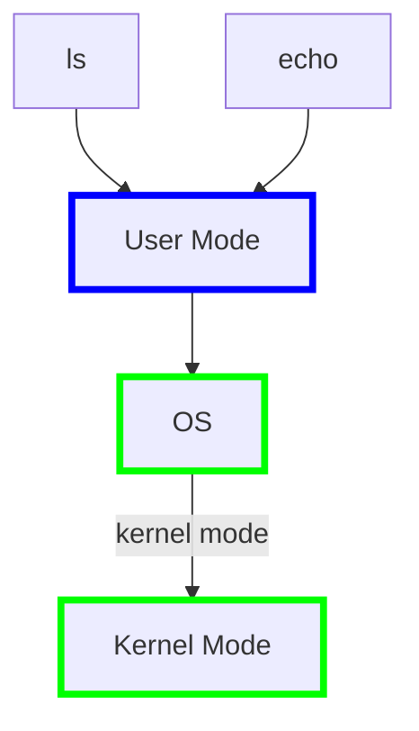

# Organization and System Calls

---

## 概述

**核心**：操作系统的组织结构。又可分为四个部分：

- **Isolation**，隔离性是设计操作系统组织结构的驱动力；

- **Kernel**和**User mode**，这两种模式用来隔离操作系统内核和应用程序；

- **System calls**，系统调用可以使应用程序转到内核执行，从而使用内核服务；

- 如何在`xv6`中实现。

---

## 操作系统隔离性

不同的应用程序间需要有强隔离性，应用程序与操作系统间也要有强隔离性。而使用操作系统就可以实现**multiplexing**和**Isolation**。接口就是**multiplexing**与物理内存的隔离，通过抽象硬件资源的方式。

举例来说，`fork`创建进程，进程实际上是CPU资源的抽象，应用程序不能直接与CPU交互，只能与进程交互，操作系统内核会完成不同进程在CPU上的切换。所以，操作系统不是直接向应用程序提供CPU，而是提供进程作为CPU的抽象，这样可以在多个应用程序之间复用一个或多个CPU。

另外，我们可以认为`exec`抽象了内存，执行`exec`系统调用的时候，我们传入一个文件名，而这个文件名对应一个应用程序的内存镜像，里面包括了程序对应的指令、全局的数据。可以视为`exec`是操作系统提供在应用程序给硬件资源（这里是内存）之间的中间层，因为应用程序无法直接访问物理内存。

`files`也是一个例子，它是磁盘的抽象。应用程序不会直接读写磁盘本身。在Unix中，与存储系统交互的唯一方式就是通过`files`，这是磁盘的抽象，可以命名文件、读写文件等，由操作系统决定如何将文件与磁盘中的块对应。

---

## 操作系统防御性

另一个内核开发时需要考虑的是抵御来自应用程序的攻击，以确保所有组件都能工作。操作系统需要能够应当恶意的应用程序，并且应用程序不能打破对它的隔离。通常这种强隔离由硬件实现，第一部分是`user/kernel mode`（RISC-V中称为`supervisor mode`），第二部分是`page table`或者`virtual memory`。

---

## 硬件对于强隔离的支持

- `user/kernel mode`：处理器主要有两种操作模式，`user mode`和`kernel mode`，两种模式下可以运行的指令权限不同。特殊权限指令主要是一些直接操纵硬件的指令和设置保护的指令。

> 处理器中`kernel mode`与`user mode`是处理器的一个bit，为1是`user mode`，0是`kernel mode`。在RISC-V中，如果你在**user space**尝试执行一条特殊权限指令，用户程序会通过系统调用切换到`kernel mode`。当用户程序执行系统调用，会通过**ECALL**触发一个软中断，软中断会查询操作系统预先设定的中断向量表，并执行中断向量表中包含的中断处理程序（在内核中），这样就完成了`mode`的切换，并执行用户程序希望执行的特殊权限指令。

- **virtual memory**：处理器中的`page table`将虚拟内存地址与物理内存地址做了对应。每个进程有自己独立的一个`page table`，只能访问出现在自己`page table`里的物理内存。操作系统通过设置`page table`使每个进程的物理内存不重合，来实现内存的强隔离性。

---

## User/Kernel mode切换

可以将`user/kernel mode`视为分隔用户空间和内核空间的边界。



在RISC-V中，**ECALL**指令专门用来实现应用程序将控制权转移给内核（Entering Kernel），它接受一个数字参数，这个参数表示应用程序想要调用的System Call。**ECALL**会跳转到内核中的一个特定位置，从这个接入点进入内核。在内核侧，有一个位于`syscall.c`的函数`syscall`，它会检查**ECALL**的参数以让内核知道是哪一个系统调用。

> 而对于每个系统调用，内核会进行特定的检查，例如`write`会检查传递给`write`的地址是否属于用户应用程序，然后再执行。另外，内核会通过硬件设置一个定时器，到期后就会将控制权限从用户空间转移到内核空间。

---

## 宏内核Monolithic Kernel与微内核Micro Kernel

内核有时也被称为可信任的计算空间（Trusted Computing Base）即TCB。在`xv6`中，所有的操作系统服务都运行在`kernel mode`中，这种形式被称为**Monolithic Kernel Design**；另一种设计则是减少内核中的代码，将大部分的操作系统运行在内核外，就像一个普通的用户程序，这被称为**Micro Kernel Design**。宏内核的优势在于各种子模块位于一个程序中，可以很好的集成，而有不错的性能，劣势在于任何操作系统的Bug都会成为漏洞；微内核设计使得内核中的代码量小，意味着更少的Bug，但当应用程序需要与其他系统交互，需要完成两次**用户空间-内核空间**的跳转，性能更差。

---

## 编译运行Kernel

首先看一下代码结构：

```bash
tinuvile@LAPTOP-7PVP3HH3:~/xv6-labs-2024$ ls
LICENSE  Makefile  README  conf  fs.img  grade-lab-util  gradelib.py  kernel  mkfs  user
tinuvile@LAPTOP-7PVP3HH3:~/xv6-labs-2024$ ls kernel
bio.c      exec.o    kernel       param.h   proc.o       stat.h     sysproc.c     virtio_disk.c
bio.d      fcntl.h   kernel.asm   pipe.c    riscv.h      string.c   sysproc.d     virtio_disk.d
bio.o      file.c    kernel.ld    pipe.d    sleeplock.c  string.d   sysproc.o     virtio_disk.o
buf.h      file.d    kernel.sym   pipe.o    sleeplock.d  string.o   trampoline.S  vm.c
console.c  file.h    kernelvec.S  plic.c    sleeplock.h  swtch.S    trampoline.o  vm.d
console.d  file.o    kernelvec.o  plic.d    sleeplock.o  swtch.o    trap.c        vm.o
console.o  fs.c      log.c        plic.o    spinlock.c   syscall.c  trap.d
defs.h     fs.d      log.d        printf.c  spinlock.d   syscall.d  trap.o
elf.h      fs.h      log.o        printf.d  spinlock.h   syscall.h  types.h
entry.S    fs.o      main.c       printf.o  spinlock.o   syscall.o  uart.c
entry.o    kalloc.c  main.d       proc.c    start.c      sysfile.c  uart.d
exec.c     kalloc.d  main.o       proc.d    start.d      sysfile.d  uart.o
exec.d     kalloc.o  memlayout.h  proc.h    start.o      sysfile.o  virtio.h
```

- `kernel`中包含基本上所有的内核文件，这些文件会被编译成二进制文件运行在`kernel mode`中；

- `user`中是运行在`user mode`的程序；

- `mkfs`会创建一个空的文件镜像，我们将这个镜像存在磁盘上，这样就可以直接使用一个空的文件系统。

关于内核的编译过程：

1. `Makefile`会读取一个C文件，以`proc.c`为例，调用gcc编译器，生产RISC-V汇编语言文件`proc.s`，再走到汇编解释器，生成`proc.o`，这是汇编语言的二进制格式；

2. `Makefile`会为所有内核文件做这样的操作；

3. 系统加载器（Loader）会收集所有`.o`文件，将它们链接在一起，并生成内核文件，这是我们将在**QEMU**运行的文件。同时，`Makefile`还会创建`kernel.asm`，这里面包含了内核的完整汇编语言，可以用来查Bug；

运行`xv6`：

```bash
tinuvile@LAPTOP-7PVP3HH3:~/xv6-labs-2024$ make qemu
qemu-system-riscv64 -machine virt -bios none -kernel kernel/kernel -m 128M -smp 3 -nographic -global virtio-mmio.force-legacy=false -drive file=fs.img,if=none,format=raw,id=x0 -device virtio-blk-device,drive=x0,bus=virtio-mmio-bus.0

xv6 kernel is booting

hart 1 starting
hart 2 starting
init: starting sh
```

传给**QEMU**的参数有：

| 参数        | 说明                                               |
|:---------:| ------------------------------------------------ |
| `-kernel` | 这里传递的是内核文件（kernel目录下的kernel文件），这是将在QEMU中运行的程序文件。 |
| `-m`      | 这里传递的是RISC-V虚拟机将会使用的内存数量。                        |
| `-smp`    | 这里传递的是虚拟机可以使用的CPU核数。                             |
| `-drive`  | 传递的是虚拟机使用的磁盘驱动，这里传入的是fs.img文件。                   |

---

## QEMU

**QEMU**是RISC-V处理器的C语言仿真，在它的内部主循环执行的主要是以下步骤：

- 读取4字节或8字节的RISC-V指令；

- 解析RISC-V指令，并找出对应的操作码（op code）；

- 在软件中执行相应的指令。

---

## XV6启动过程

- `xv6`从`entry.s`开始启动，这个阶段没有内存分页和隔离，并且运行在`machine mode`；

- 接下来，`xv6`会尽可能快的跳转到`kernel mode`，在`main`函数中进行许多初始化的操作，最后一个初始化是`userinit`函数；
  
  ```c
  #include "types.h"
  #include "param.h"
  #include "memlayout.h"
  #include "riscv.h"
  #include "defs.h"
  
  volatile static int started = 0;
  
  // start() jumps here in supervisor mode on all CPUs.
  void
  main()
  {
    if(cpuid() == 0){
      consoleinit();
      printfinit();
      printf("\n");
      printf("xv6 kernel is booting\n");
      printf("\n");
      kinit();         // physical page allocator
      kvminit();       // create kernel page table
      kvminithart();   // turn on paging
      procinit();      // process table
      trapinit();      // trap vectors
      trapinithart();  // install kernel trap vector
      plicinit();      // set up interrupt controller
      plicinithart();  // ask PLIC for device interrupts
      binit();         // buffer cache
      iinit();         // inode table
      fileinit();      // file table
      virtio_disk_init(); // emulated hard disk
      userinit();      // first user process
      __sync_synchronize();
      started = 1;
    } else {
      while(started == 0)
        ;
      __sync_synchronize();
      printf("hart %d starting\n", cpuid());
      kvminithart();    // turn on paging
      trapinithart();   // install kernel trap vector
      plicinithart();   // ask PLIC for device interrupts
    }
  
    scheduler();        
  }
  ```

- `userinit`函数会创建初始进程（这个进程的初始化在`initcode`中），返回到用户空间，执行指令，再回到内核空间，这是`xv6`的第一个系统调用；
  
  ```c
  // Set up first user process.
  void
  userinit(void)
  {
    struct proc *p;
  
    p = allocproc();
    initproc = p;
  
    // allocate one user page and copy initcode's instructions
    // and data into it.
    uvmfirst(p->pagetable, initcode, sizeof(initcode));
    p->sz = PGSIZE;
  
    // prepare for the very first "return" from kernel to user.
    p->trapframe->epc = 0;      // user program counter
    p->trapframe->sp = PGSIZE;  // user stack pointer
  
    safestrcpy(p->name, "initcode", sizeof(p->name));
    p->cwd = namei("/");
  
    p->state = RUNNABLE;
  
    release(&p->lock);
  }
  ```

- `initcode`首先将`init`中的地址加载到`a0`，将`argv`中的地址加载到`a1`，`exec`系统调用对应的数字加载到`a7`，最后调用**ECALL**，然后将控制权交给操作系统。总之，`initcode`通过`exec`调用`init`程序；
  
  ```asm6502
  # Initial process that execs /init.
  # This code runs in user space.
  #include "syscall.h"  
  
  # exec(init, argv)  
  .globl start  
  start:  
      la a0, init  
      la a1, argv  
      li a7, SYS_exec  
      ecall  
  
  # for(;;) exit();  
  exit:  
      li a7, SYS_exit  
      ecall  
      jal exit  
  
  # char init[] = "/init\0";  
  init:  
      .string "/init\0"  
  
  # char *argv[] = { init, 0 };  
  .p2align 2  
  argv:  
      .long init  
      .long 0
  ```

```c
// a user program that calls exec("/init")
// assembled from ../user/initcode.S
// od -t xC ../user/initcode
uchar initcode[] = {
  0x17, 0x05, 0x00, 0x00, 0x13, 0x05, 0x45, 0x02,
  0x97, 0x05, 0x00, 0x00, 0x93, 0x85, 0x35, 0x02,
  0x93, 0x08, 0x70, 0x00, 0x73, 0x00, 0x00, 0x00,
  0x93, 0x08, 0x20, 0x00, 0x73, 0x00, 0x00, 0x00,
  0xef, 0xf0, 0x9f, 0xff, 0x2f, 0x69, 0x6e, 0x69,
  0x74, 0x00, 0x00, 0x24, 0x00, 0x00, 0x00, 0x00,
  0x00, 0x00, 0x00, 0x00
};
```

- `init`会为用户进行一些设置，如配置`console`，调用`fork`，并在子进程中执行`shell`，最终效果为运行**Shell**。
