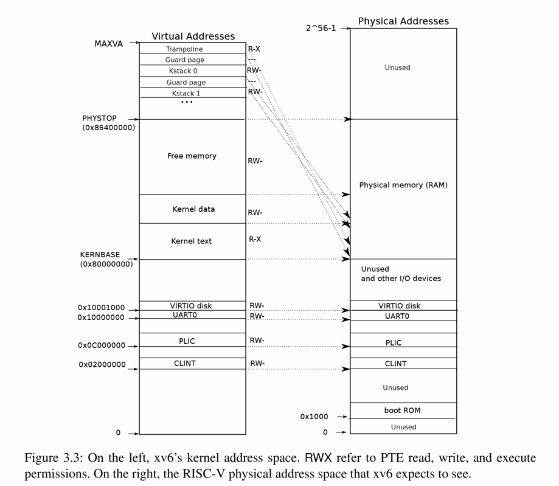

# Page tables

---

## Address Space

## 地址空间

我们知道，创造虚拟内存的一个出发点是我们可以通过它实现隔离性。为了防止不同程序破坏各自的内存进而破坏隔离性，我们希望将不同程序的内存隔离开，这可以通过地址空间来实现。

我们给包括内核的所有程序专属的地址空间，并且这些地址空间相互独立。例如当`cat`程序想向地址1000写入数据，它只会向自己的地址1000写入数据，而非向`shell`的地址1000写入，它甚至不具备引用属于`shell`内存地址的能力。这样实际上就为我们提供了强隔离性，`cat`不能引用任何不属于自己的内存。

所以现在只需要考虑如何在一个物理内存（DRAM芯片）上创造不同的地址空间。

---

## Page Table

## 页表

页表就是解决这一问题的方法之一。它在硬件中通过处理器和内存处理单元（Memory Management Unit）实现。

考虑计算机正在执行`sd $7 a0`指令。任何一条带有地址的指令中，地址都应该是虚拟内存地址，它将会被转到内存管理单元（MMU）翻译成物理地址，进而索引物理内存并实现加载或存储。

而为了完成从虚拟内存地址到物理内存地址，MMU会读取一个表单，实现二者的对应关系。在RISC-V上，这个地址关系表单存储位置的物理内存地址保存在**SATP**寄存器中。

根据前面所说，每个应用程序都有自己独立的表单，它定义了应用程序的地址空间。所以当操作系统将CPU进行应用程序的切换时，SATP寄存器中的内容也同样需要切换，以指向正确的内存地址。内核负责在切换进程时向SATP寄存器写入新的地址。

但实际上RISC-V中的工作方式与上面所说略有不同：

- 对应关系是为每个**page**创建的，即每个**page**对应一个表单条目而非地址一一对应。在RISC-V中，一个**page**是4KB即4096Bytes。

- 在这种对应关系下，内存地址的翻译方式也发生改变了。对于虚拟内存地址，我们将它划分为`index`和`offset`两个部分，`index`用于查找`page`，`offset`用于对应`page`中的具体字节。具体可见[Chapter3中的Figure3.1](https://tinuviles-organization.gitbook.io/~gitbook/image?url=https%3A%2F%2F1061060471-files.gitbook.io%2F%7E%2Ffiles%2Fv0%2Fb%2Fgitbook-x-prod.appspot.com%2Fo%2Fspaces%252FflPOMWntEF42we5M4uko%252Fuploads%252FoS6nKt30vHpuAaiR2yjc%252F2025-03-24-19-48-53-image.png%3Falt%3Dmedia%26token%3D11273baa-a337-42d3-b706-99ae2c2d2935&width=400&dpr=3&quality=100&sign=4d5e6121&sv=2)。

另外，在RISC-V中，虚拟内存地址都是64bit的，但是实际高25bit并没有被使用。在实际使用的39bit中，27bit被用来当作`index`，12bit被用来当作`offset`，`offset`的大小是确定的，因为它需要对应`page`的4096字节。

RISC-V中，物理内存地址是56bit，其中44bit是物理`page`号（PPN），剩下12bit是`offset`，这部分完全继承自虚拟内存地址。

但如果每个进程都有这样的一个`page table`，一个`page table`最多会有2^27个条目（虚拟地址），这样会消耗大量内存。因此，实际上硬件并不使用这种方式，实际的`page table`是一个多级的结构，具体可见[Chapter3中的Figure3.2](https://tinuviles-organization.gitbook.io/~gitbook/image?url=https%3A%2F%2F1061060471-files.gitbook.io%2F%7E%2Ffiles%2Fv0%2Fb%2Fgitbook-x-prod.appspot.com%2Fo%2Fspaces%252FflPOMWntEF42we5M4uko%252Fuploads%252FBL870UCttkWZABeD0biB%252F2025-03-24-19-59-39-image.png%3Falt%3Dmedia%26token%3D248be558-93aa-4dbf-a938-3778d4f422ae&width=400&dpr=3&quality=100&sign=4c27ada6&sv=2)。

虚拟内存地址中27bit的`index`实际是由3个9bit的数字组成，前9个bit用来索引最高级的`page directory`。**Directory**中的一个条目被称为PTE，大小为64bit，即8Bytes。因此一个**Directory page**有512个条目。

所以SATP寄存器会指向最高级的`page directory`的物理地址，然后用虚拟内存中`index`的高9位来索引PTE得到一个PPN，这个PPN指向中间一级的`page directory`。然后再依次使用中9位和末9位完成索引，在最低级的`page directory`中，可以得到虚拟内存地址真正对应的物理内存地址。

> 这里PPN为44bit，我们将它加上12bit的0得到下一级`page directory`的56bit物理地址。这里要求每个`page directory`都与物理`page`对齐。

在这个方案中，我们只需要3*512个PTE，显著少于前面的2^27，所需空间大大减少了。

PTE一共54bit，除去44bit的PPN，剩下的10bit是标志位（Flag）：

- 第一个标志位是Valid，如果为1，表明这是一条合法的PTE，可以用来做地址翻译；如果为0则不可被MMU使用；

- 下两个标志位分别是Readable和Writable，表明是否可以读/写这个`page`；

- Executable表明你可以从这个`page`执行指令；

- User表明这个`page`可以被运行在用户空间的进程访问；

- 其他标志位并不太重要。

---

## Translation Lookaside Buffer

## 页表缓存

对于一个虚拟内存地址的寻址，每次都需要读三次内存的话代价有点高。因此，实际上几乎所有处理器都会对最近使用过的虚拟地址的翻译结果有缓存，这个缓存被称为：**Translation Lookaside Buffer**，缩写**TLB**。基本上来说这就是PTE的缓存。

当处理器第一次查找一个虚拟地址时，硬件通过三级`page table`得到最终的PPN，TLB会保存虚拟地址到物理地址间的映射关系，这样下次访问这个虚拟地址时，处理器就可以直接查看TLB得到物理地址。而当我们切换`page table`时，处理器会清空TLB，在RISC-V中，清空TLB的指令是`sfence_vma`。

> 在一个RISC-V芯片中，有多个CPU核，MMU和TLB位于每一个CPU核中，RISC-V处理器有L1 cache，L2 cache，有些cache是根据物理地址索引的，有些cache是根据虚拟地址索引的，由虚拟地址索引的cache位于MMU之前，由物理地址索引的cache位于MMU之后。

实际上也可以说：`page table`提供了一层从虚拟地址到物理地址映射的抽象。

---

## Kernel Page Table

## 内核页表

下图是内核中地址的对应关系，左边是内核的虚拟地址空间，右边上半部分是物理内存（DRAM），下半部分是I/O设备。



图中右半部分的结构完全由硬件设计者决定。具体而言，主板中间是RISC-V处理器，旁边就是DRAM芯片。主板设计者决定：在完成虚拟地址的翻译后，如果得到的物理地址大于`0x80000000`会走向DRAM芯片，如果低于则会走向不同的I/O设备。

地址`0x1000`是**boot ROM**的物理地址，当你对主板上电，主板做的第一件事就是运行存储在boot ROM中的代码，然后会跳转到`0x80000000`。

图中还有一些I/O设备：PLIC（Platform-Level Interrupt Controller）是中断控制器，CLINT（Core Local Interruptor）也是负责中断的，UART0（Universal Asynchronous Receiver/Transmitter）负责与Console和显示器交互，VIRTIO disk负责与磁盘交互。

图的左边部分是`xv6`的虚拟内存地址空间。这里有两个地方需要注意：

- 第一个是在看教材的时候提到的特殊映射，有的`page`在虚拟内存中的地址很靠后，比如`kernel stack`，这是因为它下面有一个没有被映射的`guard page`，这个`guard page`对应的PTE的`Valid`标志位没有设置。这样如果`kernel stack`耗尽了，就会溢出到`guard page`，然后会触发`page fault`，这是一个安全上的考虑，这样比内存越界造成的数据混乱好，但我们也不想浪费物理内存给`guard page`。
  
  同时，`kernel stack`被映射了两次，一次是在靠后的虚拟地址，另一次是在`PHYSTOP`下的`kernel data`中，但实际使用的是虚拟地址的映射，更安全。

- 第二个是权限。例如`kernel text page`被标为`R-X`，这表明你可以读它，也可以在这个地址段执行指令，但不能向`kernel text`写入数据。而`kernel data`可以被写入，因此它的标志位是`RW-`，但不能在这个地址段运行指令，因为`X`标志位没有设置。

另外，在`kernel page table`中，有一段`Free Memory`对应了物理内存中的一段地址，`xv6`使用这段内存来存放用户进程的`page table`，`text`和`data`，但当用户进程过多这段内存耗尽，再`fork`或者`exec`就会返回错误。

当`kernel`创建了一个进程，针对这个进程的三级`page table`就会从`Free memory`中分配处理，内核为用户进程的`page table`分配几个`page`，并填入PTE。当内核运行了这个进程，内核会将进程的`root page table`的地址加载到SATP寄存器，然后处理器会使用内核为这个进程构建的虚拟地址空间。

---

## 代码

---

### kvminit函数

接下来用调试来看一看：

```bash
tinuvile@LAPTOP-7PVP3HH3:~/xv6-labs-2024$ gdb-multiarch -q
warning: File "/home/tinuvile/xv6-labs-2024/.gdbinit" auto-loading has been declined by your `auto-load safe-path' set to "$debugdir:$datadir/auto-load".
To enable execution of this file add
        add-auto-load-safe-path /home/tinuvile/xv6-labs-2024/.gdbinit
line to your configuration file "/home/tinuvile/.gdbinit".
To completely disable this security protection add
        set auto-load safe-path /
line to your configuration file "/home/tinuvile/.gdbinit".
For more information about this security protection see the
"Auto-loading safe path" section in the GDB manual.  E.g., run from the shell:
        info "(gdb)Auto-loading safe path"
(gdb) file kernel/kernel
Reading symbols from kernel/kernel...
(gdb) set architecture riscv:rv64
The target architecture is set to "riscv:rv64".
(gdb) target remote :26000
Remote debugging using :26000
warning: Architecture rejected target-supplied description
0x0000000000001000 in ?? ()
(gdb) b kvminit
Breakpoint 1 at 0x80000618: file kernel/vm.c, line 65.
(gdb) c
Continuing.

Thread 1 hit Breakpoint 1, kvminit () at kernel/vm.c:65
65      {
(gdb) layout split
```

在`kvminit`函数处设置断点，然后在`gdb`中执行`layout split`，可以看到函数执行的汇编指令：


```bash
0x80000618 <kvminit>    addi    sp,sp,-16         // 调整栈指针
0x8000061a <kvminit+2>  sd      ra,8(sp)          // 保存返回地址
0x8000061c <kvminit+4>  sd      s0,0(sp)          // 保存寄存器 s0
0x8000061e <kvminit+6>  addi    s0,sp,16          // 设置帧指针
0x80000620 <kvminit+8>  jal     ra,0x80000566 <kvmmake> // 调用 kvmmake
0x80000624 <kvminit+12> auipc   a5,0x7            // 获取 kernel_pagetable 地址
0x80000628 <kvminit+16> sd      a0,1092(a5)       // 保存返回值到 kernel_pagetable
0x8000062c <kvminit+20> ld      ra,8(sp)          // 恢复返回地址
0x8000062e <kvminit+22> ld      s0,0(sp)          // 恢复寄存器 s0
```

首先调用`kvmmake`函数，继续执行：


可以看到函数最先为最高一级`page directory`分配物理`page`（调用`kalloc`处）。

然后通过`kvmmap`函数，将每个I/O设备映射到内核：


例如图中就是将`UART0`映射到内核的地址空间。然后课程中用到后面实验需要实现的`vmprint`函数，这里就先不记了，这个函数会打印当前的`kernel page table`，实现后可以看到第一行是最高级`page directory`的地址，也是存在SATP中的地址；第二行可以看到最高一级`page directory`中对应序号的PTE，它包含了中间级`page directory`的物理地址，后面也是类似的，最后一行PTE指向的就是物理地址。

---

### kvminithart函数

继续运行，`kvminit`函数返回后运行到了`kvminithart`函数：


这个函数在运行完`sfence_vma`后会首先设置SATP寄存器。`kernel_pagetable`变量来自于`kvminit`，这里内核告诉MMU使用刚刚设置好的`page table`。实际上，在这条指令之前，还不存在可用的`page table`，也即不存在地址翻译。但执行完这条指令后，程序计数器会加4（程序计数器存放指令地址），而在下一条指令执行时，程序计数器就会被内存中的`page table`翻译。


因此这条指令的执行是一个重要的时间节点。在这条指令之前，我们使用的都是物理内存地址；从这条指令之后，整个地址翻译系统开始生效，所有的内存地址的含义都变成了虚拟内存地址。

值得注意的是这里在进行了物理内存地址到虚拟内存地址转换后系统仍然能正常工作的原因。这是因为在`kernel page`的映射关系中，虚拟地址到物理地址是完全相同的，所以我们依然能通过内存地址执行到正确的指令。
