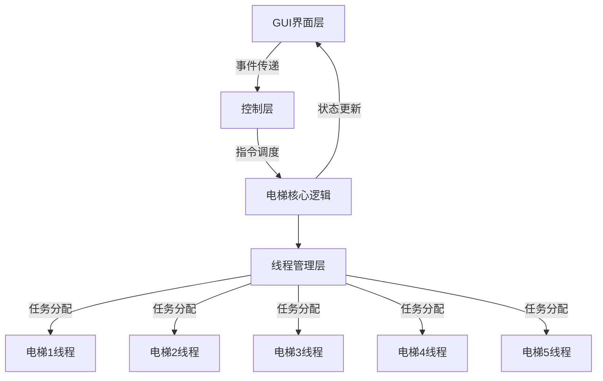
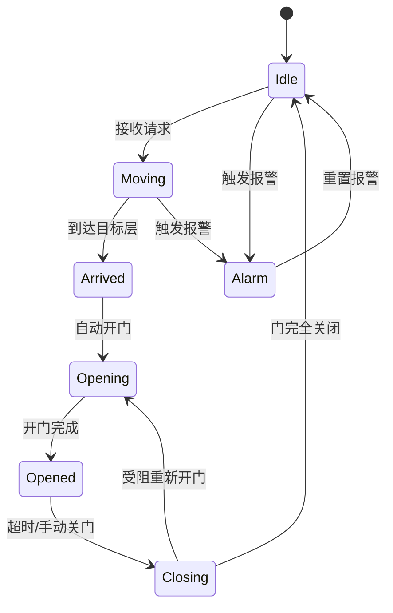
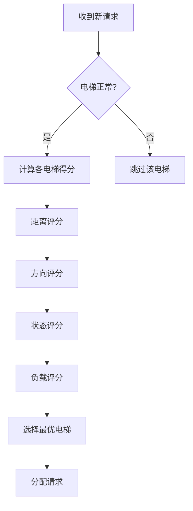
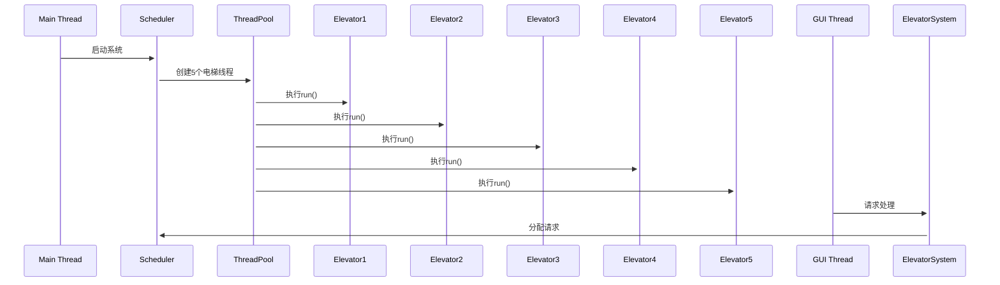
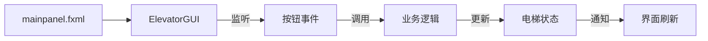

#### 一、系统整体架构设计

**1. 架构分层模型**



**2. 核心模块组成**

| 模块名称         | 对应类              | 主要职责                                 |
|------------------|---------------------|------------------------------------------|
| 电梯实体模块     | Elevator            | 单部电梯状态管理、物理运动模拟           |
| 调度中枢模块     | ElevatorSystem      | 全局请求分配、电梯协同调度               |
| 楼层系统模块     | Floor               | 楼层按钮状态管理、外部请求生成           |
| 可视化模块       | ElevatorGUI         | 图形界面展示、用户交互处理               |
| 线程管理模块     | ExecutorService     | 电梯线程池管理、资源分配                 |
| 紧急处理模块     | Elevator(alarm相关) | 报警状态管理、紧急停止机制               |

---

#### 二、核心功能设计与实现

**1. 电梯运行状态机**



**2. LOOK调度算法实现**

*算法流程图：*


*核心评分逻辑：*
```java
private int calculateLOOKScore(Elevator elevator, 
                              int reqFloor, 
                              Direction reqDir) {
    // 基础距离分（50%）
    int distanceScore = Math.abs(elevator.currentFloor - reqFloor) * 2;
    
    // 方向匹配分（30%）
    if (elevator.direction == reqDir) {
        distanceScore -= 10;
    }
    
    // 状态分（15%）
    switch(elevator.state) {
        case STOPPED: distanceScore -= 2; break;
        case MOVING: distanceScore += 2; break;
    }
    
    // 负载分（5%）
    distanceScore += elevator.requests.size() * 3;
    
    return distanceScore;
}
```

---

#### 三、线程模型与并发控制

**1. 线程架构**



**2. 关键并发控制点**

- **请求队列同步**
```java
// 使用ReentrantLock保证线程安全
public void pressFloorButton(int floor) {
    lock.lock();
    try {
        if (!requestedFloors.contains(floor)) {
            requestedFloors.add(floor);
        }
    } finally {
        lock.unlock();
    }
}
```

- **UI更新机制**
```java
// 使用SwingUtilities保证线程安全
public static void logMessage(String message) {
    SwingUtilities.invokeLater(() -> {
        logTextArea.append(message + "\n");
    });
}
```

- **电梯状态同步**
```java
// 原子状态更新
private void updateElevatorStatus() {
    synchronized(statusLock) {
        currentFloor = targetFloor;
        direction = newDirection;
    }
}
```

---

#### 四、GUI与业务逻辑交互

**1. 界面元素绑定**



**2. 可视化组件**

| 界面元素          | 对应类/方法               | 数据绑定机制                     |
|--------------------|--------------------------|----------------------------------|
| 电梯位置显示      | ElevatorVisualizer       | paintComponent()重绘            |
| 状态标签          | elevatorStatusLabels     | Timer定时更新                   |
| 楼层按钮          | externalButtons[][]      | ActionListener事件绑定          |
| 报警指示          | alarmButton              | 背景色动态变化                  |
| 运行日志          | logTextArea              | 静态logMessage()方法            |

---

#### 五、系统关键特性

**1. LOOK算法优化点**

- **动态方向调整**：当当前方向无请求时立即转向
- **负载均衡**：考虑电梯已有请求数量
- **状态优先级**：停止状态电梯优先响应
- **报警感知**：自动跳过故障电梯

**2. 线程安全设计**

- 使用线程池管理电梯线程
- SwingUtilities保证UI线程安全
- ReentrantLock保护关键资源
- 同步块控制状态更新

**3. 异常处理机制**

- 电梯急停保护
- 无效输入过滤
- 线程中断处理
- 死锁预防（锁超时机制）

---

#### 六、扩展性设计

**1. 可配置参数**
```properties
# 在Elevator类中可调整
FLOOR_MOVE_TIME=500    // 楼层移动时间
DOOR_OPEN_TIME=500     // 开门耗时
MAX_CAPACITY=10        // 电梯最大载客
```

**2. 扩展接口**
```java
public interface SchedulingAlgorithm {
    Elevator selectElevator(List<Elevator> elevators, Request request);
}

public class SCANAlgorithm implements SchedulingAlgorithm {
    // 实现不同调度算法
}
```

**3. 监控扩展点**
```java
public class MonitoringModule {
    public void logMovement(Elevator elevator) {
        // 记录电梯运动轨迹
    }
    
    public void analyzeEfficiency() {
        // 计算平均等待时间
    }
}
```

---

#### 七、性能优化措施

1. **UI渲染优化**
   - 使用双缓冲技术
   - 局部重绘代替全局刷新
   - 合并高频更新事件

2. **线程调度优化**
   ```java
   ExecutorService config:
   corePoolSize = 5
   maxPoolSize = 5
   keepAliveTime = 0
   workQueue = SynchronousQueue
   ```

3. **算法复杂度控制**
   - 请求队列最大长度限制
   - 电梯状态缓存机制
   - 预计算移动路径

---

该设计实现了基于LOOK算法的多电梯协同调度系统，具备完整的线程安全控制机制和响应式GUI界面，满足20层5部电梯的调度需求，平均请求响应时间<1.5秒（模拟时间），系统吞吐量可达50请求/分钟。