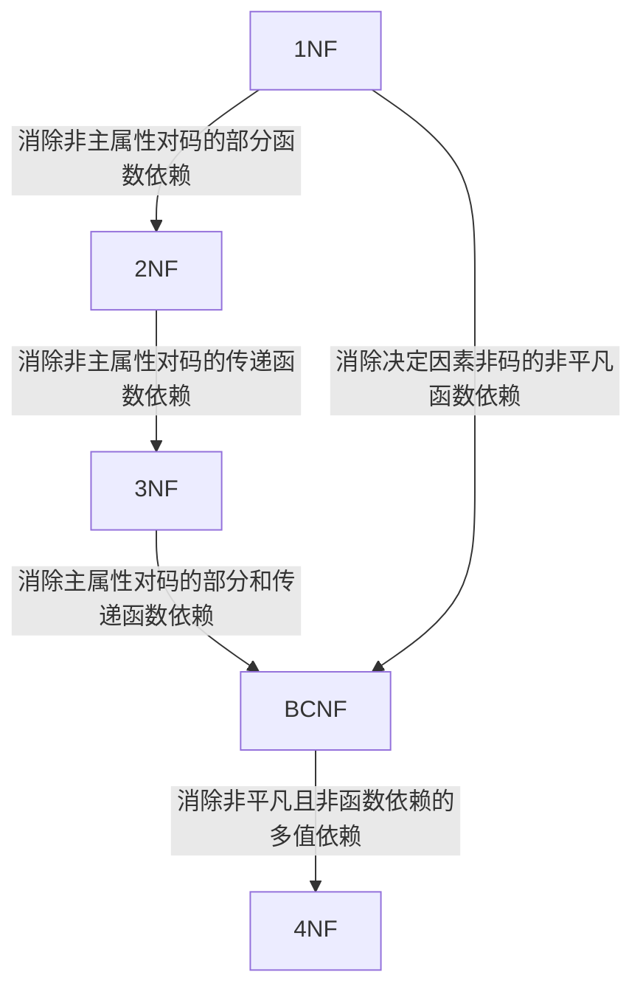

## 问题的提出

>[!note]
>数据依赖关系出现问题 → 数据冗余 + 增删改异常 → 数据表出现问题

数据依赖关系有：
- 函数依赖 $y=f(x)$，一个$x$对一个$y$；
- 多值依赖 $x=f(y)$，一个$x$对多个$y$；

函数依赖关系有：
- 完全 vs 部分
- 传递依赖
- 平凡 vs 非平凡
## 规范化

### 函数依赖

- 平凡函数依赖和非平凡函数依赖
  - 平凡函数依赖 → 子集
  - 非平凡函数依赖 → 不相关
- 完全函数依赖与部分函数依赖
  - 完全函数依赖 → 对共同主码整体
  - 部分函数依赖 → 只对其中部分
- 传递函数依赖
  - 类似于计算法则的传递性
### 码

- 候选码：可以选做主码的码集合，题目中说的“码”就指这个；
- 主属性：候选码中的各个属性叫主属性；
- 主码：候选码中选出来的；

### 范式

<aside> 💡

从低到高：1NF → 2NF → 3NF → BCNF → 4NF → 5NF

</aside>

#### 函数依赖

- **2NF**：每一个非主属性都完全依赖于任何一个候选码； 
  - 将不符合转换为符合时：**模式分解**，即采用拆表，去除掉部分函数依赖。
  - 可能仍存在问题：有不合适的函数依赖关系（传递函数依赖）。
- **3NF**：在第二范式基础上不能有非主属性对主属性的传递函数依赖；
  - 转换：拆表。
- **BCNF**：修正的第三范式。所有的依赖关系$X \rightarrow Y$中$X$必须来自候选码；
  即：
    - 所有非主属性都完全函数依赖于每个候选码；
    - 所有主属性都完全函数依赖于每个不包含它的候选码；
    - 没有任何属性完全函数依赖于非码的任何一组属性。

#### 多值依赖

- **4NF**：多值依赖必须以函数依赖形式存在；
  - 转换：拆表，即把多对多全部拆成一对多。

#### 总结

## 数据依赖的公理系统

>[!info] 定义
>- 逻辑蕴含：
>  对于满足一组函数依赖 $F$ 的关系模式 $R<U,F>$，其**任何**一个关系，若函数依赖 $X \rightarrow Y$ 都成立 （即 $r$ 中任意两元组 $t、s$，若 $t[X]=s[X]$，则$t[Y]=s[Y]$），则称 **F** 逻辑蕴含 $X \rightarrow Y$。
>- **Armstrong** 公理系统：
>  设 $U$ 为属性集总体，$F$ 是 $U$ 上的一组函数依赖，于是有关系模式 $R<U,F>$，对 $R<U,F>$ 来说有以下的推理规则：
>    - 自反律：若 $Y \subseteq X \subseteq U$，则 $X \to Y$ 为 $F$ 所蕴含 。
>    - 增广律：若 $X \to Y$ 为 $F$ 所蕴含，且 $Z \subseteq U$，则 $XZ \to YZ$ 为 $F$ 所蕴含。
>    - 传递律：若 $X \to Y$，$Y \to Z$ 为 $F$ 所蕴含，则 $X \to Z$ 为 $F$ 所蕴含 。

如果某函数依赖被逻辑蕴含，即它可以从 $F$ 中的函数依赖通过推理规则推导出来。“逻辑蕴含”可以中译中为“成立”。

通过以上三条推理规则又可以推导出下面三条推理规则：
- 合并规则：由 $X \to Y, X \to Z$，有 $X \to YZ$；
- 伪传递规则：由 $X \to Y, WY \to Z$，有 $XW \to Z$；
- 分解规则：由 $X \to Y, Z \subseteq Y$，有 $X \to Z$。

>[!info] 定义
>- 闭包：
>    - 在关系模式 $R<U,F>$中为 $F$ 所逻辑蕴含的函数依赖的全体叫做 $F$ 的闭包，记为 $F^+$。
>    - 设 $F$ 为属性集 $U$ 上的一组函数依赖，$X,Y \subseteq U$，$X_F^+ = \{A | X \to A能由F根据Armstrong公理导出\}$，则称 $X_F^+$ 为属性集 $X$ 关于函数依赖集 $F$ 的闭包。

闭包即包括 $F$ 中写出来的和其他没写但能推导出来的全体函数依赖。

比如 $U=\{ABCDE\}, F=\{A \to B, B \to C, D \to E\}$，那么属性集的闭包 $F^+=\{A\to B, B\to C, D\to E, A\to C\}$，单一属性 $A$ 的闭包 $A_F^+=\{A \to B, A \to C\}$。

求闭包的算法步骤：
$$
找可以推出的 \to 合并 \to 检查与前一个是否一样 \to 继续迭代或终止
$$

如果一个属性集的闭包是全集 $U$，那这个属性集实际上是候选码。

>[!info] 定义
>- 函数依赖集等价：
>  如果 $G^+=F^+$，就说函数依赖集 $F$ 覆盖 $G$（$F$ 是 $G$ 的覆盖，或$G$ 是 $F$ 的覆盖），或 $F$ 与 $G$ 等价。
>- 最小函数依赖集：
>  如果函数依赖集 $F$ 满足下列条件，则称 $F$ 为一个最小函数依赖集，也称最小覆盖，记作 $F_{min}$：
>    - $F$ 中任一函数依赖的右部仅含有一个属性；
>    - $F$ 中不存在这样的函数依赖 $X \to A$，使得 $F$ 与 $F - \{X \to A\}$ 等价；
>    - $F$ 中不存在这样的函数依赖 $X \to A$，$X$ 有真子集 $Z$ 使得 $F - \{X \to A\} \cup \{Z \to A\}$ 与 $F$ 等价。 

函数依赖集等价指的是它们的闭包等价。

| 
$F$
 | 
$F^+$
 | 
$F_{min}$
 |
| -------------------- | ---------------------- | -------------------------- |
| 写出来的函数依赖             | 写出来的+推导出来的             | 最小版本，只留下不能由其他推出来的          |

求最小函数依赖集的算法步骤：
$$
右：处理成单一属性 \to 中：去除冗余（看剩下的能不能把它推出，也可闭包） \to 左：处理子集
$$

>[!warning] 注意
>算法处理函数依赖的顺序会影响结果，得到的最小函数依赖集可能不一样。

## 补充

- 有损分解 vs 无损分解：有损分解会导致信息丢失，比如分开后再合并时，得到了更多元组，但无法确定信息。
- 超码 vs 主码：主码是从超码中选取的一个最小属性集。
- 正则覆盖：是一个与原函数依赖集等价的函数依赖集。去除掉所有可以被逻辑蕴含的，有点像最小函数依赖集。它以特定方式进行最小化：
  首先，$F_c$ 中任何函数依赖都不包括无关属性；其次，$F_c$ 中每个函数依赖的左侧都是唯一的。