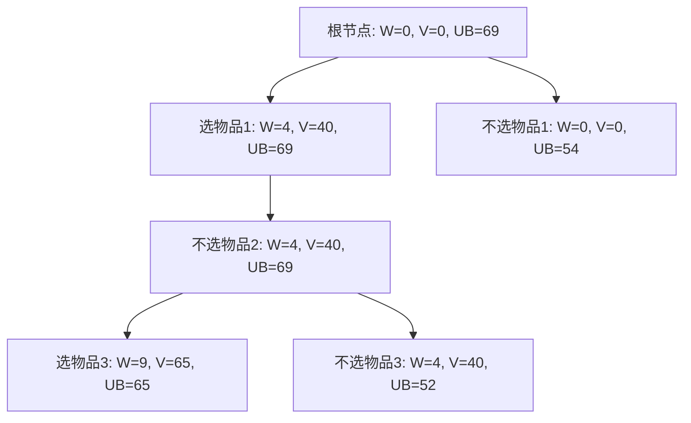

# HW3

---

2352495  张竹和

---

> [!info]
> 1（10分）有一根长度为 n 英寸的铜管和一个非负整数数组，数组包含所有长度不超过 n 的管段的价格。通过切割管道并出售管段来获得最大价值。例如，如果管道长度为8，不同管段的价格如下表所示，则最大可获得价值为22（通过切割为长度2和6的两段）。
> 
> | 长度  | 1   | 2   | 3   | 4   | 5   | 6   | 7   | 8   |
> | --- | --- | --- | --- | --- | --- | --- | --- | --- |
> | 价格  | 1   | 5   | 8   | 9   | 10  | 17  | 17  | 20  |
> 
> 设计一个动态规划算法，帮助Cooper在给定管道长度和价格表时找到最大可获得价值。 （根据n分析算法）
> 
> (a) 描述你的算法。（给出伪代码） 
> 
> (b) 分析算法的时间复杂度。

**解答**

**（a）** 
子状态：
    长度为`i`的铜管能获得的最大价值，假设用数组`dp[i]`。
   状态转移方程：
    对于每个长度为`i`的铜管，考虑切割为两部分：一部分长度为`j`，后续不切割；一部分长度为`i-j`，后续继续切割。
    则状态转移方程应该是：`dp[i]=max(price[j]+dp[i-j])`。

伪代码：
```python
function max_cut_value(price, n):
    dp = array of size (n+1) initialized to 0
    dp[0] = 0

    for i from 1 to n:
        max_val = -infinity
        for j from 1 to i:
            current_val = price[j] + dp[i - j]
            if current_val > max_val:
                max_val = current_val
        dp[i] = max_val

    return dp[n]
```

**（b）** 
外层循环：遍历长度为 $1$ 到 $n$ 的铜管，共 $n$ 次；
内层循环：对每个长度 $i$ 需要检查 $i$ 种切割方案
总次数：
$$
\sum_{i=1}^{n} i = \frac{n(n+1)}{2} = O(n^2)
$$

---

> [!info] 
> 2（10分）请⽤分⽀限界法对以下背包问题求解。详细给出解空间树，搜索过程及结果。背包容量W=10，物品不可拆分。
> 
> | 物品 | 重量(w) | 价值(v) |
> | --- | --- | --- | 
> | 1 | 4 | 40 |
> | 2 | 7 | 42 | 
> | 3 | 5 | 25 | 
> | 4 | 3 | 12 |

**解答**

| 物品 | 重量(w) | 价值(v) | 单位价值 |
| --- | --- | --- | --- |
| 1 | 4 | 40 | 10 |
| 2 | 7 | 42 | 6 |
| 3 | 5 | 25 | 5 |
| 4 | 3 | 12 | 4 |





